# IoT Device Integration Specification — Device / Firmware Team

**Audience:** firmware and device engineers building gateways, sensors, and actuators for the Office IoT Monitoring & Control Platform.
**Scope:** everything a device needs to talk to the platform — provisioning, authentication, MQTT/HTTP transport, every message body, every flow as a sequence diagram, command contracts per device type, timing, error handling, and a firmware checklist.
**Source of truth:** this document consolidates the *Data Specification* (`basic_overview.md`, authoritative for MQTT wire formats), the *System Design*, the *API Design*, and the *OpenAPI* contract. Where the wire format and the architecture docs disagree, the wire format wins and the disagreement is flagged ⚠️.

---

## How to read this document

1. **Quick reference** (§1) — the tables you'll keep open while coding: topics, QoS, scopes, intervals, enums.
2. **Device lifecycle** (§2) — the states a device moves through.
3. **Flows** (§3) — one numbered flow per interaction, each with a sequence diagram + the exact message bodies it uses. This is the core of the spec.
4. **Message body reference** (§4) — every payload, field by field.
5. **Command contracts** (§5) — what `parameters` each actuator type accepts.
6. **Reference tables** (§6) — connection params, timing, error handling.
7. **Firmware checklist** (§7) — what "done" looks like.
8. **Open items** (§8) — discrepancies to confirm with the backend team before freezing firmware.

> **Conventions in this doc**
> - `{placeholder}` = substitute the real value (e.g. `{device_id}` → `OFFICE1_NODE_01`).
> - ⚠️ = a documented inconsistency or an assumption to confirm — do not freeze firmware on it without backend sign-off.
> - All timestamps are **ISO-8601, UTC, `Z`-suffixed** (e.g. `2026-06-21T20:39:36Z`).
> - **MQTT payloads use `snake_case`** (per the data spec). **HTTP REST payloads use `camelCase`** (per the OpenAPI). They are *different wire formats* — §8.1.

---

## 1. Quick reference

### 1.1 MQTT topics

| Purpose        | Topic                                  | Device role   | QoS  | Retained | Notes |
|----------------|----------------------------------------|---------------|------|----------|-------|
| Telemetry      | `iot/telemetry/{zone}/{gateway_id}`    | **publish**   | 1    | no       | Per-gateway suffix added for tighter broker ACLs (was `iot/telemetry/{zone}`). ⚠️ §8.2 |
| Command        | `iot/command/{device_id}`              | **subscribe** | 1    | no       | Actuators only |
| Command ack    | `iot/command_ack/{device_id}`          | **publish**   | 1    | no       | Actuators only |
| Heartbeat      | `iot/heartbeat/{device_id}`            | **publish**   | 0–1  | no       | All devices |
| Presence (LWT) | `iot/status/{device_id}`               | **publish** (Last Will) | 1 | yes (recommended) | Broker auto-publishes on ungraceful disconnect |

> A **gateway** publishes telemetry + heartbeat. A **sensor** is read by its gateway and does not talk MQTT directly (it has no client credentials of its own unless registered as one). An **actuator** subscribes to commands, publishes acks + heartbeat.

### 1.2 OAuth2 device scopes

A device's token only grants the scopes intersected with what was provisioned for it.

| Scope               | Lets the device…       | Needed by |
|---------------------|------------------------|-----------|
| `telemetry:publish` | publish telemetry      | gateways |
| `command:subscribe` | receive commands       | actuators |
| `command:ack`       | send acknowledgements  | actuators |
| `heartbeat:publish` | publish heartbeat      | all |

### 1.3 Status / enum values

| Enum                 | Values |
|----------------------|--------|
| Command status       | `PENDING` · `RECEIVED` · `SUCCESS` · `FAILED` · `TIMEOUT` |
| Device heartbeat status | `ONLINE` (and `OFFLINE` via LWT) |
| Device registry status | `ACTIVE` · `INACTIVE` · `SUSPENDED` · `DECOMMISSIONED` |
| On/off state         | `ON` · `OFF` |
| AC mode              | `COOL` · `HEAT` · `DRY` · `FAN` · `AUTO` |
| Curtain direction    | `UP` · `DOWN` · `STOP` (⚠️ REST docs also reference `OPEN`/`CLOSED` — §8.3) |

### 1.4 Default intervals & timeouts

| Thing | Value | Source |
|-------|-------|--------|
| Telemetry publish interval | 10–60 s (aggregated per gateway) | System design assumption #2 |
| Heartbeat interval | 30–60 s | Data spec §14 |
| Device access-token lifetime | 3600 s (1 h) | Data spec §8.2 |
| Command end-to-end target | actuator reacts within ~1–2 s | System design NFRs |
| Command ack timeout (server-side sweeper) | N seconds → marks `TIMEOUT` | System design §5.5 ⚠️ confirm N (§8.4) |

---

## 2. Device lifecycle

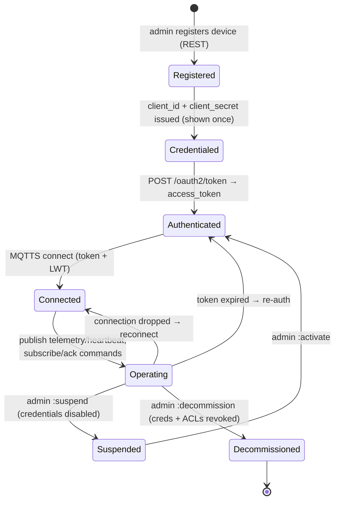

Registry status maps onto this: only an **`ACTIVE`** device can authenticate and communicate. `SUSPENDED` devices are rejected at auth; `DECOMMISSIONED` is terminal and irreversible.

---

## 3. Flows

Each flow below is self-contained: a sequence diagram followed by the message bodies it uses. Diagrams are device-centric — they show what the firmware sends and expects back.

### Flow 1 — Provisioning & credential issuance (one-time, out of band)

The device does **not** self-register. An administrator registers it over REST and hands the firmware its credentials. The client secret is shown **exactly once**.

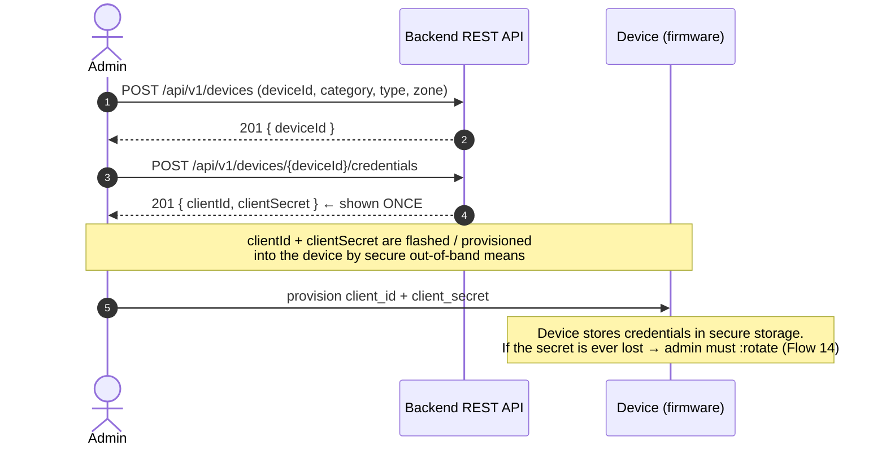

**Register request body** (`POST /api/v1/devices`):
```json
{
  "device_id": "OFFICE1_NODE_01",
  "device_type": "gateway",
  "zone": "office_1",
  "firmware_version": "1.0.0",
  "protocols": ["MQTT", "HTTP"]
}
```

**Credential response** (returned once, never re-emitted):
```json
{
  "device_id": "OFFICE1_NODE_01",
  "client_id": "OFFICE1_NODE_01",
  "client_secret": "generated-secret"
}
```

> Firmware requirement: persist `client_id` / `client_secret` in secure, non-volatile storage. There is no recovery path other than admin-driven rotation.

---

### Flow 2 — Device authentication (OAuth2 client-credentials)

Before any MQTT or HTTP traffic, the device exchanges its credentials for a short-lived bearer token.

```mermaid
sequenceDiagram
    autonumber
    participant Dev as Device
    participant Auth as Backend /oauth2/token

    Dev->>Auth: POST /oauth2/token (client_credentials)
    alt credentials valid & device ACTIVE
        Auth-->>Dev: 200 { access_token, expires_in: 3600, scope }
        Note over Dev: cache token; schedule refresh<br/>before expires_in elapses
    else invalid / SUSPENDED / DECOMMISSIONED
        Auth-->>Dev: 401 / 403
        Note over Dev: back off and retry;<br/>do NOT hammer the auth endpoint (20 req/min limit)
    end
```

**Token request** (form-encoded):
```json
{
  "grant_type": "client_credentials",
  "client_id": "OFFICE1_NODE_01",
  "client_secret": "********",
  "scope": "telemetry:publish heartbeat:publish"
}
```

**Token response:**
```json
{
  "access_token": "eyJ...",
  "token_type": "Bearer",
  "expires_in": 3600,
  "scope": "telemetry:publish heartbeat:publish"
}
```

> The **granted** `scope` may be narrower than requested — it is the intersection with what the device was provisioned for. Honour the granted set; don't assume a scope you didn't receive.

---

### Flow 3 — MQTT connection + Last Will registration

The device connects to the broker over **MQTTS (TLS 1.2+)**, authenticating with the access token, and registers a **Last Will & Testament** so the broker announces it offline if it drops uncleanly.

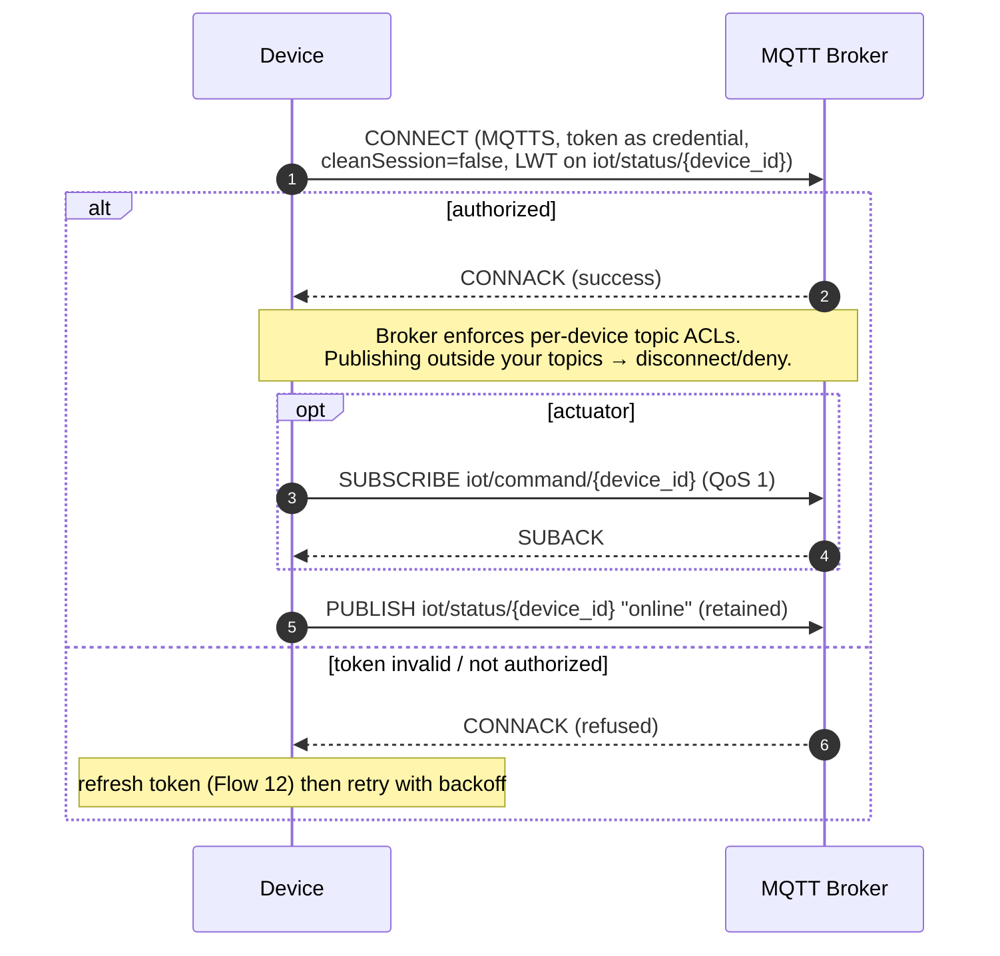

**Connection parameters (recommended):**

| Parameter | Value | Why |
|-----------|-------|-----|
| Transport | MQTTS, TLS 1.2+ | Plain MQTT is disabled in production |
| Port | `8883` (standard MQTTS) ⚠️ confirm | Not stated in docs — §8.5 |
| Credential | OAuth2 access token (as username/password or auth field per broker) ⚠️ confirm exact MQTT auth mechanism — §8.5 | Broker authenticates every connection |
| `cleanSession` | `false` (persistent session) | Actuators must receive QoS-1 commands queued while briefly offline |
| Keep-alive | ≤ heartbeat interval | Timely LWT firing |
| LWT topic | `iot/status/{device_id}` | Presence detection |
| LWT payload | offline status (§4.6) | Broker publishes this on ungraceful drop |

---

### Flow 4 — Telemetry publish (MQTT, primary path)

The gateway aggregates its sensors' readings and publishes one envelope per cycle.

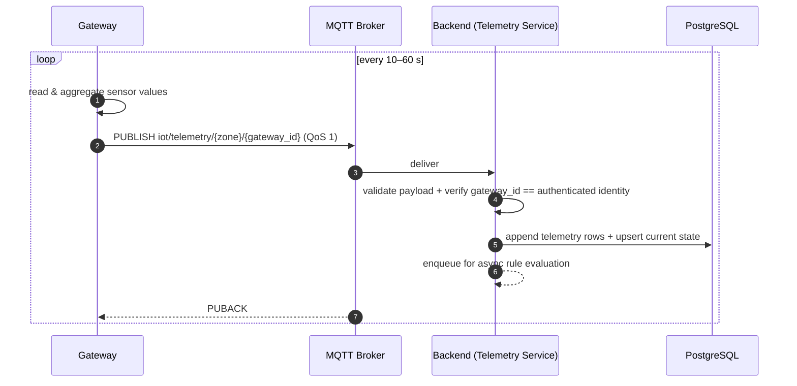

**Topic:** `iot/telemetry/office_1/OFFICE1_NODE_01`

**Payload** (data-spec MQTT format — `snake_case`, `sensors[]`):
```json
{
  "timestamp": "2026-06-21T20:39:36Z",
  "zone": "office_1",
  "gateway_id": "OFFICE1_NODE_01",
  "sensors": [
    { "id": "OFFICE1_TEMP_01", "type": "temp",  "value": 25.8, "unit": "C" },
    { "id": "OFFICE1_HMID_01", "type": "hmid",  "value": 60.5, "unit": "%" },
    { "id": "OFFICE1_SMKE_01", "type": "smoke", "value": false }
  ]
}
```

Rules:
- Numeric sensors (`temp`, `hmid`, `light`) carry a numeric `value` + `unit`.
- Boolean sensors (`smoke`, `open`) carry a boolean `value` and **omit** `unit`.
- `gateway_id` **must equal the authenticated device identity** — a mismatch is rejected (the backend re-validates even though the broker ACL already checks).
- Implausible timestamps (far future / far past) are rejected as stale-replay. Keep the device clock synced (NTP).

---

### Flow 5 — Telemetry HTTP fallback

Used **only** when MQTT/the broker is unavailable. Same data, **different wire format** (REST/`camelCase`/`readings[]`) — see ⚠️ §8.1.

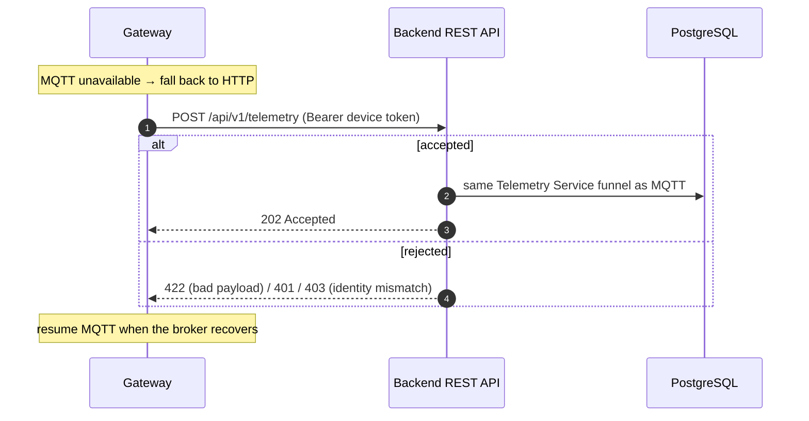

**Request body** (OpenAPI `TelemetryBatch` — note `camelCase`, `readings[]`, `valueNum`/`valueBool`):
```json
{
  "gatewayId": "OFFICE1_NODE_01",
  "zone": "office_1",
  "readings": [
    { "sensorId": "OFFICE1_TEMP_01", "sensorType": "temp",  "valueNum": 25.8, "unit": "C", "ts": "2026-06-21T20:39:36Z" },
    { "sensorId": "OFFICE1_SMKE_01", "sensorType": "smoke", "valueBool": false,           "ts": "2026-06-21T20:39:36Z" }
  ]
}
```

> Exactly **one** of `valueNum` / `valueBool` per reading — sending both → `422`. `gatewayId` must match the token identity → else `403`.

---

### Flow 6 — Heartbeat (MQTT)

Every device periodically reports liveness + basic health.

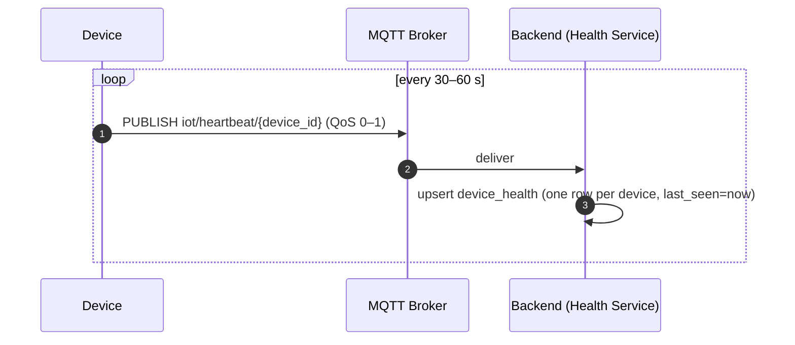

**Topic:** `iot/heartbeat/OFFICE1_NODE_01`

**Payload:**
```json
{
  "device_id": "OFFICE1_NODE_01",
  "timestamp": "2026-06-21T20:39:36Z",
  "status": "ONLINE",
  "firmware_version": "1.2.0",
  "memory_usage_pct": 43,
  "cpu_usage_pct": 21,
  "wifi_rssi": -58
}
```

> The backend keeps only the **latest** health row per device, not every heartbeat. `wifi_rssi` is dBm (negative; closer to 0 = stronger). `*_pct` are 0–100.

---

### Flow 7 — Heartbeat HTTP fallback

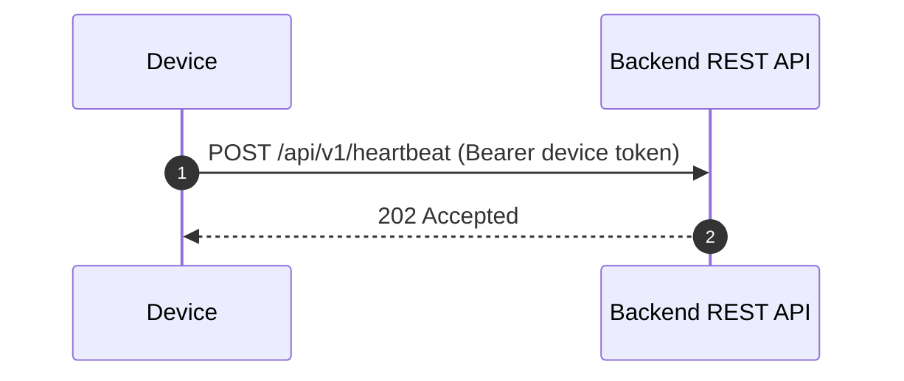

**Request body** (OpenAPI `HeartbeatRequest`, `camelCase`):
```json
{
  "deviceId": "OFFICE1_NODE_01",
  "memoryUsagePct": 43,
  "cpuUsagePct": 21,
  "wifiRssi": -58
}
```

> `deviceId` must match the authenticated identity → else `403`. (REST heartbeat omits `timestamp`/`status`/`firmwareVersion`; the server stamps its own `lastSeen`.)

---

### Flow 8 — Presence / offline detection (Last Will)

The device does nothing extra at runtime; the broker fires the will the device registered at connect (Flow 3) if the connection drops without a clean `DISCONNECT`.

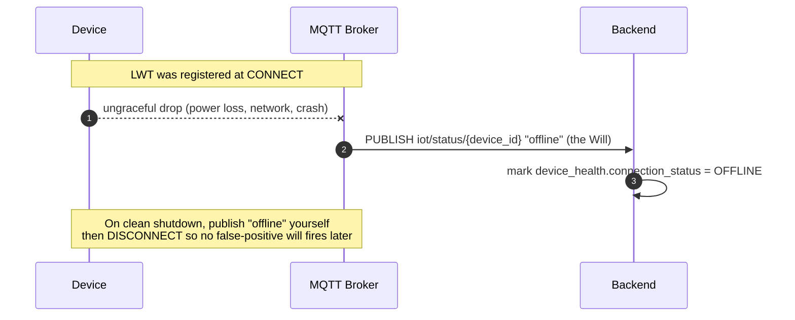

**Presence payload** (⚠️ exact body not pinned by the data spec — §8.6; recommended shape):
```json
{
  "device_id": "OFFICE1_NODE_01",
  "status": "OFFLINE",
  "timestamp": "2026-06-21T20:41:00Z"
}
```

---

### Flow 9 — Command receive + acknowledge lifecycle (actuators)

The central actuator flow. The backend (operator or rule engine) issues a command; the device acks **twice**: once on receipt (`RECEIVED`), once on outcome (`SUCCESS`/`FAILED`).

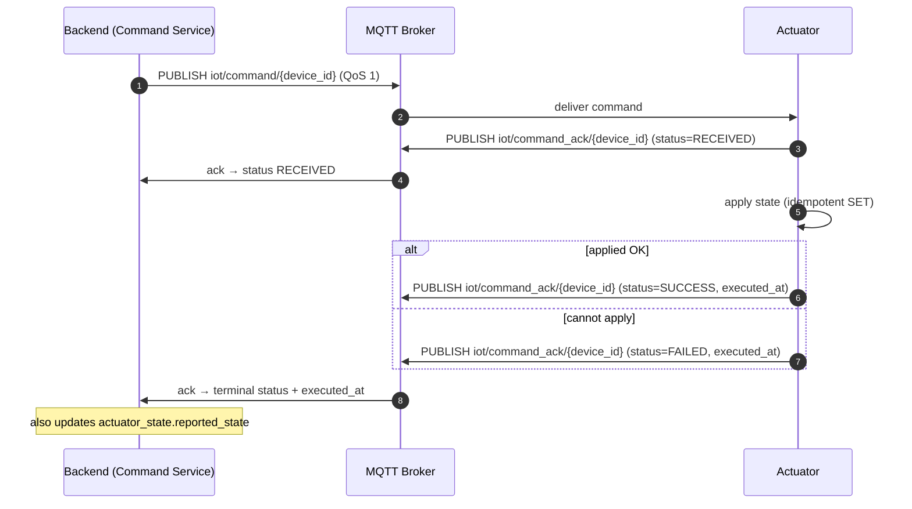

**Command received** on `iot/command/AC_01`:
```json
{
  "command_id": "CMD_21062026_036",
  "target_id": "AC_01",
  "type": "ac",
  "action": "SET",
  "parameters": { "status": "ON", "set_temp": 24 }
}
```

**Ack #1 — receipt** on `iot/command_ack/AC_01`:
```json
{
  "command_id": "CMD_21062026_036",
  "device_id": "AC_01",
  "status": "RECEIVED"
}
```

**Ack #2 — outcome** on `iot/command_ack/AC_01`:
```json
{
  "command_id": "CMD_21062026_036",
  "device_id": "AC_01",
  "status": "SUCCESS",
  "executed_at": "2026-06-21T20:40:00Z"
}
```

> The `RECEIVED` ack is optional-but-recommended (it lets the backend distinguish "delivered but not yet executed" from "never arrived"). The **terminal** ack (`SUCCESS`/`FAILED`) is mandatory and **must** include `executed_at`. On `FAILED`, you may add a `reason` string (⚠️ not in the base spec — §8.7).

---

### Flow 10 — Command redelivery & idempotency (dedup)

MQTT QoS 1 is **at-least-once** — the same command may arrive twice. Commands are absolute state-sets (`SET status=ON`, never `TOGGLE`), so re-applying is harmless, but you must still **dedupe on `command_id`** to avoid re-acking / re-actuating noise.

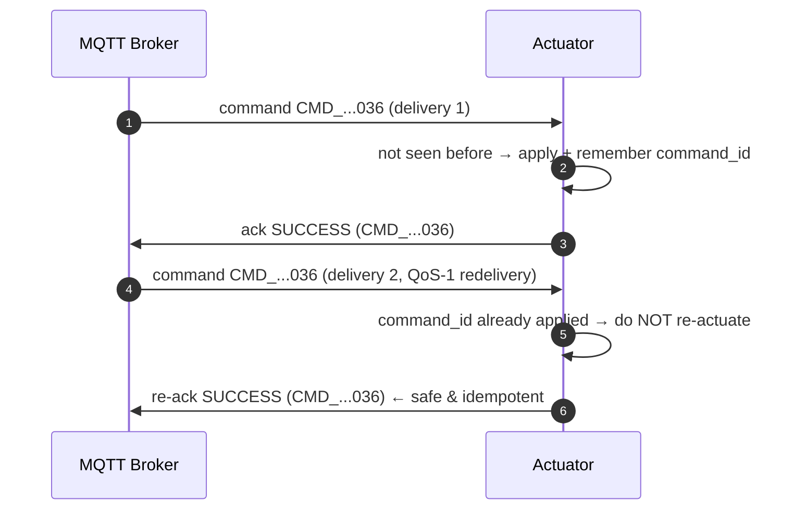

Firmware requirements:
- Keep a small **recently-seen `command_id`** cache (LRU is fine).
- A repeat `command_id` → skip actuation, re-send the same terminal ack.
- Design every action as a state-set so even a missed dedup is benign.

---

### Flow 11 — Command timeout (server-side sweeper)

If the device never acks, the **backend** ages the command to `TIMEOUT`. The device doesn't implement the timer, but must understand the consequence: a late ack may arrive for a command the backend already considers `TIMEOUT`.

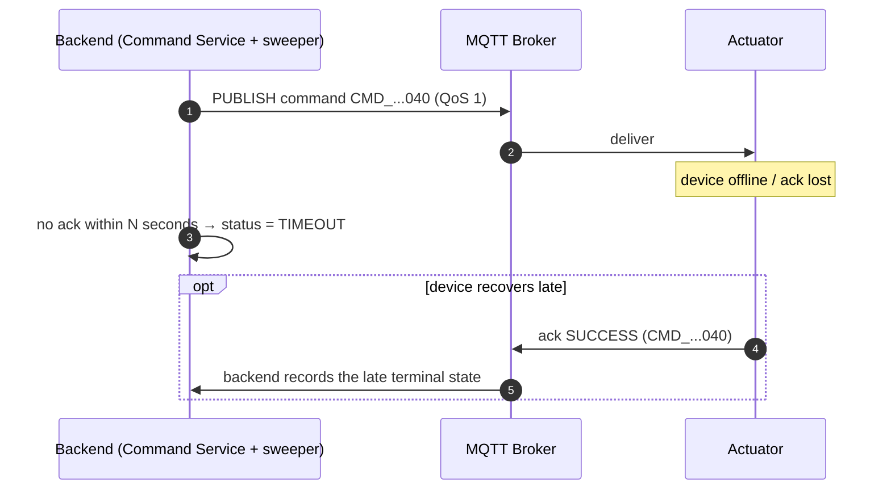

> Always send the terminal ack even if you suspect you're late — it lets the backend reconcile actual hardware state. Don't silently drop a command you executed.

---

### Flow 12 — Token expiry & re-authentication

Tokens live ~1 h. Refresh **before** expiry to avoid a window where publishes/commands are refused.

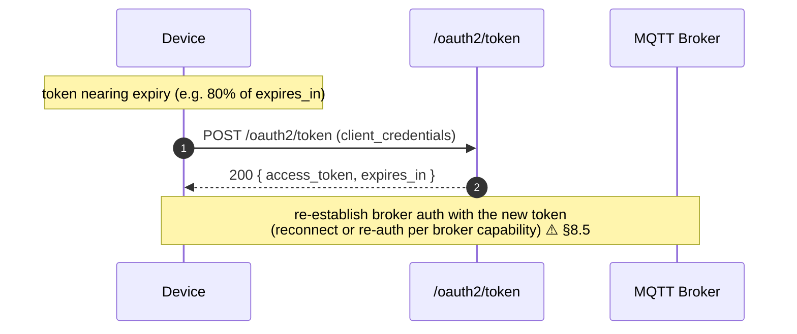

> Devices use **client-credentials** — there is **no refresh-token** flow for devices (that's for human users). Re-auth = repeat Flow 2 with the stored secret.

---

### Flow 13 — Reconnect with persistent session

On any disconnect, reconnect with backoff. Because the session is persistent (`cleanSession=false`), the broker queues QoS-1 commands issued while the actuator was briefly away and delivers them on reconnect.

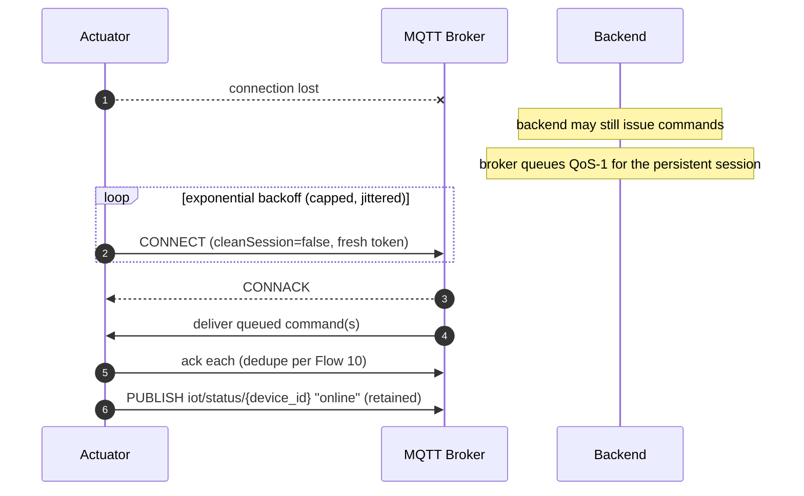

> Backoff must be **bounded and jittered** so a broker restart doesn't cause a thundering-herd reconnect from the whole fleet.

---

### Flow 14 — Credential rotation (with grace window)

An admin can mint a new secret. The **old secret stays valid during a grace window** so the device isn't locked out mid-roll.

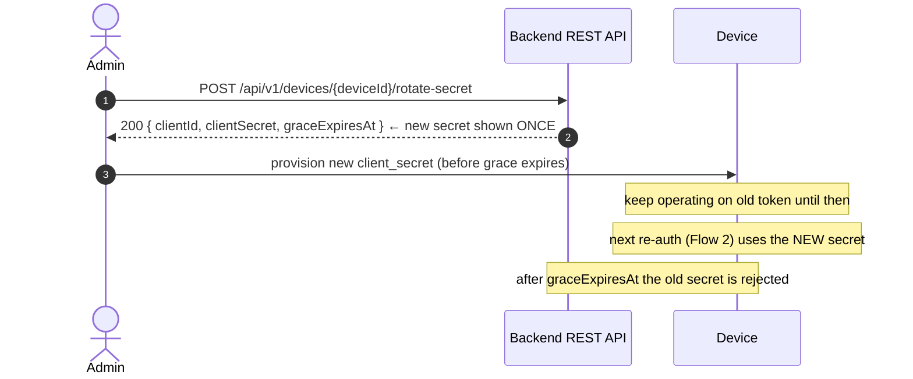

> Firmware should make the stored secret **field-updatable** and re-auth cleanly with the new value. Every rotation is audited server-side.

---

### Flow 15 — End-to-end safety scenario (smoke → exhaust ON)

How the pieces combine in the highest-priority path. Shows the gateway, the rule engine, and the actuator the firmware team owns.

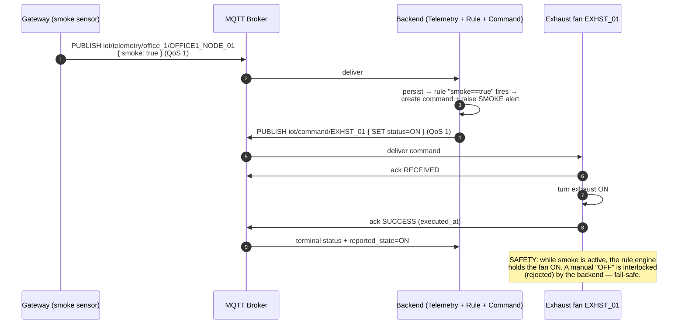

**Triggering telemetry** (boolean sensor, `value: true`, no `unit`):
```json
{
  "timestamp": "2026-06-21T20:39:36Z",
  "zone": "office_1",
  "gateway_id": "OFFICE1_NODE_01",
  "sensors": [
    { "id": "OFFICE1_SMKE_01", "type": "smoke", "value": true }
  ]
}
```

**Command to the exhaust fan** (`iot/command/EXHST_01`):
```json
{
  "command_id": "CMD_21062026_077",
  "target_id": "EXHST_01",
  "type": "exhst_fan",
  "action": "SET",
  "parameters": { "status": "ON" }
}
```

> Safety contract for actuator firmware: on **comms loss**, adopt the **safe default** for your device class (fail-safe, not fail-open) rather than silently dropping a safety action. Confirm the safe default per device class with the backend team (§8.8).

---

### Flow 16 — Operator manual control (for context)

A human operator drives the same actuator through the **same** command pipeline — the device sees no difference vs a rule-issued command. Included so firmware engineers understand there is exactly **one** command/ack contract regardless of who issued it.

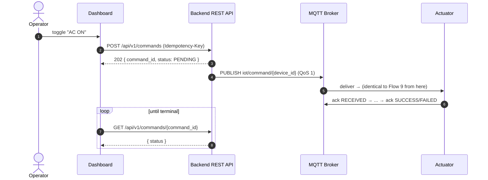

> Device side: **no special handling**. A manual command and a rule command are byte-identical on `iot/command/{device_id}`. Implement Flow 9 once.

---

## 4. Message body reference

All MQTT bodies are `snake_case` (data spec). REST bodies are `camelCase` (OpenAPI).

### 4.1 Telemetry (MQTT) — `iot/telemetry/{zone}/{gateway_id}`

| Field | Type | Req | Notes |
|-------|------|-----|-------|
| `timestamp` | string (ISO-8601 UTC) | ✓ | device capture time |
| `zone` | string | ✓ | e.g. `office_1` |
| `gateway_id` | string | ✓ | must equal authenticated identity |
| `sensors` | array | ✓ | ≥1 reading |
| `sensors[].id` | string | ✓ | sensor id (`<ZONE>_<TYPE>_<INDEX>`) |
| `sensors[].type` | string | ✓ | `temp`/`hmid`/`smoke`/`light`/`open` |
| `sensors[].value` | number \| boolean | ✓ | numeric for temp/hmid/light, boolean for smoke/open |
| `sensors[].unit` | string | numeric only | `C`, `%`, `lux` — omit for boolean |

### 4.2 Command (MQTT) — `iot/command/{device_id}`

| Field | Type | Req | Notes |
|-------|------|-----|-------|
| `command_id` | string | ✓ | dedupe key (Flow 10) |
| `target_id` | string | ✓ | your `device_id` |
| `type` | string | ✓ | device type: `light`/`ac`/`exhst_fan`/`curtain` |
| `action` | string | ✓ | currently always `SET` |
| `parameters` | object | ✓ | per device type — §5 |

### 4.3 Command ack (MQTT) — `iot/command_ack/{device_id}`

| Field | Type | Req | Notes |
|-------|------|-----|-------|
| `command_id` | string | ✓ | echoes the command |
| `device_id` | string | ✓ | your id |
| `status` | enum | ✓ | `RECEIVED` (interim) or `SUCCESS`/`FAILED` (terminal) |
| `executed_at` | string (ISO-8601) | terminal only | required on `SUCCESS`/`FAILED` |
| `reason` | string | optional | failure detail ⚠️ §8.7 |

### 4.4 Heartbeat (MQTT) — `iot/heartbeat/{device_id}`

| Field | Type | Req | Notes |
|-------|------|-----|-------|
| `device_id` | string | ✓ | |
| `timestamp` | string (ISO-8601) | ✓ | |
| `status` | string | ✓ | `ONLINE` |
| `firmware_version` | string | ✓ | |
| `memory_usage_pct` | integer 0–100 | ✓ | |
| `cpu_usage_pct` | integer 0–100 | ✓ | |
| `wifi_rssi` | integer (dBm, negative) | ✓ | |

### 4.5 Token request/response — `POST /oauth2/token`
See Flow 2. Request: `grant_type`, `client_id`, `client_secret`, optional `scope`. Response: `access_token`, `token_type`, `expires_in`, `scope`.

### 4.6 Presence / LWT — `iot/status/{device_id}`
⚠️ Body not pinned by the data spec. Recommended: `device_id`, `status` (`OFFLINE`/`ONLINE`), `timestamp`. Confirm in §8.6.

---

## 5. Command contracts per device type

`action` is `SET` for all current types. `parameters` are **whitelisted** by the backend — unknown actions/params are rejected (`422`) before they reach the device, but firmware should also validate defensively and `FAILED`-ack anything it can't honour.

### 5.1 Light (`type: "light"`)
| Param | Type | Values | Notes |
|-------|------|--------|-------|
| `status` | string | `ON` / `OFF` | required |
| `level` | integer | e.g. 0–100 or 1–N | ⚠️ optional dimming — appears in `actuator_state.attributes` examples but not pinned for commands; confirm §8.9 |

```json
{ "command_id": "CMD_...", "target_id": "LIGHT_001", "type": "light", "action": "SET", "parameters": { "status": "ON" } }
```

### 5.2 Air conditioner (`type: "ac"`)
| Param | Type | Values | Notes |
|-------|------|--------|-------|
| `status` | string | `ON` / `OFF` | required |
| `set_temp` | number | bounded setpoint (e.g. 16–30 °C) | ⚠️ confirm exact bounds §8.9 |
| `mode` | string | `COOL`/`HEAT`/`DRY`/`FAN`/`AUTO` | optional |

```json
{ "command_id": "CMD_...", "target_id": "AC_01", "type": "ac", "action": "SET", "parameters": { "status": "ON", "set_temp": 24, "mode": "COOL" } }
```

### 5.3 Exhaust fan (`type: "exhst_fan"`) — safety actuator
| Param | Type | Values | Notes |
|-------|------|--------|-------|
| `status` | string | `ON` / `OFF` | required; subject to safety interlock — a rule may hold it `ON` |

```json
{ "command_id": "CMD_...", "target_id": "EXHST_06", "type": "exhst_fan", "action": "SET", "parameters": { "status": "ON" } }
```

### 5.4 Curtain (`type: "curtain"`)
| Param | Type | Values | Notes |
|-------|------|--------|-------|
| `direction` | string | `UP` / `DOWN` / `STOP` | per data spec §17 |

⚠️ The API/system-design docs reference `OPEN`/`CLOSED` for curtains instead of `UP`/`DOWN`/`STOP`. These are inconsistent — **do not implement either until confirmed** (§8.3).

```json
{ "command_id": "CMD_...", "target_id": "CURT_018", "type": "curtain", "action": "SET", "parameters": { "direction": "DOWN" } }
```

---

## 6. Reference tables

### 6.1 Naming conventions
| Entity | Pattern | Example |
|--------|---------|---------|
| Sensor | `<ZONE>_<TYPE>_<INDEX>` | `OFFICE1_TEMP_01` |
| Gateway | `<ZONE>_NODE_<INDEX>` | `OFFICE1_NODE_01` |
| Actuator | type-prefixed id | `LIGHT_001`, `AC_01`, `EXHST_06`, `CURT_018` |

### 6.2 Zones
`pantry`, `storage`, `prvt_meeting`, `office_1`, `office_2`, `lobby`, `connect`, `director`, `finance_mng`, `meeting`, `technical_mng`, `vice_director`.

### 6.3 HTTP error responses (fallback paths)
All REST errors share one shape:
```json
{
  "timestamp": "2026-06-21T20:39:36Z",
  "status": 403,
  "error": "Forbidden",
  "code": "ACCESS_DENIED",
  "message": "Insufficient permissions",
  "path": "/api/v1/telemetry"
}
```

| Code | When the device sees it | Firmware response |
|------|-------------------------|-------------------|
| `401` | token missing/expired/invalid | re-auth (Flow 12), retry |
| `403` | identity mismatch (`gateway_id`/`device_id` ≠ token) or suspended | fix payload identity; if suspended, stop and alert ops |
| `422` | malformed payload, both `valueNum`+`valueBool`, stale timestamp | fix payload; sync clock |
| `429` | rate limit exceeded | back off (see §6.4) |

### 6.4 Rate limits (REST)
| Endpoint class | Limit |
|----------------|-------|
| Device APIs (telemetry/heartbeat fallback) | 300 req/min |
| Authentication (`/oauth2/token`) | 20 req/min |

> Exceeding → `429`. Respect backoff; the auth limit is tight, so cache tokens and refresh on schedule rather than per-publish.

---

## 7. Firmware implementation checklist

**Provisioning & auth**
- [ ] Store `client_id` / `client_secret` in secure non-volatile storage; secret is field-updatable (rotation).
- [ ] Obtain token via `POST /oauth2/token`; cache it; refresh at ~80% of `expires_in`.
- [ ] Honour the **granted** scope set, not the requested one.
- [ ] Back off on `401`/`403`/`429`; never hammer the auth endpoint (20/min).

**Connection**
- [ ] MQTTS only (TLS 1.2+); validate the broker certificate.
- [ ] `cleanSession=false` (persistent session) — actuators especially.
- [ ] Register LWT on `iot/status/{device_id}` at connect; publish "online" after CONNACK.
- [ ] Bounded, jittered reconnect backoff.
- [ ] NTP-synced clock (timestamps are validated for skew).

**Telemetry (gateways)**
- [ ] Publish aggregated `sensors[]` to `iot/telemetry/{zone}/{gateway_id}` at QoS 1, every 10–60 s.
- [ ] Numeric sensors carry `value`+`unit`; boolean sensors carry boolean `value`, no `unit`.
- [ ] `gateway_id` in the body equals your authenticated identity.
- [ ] HTTP fallback (`POST /api/v1/telemetry`) implemented in the **camelCase/`readings[]`** format ⚠️ §8.1.

**Heartbeat**
- [ ] Publish to `iot/heartbeat/{device_id}` every 30–60 s with health metrics.

**Commands (actuators)**
- [ ] Subscribe `iot/command/{device_id}` at QoS 1.
- [ ] Dedupe on `command_id` (recently-seen cache).
- [ ] Treat actions as idempotent state-sets.
- [ ] Send interim `RECEIVED` ack, then mandatory terminal `SUCCESS`/`FAILED` ack with `executed_at`.
- [ ] Defensively validate `parameters`; `FAILED`-ack anything unhonourable.
- [ ] Adopt the fail-safe default on comms loss (per device class — §8.8).

**Lifecycle**
- [ ] Handle suspend/decommission gracefully (auth will start failing).
- [ ] Support clean shutdown: publish "offline" then DISCONNECT.

---

## 8. Open items — confirm with the backend team before freezing firmware

These are genuine inconsistencies or gaps across the source documents. Firmware should not be locked down on a guess for any of them.

1. **§8.1 — MQTT vs HTTP telemetry format mismatch.** MQTT uses `snake_case` with `sensors[{id,type,value,unit}]` and a top-level `timestamp`; the HTTP-fallback `TelemetryBatch` uses `camelCase` with `readings[{sensorId,sensorType,valueNum|valueBool,unit,ts}]`. The OpenAPI claims it "mirrors the MQTT envelope" but it doesn't. **Confirm both formats are intentional, or unify.**
2. **§8.2 — Telemetry topic.** Data spec §10 says `iot/telemetry/{zone}`; system design §6 recommends `iot/telemetry/{zone}/{gateway_id}` for per-gateway ACLs. Confirm which the broker enforces.
3. **§8.3 — Curtain parameters.** `direction: UP/DOWN/STOP` (data spec) vs `OPEN/CLOSED` (API/system design). Pick one.
4. **§8.4 — Command ack timeout `N`.** The sweeper marks `TIMEOUT` after N seconds — value not stated. Confirm so firmware ack latency budgets fit inside it.
5. **§8.5 — MQTT authentication mechanism & port.** How exactly the OAuth2 access token is presented to the broker (username/password fields? client cert?), the MQTTS port, and the re-auth-on-token-refresh behaviour (reconnect vs in-band re-auth) are not pinned.
6. **§8.6 — LWT / presence payload.** No body defined for `iot/status/{device_id}`. Confirm the exact "online"/"offline" payload and whether it's retained.
7. **§8.7 — Failure `reason` field.** Whether the `FAILED` ack may/should carry a `reason` string.
8. **§8.8 — Fail-safe defaults per device class.** What state each actuator type adopts on comms loss (e.g. exhaust fan → ON? light → OFF? curtain → STOP?).
9. **§8.9 — Optional command params & bounds.** Light `level` dimming, AC `set_temp` valid range and `mode` support — confirm which are accepted and their bounds.

---

*End of specification.*
