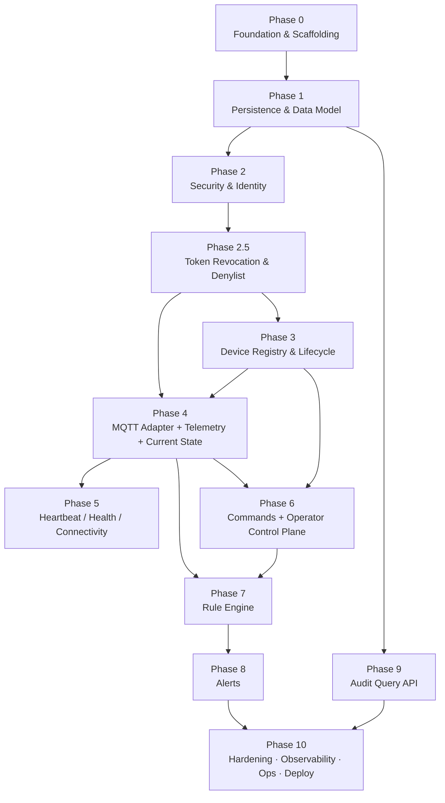

# Office IoT Monitoring & Control — Implementation Plan

**Purpose:** A phase-by-phase build plan for Claude Code, covering everything in the *System Design* and *REST API Design / OpenAPI* documents.
**Target stack:** Spring Boot · PostgreSQL · MQTT (Mosquitto/EMQX) · Spring Security (OAuth2 + JWT) · optional Redis.
**Topology:** Modular monolith, one deployable, extract-ready module seams.

---

## How to use this plan

- Phases are ordered by dependency. **Do not start a phase until the previous one meets its Definition of Done (DoD).** Each phase leaves the system compiling, migrating, and passing its tests.
- Every phase lists: **Goal · Deliverables (what is achieved) · Endpoints/Topics · Modules · Data · Load-bearing decisions to honor · DoD · Tests.**
- The two design documents remain authoritative: the **Data Spec** wins for wire formats; the **System Design** wins for structure/decisions; the **API Design / OpenAPI** wins for REST contracts.
- The **Coverage Matrix** at the end maps every one of the 46 REST operations and every load-bearing decision to a phase — use it to confirm nothing is dropped.

---

## Current implementation status (security audit, 2026-06-26)

A code-vs-design (§7) audit produced this phase-completion snapshot. Each phase header below carries a status badge; full details are in the phase sections.

| Phase | Status | Headline |
|---|---|---|
| **0** Foundation & Scaffolding | ✅ **DONE** | Modular monolith skeleton, RFC 9457 errors, Flyway, OpenAPI, pagination + idempotency infra, common enums all in place. |
| **1** Persistence & Data Model | ✅ **DONE** (core) | All 13 core tables migrated (V1) + V2 added `TECHNICIAN` to the role ladder. Monthly partitioning automated via `PartitionManager`; audit writer (`AuditService.append`) wired and running in `REQUIRES_NEW`. **Design-update delta:** the operator control plane adds a 14th table — `actuator_state` (**V3**, file already in repo) — and an optional `user_zone_grants` (**V4**); both are pure additive `CREATE TABLE`s applied with Phase 6 (§ Phase 6). |
| **2** Security & Identity | ✅ **DONE** | OAuth2 resource server, Argon2id, `@PreAuthorize` + 5-level role hierarchy (SUPER_ADMIN > ADMIN > OPERATOR > TECHNICIAN > VIEWER), refresh-token rotation, device client-credentials with scope intersection, rate-limit filter, security headers. |
| **2.5** Token Revocation & Denylist | ✅ **DONE** | `DenylistJwtValidator` chained for user *and* device tokens; access-`jti` + refresh-hash denylist with TTL = remaining lifetime; refresh-reuse cascade walks `rotated_to`; in-memory ↔ Redis backend flipped by `iot.redis.enabled`. |
| **3** Device Registry & Lifecycle | ✅ **DONE** | Registry CRUD + filters, named lifecycle actions (activate/suspend/decommission) with side effects, write-once credential issue/rotate with grace window, scope replace. Token minting gated on device status (suspend disables / decommission revokes). 8 device `AuditEvent` codes added. |
| **4** MQTT + Telemetry + Current State | ✅ **DONE** | Paho-backed `MqttClientLifecycle` (persistent session, async connect, reconnect + resubscribe) + `TelemetryMqttListener` and `POST /v1/telemetry` share one `TelemetryService` funnel. Ingest-time integrity: JWT-identity re-check (HTTP) / registry gateway cross-check (MQTT), registry-derived sensorType whitelist, valueNum/valueBool XOR, stale-replay skew flagging, per-device telemetry rate-limit key. History (`GET /v1/telemetry`, keyset-cursor paged, bounded window), `GET /v1/current-state`, `GET /v1/sensors/{id}/latest`, `GET /v1/connectivity` (zone roll-up incl. devices with no heartbeat) all live. Rule hand-off is a marked no-op seam pending Phase 7. |
| **5** Heartbeat / Health / Connectivity | ✅ **DONE** | Heartbeat ingest (MQTT `iot/heartbeat/{device_id}` + `POST /v1/heartbeat`) upserts `device_health` through `HealthService`; LWT `iot/status/{device_id}` consumption flips devices `OFFLINE`; telemetry ingest also touches `ONLINE`/`last_seen`. `GET /v1/devices/{deviceId}/health` added; optional staleness sweep implemented. |
| **6** Commands + Operator Control Plane | ✅ **DONE** | `POST /v1/commands` (issue, `Idempotency-Key` required) → `PENDING` + `actuator_state.desiredState` upsert → MQTT publish (`CommandDispatcher`/`MqttCommandDispatcher`) → `202`. `CommandAckMqttListener` correlates `iot/command_ack/{device_id}` → `RECEIVED`/`SUCCESS`/`FAILED`, status-guarded so it can't race the timeout sweeper (`CommandTimeoutSweeper`, `COMMAND_TIMEOUT` audit). Operator control plane: `actuator_state` mirror (V3) live; role×actuator-class authorization (`TECHNICIAN` routine-only, `OPERATOR` safety-ON-only, `ADMIN`/`SUPER_ADMIN` unrestricted) — **zone scoping adopted as global-per-role, V4 `user_zone_grants` skipped**; `409 errors/safety-interlock` seam (`SafetyInterlockCheck`/`NoOpSafetyInterlockCheck`, real enforcement pending Phase 7/8) with audited `SUPER_ADMIN` override; command-parameter whitelist per `device_type` (`light`/`ac`/`exhst_fan`/`curtain`, curtain follows the device-team firmware spec's `UP/DOWN/STOP` over the conflicting API-doc `OPEN/CLOSED`). 5 new `AuditEvent` codes (`COMMAND_ISSUE/EXECUTE/TIMEOUT`, `MANUAL_COMMAND`, `SAFETY_OVERRIDE`). `GET /v1/commands`, `GET /v1/commands/{commandId}`, `GET /v1/actuator-state` (zone/drifted filters), `GET /v1/devices/{deviceId}/actuator-state` all live. |
| **7** Rule Engine | ✅ **DONE** | Safe evaluator is a **hand-rolled tokenizer + recursive-descent parser** (`RuleGrammarParser`) — no SpEL, no scripting engine, no reflection; every accepted token is enumerated by hand, closing the T8 RCE gap. Condition grammar: `zone.sensorType op literal` clauses combined by a single `&&`/`||` (no mixing). Action grammar: `command(...)`/`alert(...)` effects. Validated on every write (`RuleServiceImpl`, `422` with offending token), never on read. Real async pipeline: `QueuedRuleEventPublisher` (replaces the Phase 4 no-op) → bounded `RuleEventQueue` → `RuleEngineWorker` (dedicated thread, `SmartLifecycle`) → `RuleConditionEvaluator` (reads `sensor_latest` via `TelemetryService`) → `RuleActionExecutor` (dispatches through `CommandService.issue`, `AuditLog.ActorType.SYSTEM`, and a new minimal-but-real `AlertService.raise`). Full CRUD (`GET/POST/PUT/PATCH/DELETE /v1/rules`). 4 new `AuditEvent` codes (`RULE_CREATE/UPDATE/PATCH/DELETE`). |
| **8** Alerts | ✅ **DONE** | `AlertService.raise` (built in Phase 7, already real) extended with cursor-paged `list` (filters `status`/`zone`/`severity`/`from`/`to`), `get`, and explicit `acknowledge`/`resolve` transitions — `status` is never directly writable. `POST /v1/alerts/{alertId}:acknowledge` (`OPEN→ACK`) and `:resolve` (`OPEN\|ACK→RESOLVED`) both `409` on an illegal source state via the existing `ApiException.invalidLifecycleTransition`. 2 new `AuditEvent` codes (`ALERT_ACKNOWLEDGE`, `ALERT_RESOLVE`). `GET /v1/alerts`, `GET /v1/alerts/{alertId}` live; response DTO intentionally omits `acknowledgedBy/At`/`resolvedBy/At` (entity tracks them, OpenAPI's `Alert` schema doesn't expose them). |
| **9** Audit Query API | ✅ **DONE** | `AuditService.query` (Specification-based filter + keyset cursor on `(ts, id)`, mirrors `telemetry`/`command`/`alert`'s cursor idioms) added alongside the existing write side. `GET /v1/audit-logs` (`ADMIN`) requires a bounded `from`/`to` window (`audit_logs` is partitioned by `ts` — same mandatory-window rule as telemetry), filters `actor`/`actorType`/`event`/`target`. No write endpoint. |
| **10** Hardening / Observability / Ops / Deploy | 🟡 **APP-SIDE DONE, INFRA DOCUMENTED** | Redis-backed rate limiting, asymmetric JWT `kid`-rollover + JWKS endpoint, Micrometer/Prometheus metrics + liveness/readiness probes, and real detection→alert wiring (auth-failure burst, refresh-reuse, rate-limit spike, `403` spike, command-timeout burst, safety-sensor telemetry gap) are all built and tested. Broker HA, per-device broker ACLs, encryption-at-rest/backups, least-privilege DB/network isolation, privacy classification, and the device-compromise runbook are written up in a new ops runbook doc, not provisioned (needs real infra this repo can't stand up). NFR load testing and CI security gates (SAST/secret-scanning) explicitly **not done** — out of scope per this pass. |

### Security items already satisfied (do not re-do)

- Argon2id (Spring Security `delegatingPasswordEncoder` default) — `SecurityConfig.java`.
- Refresh-token server-side hashed store with **rotation + reuse cascade + descendant revoke** — `AuthServiceImpl.java`.
- One `OAuth2TokenValidator<Jwt>` chained into the decoder so **both user *and* device tokens** flow through the denylist — `DenylistJwtValidator.java`, `SecurityConfig.java`.
- Random `jti` on every access token + SHA-256 refresh hashes with **TTL = remaining lifetime** in `InMemoryTokenDenylist` / `RedisTokenDenylist`.
- Rate-limit filter (User 100/min, Device 300/min, Auth 20/min, Telemetry 600/min configurable) — `RateLimitFilter.java`. Backend is in-memory now; Redis swap deferred to Phase 10.
- Security headers (HSTS 2y, X-Content-Type-Options, X-Frame-Options deny, CSP `default-src 'self'`) — `SecurityConfig.java`.
- Append-only `audit_logs` partitioned writer in a separate `REQUIRES_NEW` transaction — `AuditServiceImpl.java`.
- `IdempotencyService` (24h replay store) ready for Phase 3 credential/issue endpoints and Phase 6 command issue.

### Outstanding security gaps that block "production-ready"

Ordered by safety-blast-radius (worst first); each maps to its phase below.

1. **No telemetry ingest integrity (T1 spoofing).** No payload-identity re-validation, no server-side received-timestamp / stale-replay detection, no per-device ingest rate limit. → **Phase 4**.
2. **No command safety loop (T2 tamper / T3 suppression).** No ack correlation, no timeout sweeper, no command-suppression detection signal, no documented fail-safe actuator default. → **Phase 6** + **Phase 10**.
   2b. **No operator-control authorization or safety interlock (T4 EoP / safety).** The operator control plane (design update — system design §5.8/§7, API §6/§8) is unbuilt: no role+zone command authorization matrix, no `409` `safety-interlock` rejecting a manual command that contradicts an active safety rule, no audited `SUPER_ADMIN` `override`, no `MANUAL_COMMAND`/`SAFETY_OVERRIDE` audit events, no `actuator_state` desired-vs-reported mirror. → **Phase 6** (interlock needs the rule/alert state from **Phase 7/8** to be fully enforceable — see Phase 6 note).
3. **No safe rule evaluator (T8 RCE).** `rules.condition` / `rules.action` are TEXT with nothing reading them — but the moment Phase 7 wires evaluation, it **must** use locked-down SpEL or a custom DSL with write-time validation. **Never `eval`.** → **Phase 7**.
4. **No broker authorization.** Per-`device_id` topic ACL enforcement is a broker-side config that depends on Phase 4 topic shape and Phase 10 broker setup. Until then, device identity on the broker is unverified. → **Phase 4** (topics) + **Phase 10** (ACLs).
5. **No detection / incident response.** Audit records exist but no alerting on auth-failure bursts, refresh-reuse cascade triggers, broker ACL denials, command anomalies, telemetry gaps, or `403`/`429` spikes. → **Phase 10**.
6. **`AuditEvent` catalog is incomplete.** Today it covers user/auth/partition only. Add device-register/-delete, credential-rotate, command-issue/-execute, **`MANUAL_COMMAND` / `SAFETY_OVERRIDE`** (operator control), rule-change, alert-acknowledge/-resolve, role-grant (and `ZONE_GRANT`/`ZONE_REVOKE` if zone grants are adopted) codes as each phase lands them. `audit_logs.event` is free-form `VARCHAR(64)`, so these need no migration. → **Phase 3 → 8**.
7. **Rate-limit counters still in-memory.** Fine for single-instance; **swap to Redis-backed before any horizontal scale-out** so limits are global, not per-instance. → **Phase 10**.
8. **JWT signing key is a single shared HMAC in `JWT_SECRET` env var.** §7 secrets table mandates KMS-managed signing key, **scheduled rotation**, and **key-rollover with a `kid` claim** so an emit/verify mix during rollover stays valid. Today there is no `kid`, no JWKSet, no rotation procedure. → **Phase 10** (with Phase 2 carry-over flag).
9. **No DB encryption at rest, no encrypted-and-restore-tested backups.** §7 checklist line 9; nothing in `application-prod.yaml` or Compose configures this. → **Phase 10**.
10. **No CI security gates (SCA + SAST + secret scanning).** §7 calls for gitleaks/trufflehog + SAST gating merges. Current pipeline (per Phase 0 status) is build + test + style only. → **Phase 10**.
11. **No least-privilege DB user and no network-isolation contract.** §7 trust-boundary control for `Backend → DB / Secrets`; the Compose stack runs as a single privileged role. → **Phase 10**.
12. **TLS / DB / broker credentials still come from env files in prod.** §7 secrets table requires KMS injection at runtime; reconcile alongside item 8. → **Phase 10**.
13. **Command-parameter whitelist not explicit.** §7 input-validation table requires whitelist of allowed actions/params and a `422` for non-actuator/decommissioned targets; Phase 6 covers idempotent state-sets but the whitelist itself is implicit. → **Phase 6**.
14. **Telemetry ingest does not yet reject unknown sensor types.** §7 input-validation table requires it at the single ingest funnel; today the funnel doesn't exist. → **Phase 4**.
15. **Device JWTs must explicitly 403 on user/admin endpoints (T4 "devices ingest-only").** Today `@PreAuthorize` only covers `/users`; once Phase 3+ endpoints land, every admin/operator endpoint must reject device-issued tokens (e.g. by requiring `ROLE_USER` *and* checking no device scope, or by gating on `actorType=USER`). → **Phases 3 → 8** + checklist gate in Phase 10.
16. **Privacy: occupancy data is sensitive but not labeled or access-controlled as such.** §7 OWASP IoT mapping treats presence/occupancy readings as sensitive. No data-classification or retention/redaction policy for these readings exists. → **Phase 10** policy + targeted controls earlier if a `VIEWER` role gets broad telemetry access.

---

### Non-negotiable invariants (apply in every phase)
1. **No persistence detail on the wire** — never expose `passwordHash`, `clientSecretHash`, raw partition row PKs (`telemetry.id`), or internal IDs. DTOs only.
2. **JSON is camelCase; timestamps are ISO-8601 UTC; IDs are opaque strings.**
3. **One error shape everywhere** — RFC 9457 Problem Details. Never return `200` with an error body.
4. **Module boundaries are real** — modules talk through service interfaces, never each other's repositories. Only `telemetry`, `command`, `audit`, `health` own write access to their own tables. The `rules → command/alert` hop goes through a published interface.
5. **RBAC + scopes enforced at the edge** — `@PreAuthorize` on every endpoint per the contract; device endpoints gated by scope.
6. **Reads of partitioned tables (`telemetry`, `audit_logs`) require a bounded time window** — reject unbounded/oversized queries with `422`.
7. **Security-relevant actions are audited** — login, device register/delete, credential rotation, rule change, command execution, **manual operator command (`MANUAL_COMMAND`) and safety override (`SAFETY_OVERRIDE`)**, role change.

### Definition-of-Done template (every phase)
- Code compiles; app boots on the `local` profile against Docker Compose.
- DB migrations apply cleanly forward (and are reversible or forward-fix documented).
- Unit tests for service logic + integration tests (Testcontainers: Postgres, and MQTT broker where relevant) green.
- New endpoints match the OpenAPI contract (status codes, DTO shapes, role/scope gates) — verified by contract tests.
- New security-relevant actions write audit entries.
- OpenAPI doc regenerated; no contract drift.

---

## Phase dependency overview

---

## Phase 0 — Foundation & Scaffolding · ✅ DONE

**Goal:** A running, empty modular monolith with the package seams, build, local infra, and cross-cutting plumbing in place — so every later phase only adds domain logic.

**Deliverables (what is achieved)**
- Spring Boot app skeleton with build tooling (Gradle or Maven), pinned Java LTS version, dependency management.
- **Package structure created exactly per System Design §9** — one package per module, each a future extract seam:
  `api`, `security/user`, `security/device`, `mqtt`, `registry`, `telemetry`, `rules`, `command`, `alert`, `audit`, `health`, `common`.
- Spring profiles: `local`, `test`, `prod`. Externalized config; no secrets in source.
- **Docker Compose** for local dev: PostgreSQL, an MQTT broker (Mosquitto for dev), and Redis (off by default, profile-gated).
- Migration framework wired (Flyway or Liquibase) with an empty baseline migration that applies.
- **RFC 9457 error handling shell** — `@RestControllerAdvice` mapping validation/auth/conflict/not-found to Problem Details with `type`, `title`, `status`, `detail`, `instance`, `errors[]`. Stack traces never leaked.
- **Cross-cutting conventions wired once:** camelCase JSON (Jackson config), ISO-8601 UTC serialization, global `/api/v1` base path, pagination envelope types (`CursorPage`, `OffsetPage`) and `PagedResponse<T>`, `Idempotency-Key` handling infrastructure (24 h replay store).
- OpenAPI/Swagger generation enabled and served; CI skeleton (build + test) and code-style/formatting check.
- `common/` utilities: shared enums (`Role`, `UserStatus`, `DeviceCategory`, `DeviceStatus`, `CommandStatus`, `AlertStatus`, `Severity`, `ActorType`), validation helpers, time/partitioning helpers.

**Endpoints/Topics:** none yet (a liveness/readiness probe under `health/` infra is fine).
**Modules:** all packages created; `common`, `api` error layer populated.
**Load-bearing decisions to honor:** modular-monolith layout (§5.1, §9); one error shape (API §1); URI versioning `/v1/`.
**DoD:** app boots, empty migration applies, error handler returns Problem Details for a forced error, OpenAPI UI renders, CI green.
**Tests:** context-loads test; one Problem-Detail mapping test; JSON casing/date serialization test.

---

## Phase 1 — Persistence & Data Model · ✅ DONE

**Goal:** The complete schema from System Design §4, including time partitioning and retention, plus the cross-cutting **audit writer** that later phases depend on.

> **Status note (2026-06-26):** `V1__init_schema.sql` ships all 13 tables plus the partitioned `telemetry` and `audit_logs`. `PartitionManager` pre-creates and drops partitions on a schedule. The audit writer (`AuditService` / `AuditServiceImpl`) runs in `REQUIRES_NEW`. **Carry-over:** the `AuditEvent` catalog currently lists only user/auth/partition codes — device, credential, command, rule, and alert codes must be added as their owning phases land (see Phases 3 / 6 / 7 / 8).

**Deliverables (what is achieved)**
- **Migrations for all 13 tables:** `users`, `refresh_tokens`, `devices`, `device_credentials`, `device_scopes`, `device_health`, `sensors`, `telemetry`, `sensor_latest`, `commands`, `rules`, `alerts`, `audit_logs`.
- **Range partitioning by month** for `telemetry` and `audit_logs`; automated partition creation (pg_partman or a scheduled job in `common`).
- **Retention job** that drops old partitions (metadata op, not `DELETE`) — wired but driven by config (horizon TBD per Open Question #1; default conservative).
- **Indexes that matter:** `telemetry (sensor_id, ts DESC)` and `(zone, ts DESC)`; appropriate unique/lookup indexes on `users.username`, `device_credentials.client_id`, FKs. Deliberately **no FK from `telemetry` to `devices`** (append-only fact log — §4).
- JPA entities + repositories per module, **respecting write-ownership** (only owning module writes its tables).
- **`sensor_latest`** and **`device_health`** modeled as single-row-per-key upsert targets (current state), separate from history.
- **Audit module writer:** an internal `AuditService` append API (actor, actorType, event, target, detail JSON, ip) writing to partitioned `audit_logs`. Available to all modules from here on. (Query API comes in Phase 9.)
- Seed/dev-fixture loader for `local` (a few zones, devices, one admin user) to make later phases testable.

**Endpoints/Topics:** none.
**Modules:** all repositories; `audit` (writer half).
**Data:** entire ER model (§4).
**Load-bearing decisions to honor:** Postgres-for-everything + monthly partitioning + drop-don't-delete retention (§5.2); current-state vs history split (§5.3, §4); telemetry has no device FK; refresh tokens stored hashed server-side; one-row-per-device health (not per-heartbeat).
**DoD:** migrations apply; partitions auto-create for current + next month; retention job dry-run logs the drop set; entities round-trip in repository tests; audit writer persists an entry.
**Tests (Testcontainers Postgres):** migration apply test; partition routing test (insert into `telemetry` lands in correct partition); index presence assertions; audit-writer integration test.

---

## Phase 2 — Security & Identity · ✅ DONE

**Goal:** Working authentication, RBAC, device tokens, rate limiting, and the user-admin CRUD surface. After this, every later endpoint can be gated correctly.

> **Status note:** Login / refresh (with rotation) / logout, `/oauth2/token` client-credentials with scope intersection, user CRUD with authority ceiling, rate-limit filter, security headers, and Argon2id are all in place. **Resolved (2026-06-30):** `V2__add_technician_role.sql` introduced a fifth role `TECHNICIAN`, slotted between `OPERATOR` and `VIEWER`. The design docs (system design §0/§7, API design §0/§3/§8, OpenAPI `Role` enum + ladder prose, DB design `users.role` CHECK) have been reconciled to the 5-role ladder `SUPER_ADMIN > ADMIN > OPERATOR > TECHNICIAN > VIEWER`. `TECHNICIAN` = read all state + command **routine** actuators in permitted zones (diagnostics/testing); **no** safety actuators, **no** override; still subject to the safety interlock. `Role.java` remains the single source of truth. **Carry-overs to Phase 10:** (a) rate-limit counters are in-memory (`InMemoryRateLimiter`); flipping to Redis. (b) JWT signing key is a single shared HMAC sourced from the `JWT_SECRET` env var — §7 mandates KMS-managed signing key with **scheduled rotation and a `kid` claim for key-rollover**; this entails moving to asymmetric keys (e.g. RSA/ECDSA), publishing a JWKSet, and adding `kid` to every issued token + the validator chain. (c) Every endpoint added in Phases 3 → 8 must enforce **devices-ingest-only** (T4) — operator/admin endpoints must reject device JWTs, not just under-privileged users.

**Deliverables (what is achieved)**
- **Spring Security + OAuth2 Resource Server** validating JWTs; method-level `@PreAuthorize` with role hierarchy `SUPER_ADMIN > ADMIN > OPERATOR > TECHNICIAN > VIEWER` (5-level; `TECHNICIAN` added in `V2`).
- **User auth flow:**
  - `POST /v1/auth/login` → access (1 h) + refresh (30 d) tokens, `role` in response.
  - `POST /v1/auth/refresh` → **rotate** refresh token (revoke old, issue new), mint access; reuse of revoked token → `401` `errors/token-revoked`.
  - `POST /v1/auth/logout` → revoke presented refresh token (`204`).
  - Passwords hashed with **Argon2id** (BCrypt acceptable fallback); refresh tokens stored **hashed** in `refresh_tokens`, revocable.
  - Bad credentials → `401` (never `403`, never 200-with-error).
- **Device auth:** `POST /v1/oauth2/token` client-credentials grant; secret verified against hash; **granted scopes = intersection(stored, requested)**; scopes `telemetry:publish`, `heartbeat:publish`, `command:subscribe`, `command:ack`.
- **Rate limiting filter:** User 100/min, Device 300/min, Auth 20/min, telemetry configurable; `429` + `Retry-After` + `RateLimit-*` headers. Counters in-memory now, **Redis-backed switch** ready (profile-gated) for multi-instance.
- **Security headers** on all responses: HSTS, `X-Content-Type-Options`, `X-Frame-Options`, CSP. TLS/HTTPS enforced in `prod` config (plain HTTP disabled).
- **Users & RBAC admin (API §3):** `GET/POST /v1/users`, `GET/PATCH/DELETE /v1/users/{id}`, `POST /v1/users/{id}/password-reset`.
  - `SUPER_ADMIN` required to grant `ADMIN`/`SUPER_ADMIN`; `ADMIN` manages `OPERATOR`/`TECHNICIAN`/`VIEWER`; over-authority grant → `403`.
  - Duplicate username → `409`; soft-delete sets `DISABLED` + revokes refresh tokens; **no `passwordHash` in DTO**.
- Audit entries for login, role/status change, password reset, user delete.

**Endpoints:** `/auth/login`, `/auth/refresh`, `/auth/logout`, `/oauth2/token`, `/users`, `/users/{userId}`, `/users/{userId}/password-reset`.
**Modules:** `security/user`, `security/device`, `api` (auth + user controllers), `audit` (consumed).
**Load-bearing decisions to honor:** refresh-token server-side revocation (§7); Argon2id; scope intersection; RBAC in JWT; rate-limit at filter, Redis-ready (§7).
**DoD:** a user can log in, refresh (with rotation), and log out; revoked refresh token is rejected; a device can mint a scoped token; RBAC denies under-privileged calls with `403`; rate limit returns `429`; user CRUD honors authority rules and audits changes.
**Tests:** login/refresh/rotation/reuse-detection; Argon2id verify; scope-intersection; RBAC matrix (`403` cases); rate-limit `429`; user CRUD authority + `409` duplicate; security-header presence.

---

## Phase 2.5 — Token Revocation & Denylist · ✅ DONE

**Goal:** Make revocation of access *and* refresh tokens **instantaneous and enforceable**, closing two gaps the Phase 2 auth flow leaves open: a stateless 1 h access token cannot be killed before it expires, and the `refresh_tokens.revoked` flag alone costs a DB round-trip on every refresh. This phase finalizes the Security & Identity layer (System Design §7 "Token revocation (denylist)") before the registry, ingest, and command paths build on it. *(Added after the §7 security update; slots in right after the now-complete Phase 2.)*

> **Status note (2026-06-26):** Everything in this phase is implemented and verified. `DenylistJwtValidator` is chained into the `NimbusJwtDecoder` and runs ahead of issuer/expiry checks; access-`jti` and refresh-hash key spaces are both honored; TTL = remaining lifetime; the reuse cascade walks `rotated_to` and revokes every descendant. Both `InMemoryTokenDenylist` (default) and `RedisTokenDenylist` (`iot.redis.enabled=true`) exist and share an identical SPI. **Reuse-cascade audit event** (`USER_TOKEN_REUSE_DETECTED`) is already emitted — Phase 10 only needs to wire that into an alerting signal.

**Deliverables (what is achieved)**
- **Random `jti` on every access token** — minted in the Phase 2 token service so each issued JWT is individually addressable for revocation.
- **`refresh_tokens.rotated_to` column (migration)** — self-referential pointer to the token a refresh was rotated into, enabling the reuse cascade to walk the chain. *(System Design §7 references `rotated_to`; the §4 ER diagram still shows only `revoked` — this migration reconciles them.)*
- **`TokenDenylist` SPI with two interchangeable backends (§7):**
  - `InMemoryTokenDenylist` (default, `iot.redis.enabled=false`) for single-instance and tests.
  - `RedisTokenDenylist` (`iot.redis.enabled=true`) so every instance sees the same denials when running >1 instance. Identical interface; switching is a config flip.
  - **TTL = remaining lifetime of the underlying token** — entries auto-expire when the token would have anyway, so the store self-prunes and never outlives what it blocks.
- **One validator gates every JWT:** a custom `OAuth2TokenValidator<Jwt>` chained into the `NimbusJwtDecoder`, so **both user and device** tokens pass through it. A token whose `jti` is denylisted fails verification **ahead of** issuer/expiry checks.
- **Two key spaces, two purposes (§7):**
  - **Access `jti`** — blocks an issued JWT before its 1 h natural expiry; added on logout (when the client presents its access token) and on demand for forced sign-out.
  - **Refresh hash** (SHA-256 of the raw token) — short-circuits the refresh path before any DB lookup and serves as the fast-deny entry for any revoked/rotated token.
- **Refresh-reuse cascade (§7):** presenting a revoked/rotated refresh token (likely compromise) walks `rotated_to` and denylists **every descendant's hash**, returns `401` `errors/token-revoked`, and emits a **detection signal** (consumed in Phase 10).
- **Logout & refresh upgraded:** logout now additionally denylists the presented access `jti` **and** the refresh hash (truly instantaneous, not "eventual within 1 h"); refresh checks the denylist before the DB. The DB `revoked` flag remains authoritative; the denylist is the fast-deny layer in front of it.
- Audit on forced revocation and reuse-cascade trigger.

**Endpoints:** no new REST operations — augments the existing `/auth/login` (adds `jti`), `/auth/refresh` (denylist + cascade), `/auth/logout` (denylist access + refresh), and the JWT validation path for **every** authenticated endpoint.
**Modules:** `security/user`, `security/device` (shared validator path), `common` (denylist SPI), `audit` (consumed).
**Load-bearing decisions to honor:** denylist as a fast-deny layer in front of the authoritative DB `revoked` flag; one validator for user *and* device JWTs; TTL = remaining token lifetime; reuse cascade via `rotated_to`; pluggable in-memory/Redis backend switched by config (§7).
**DoD:** a logged-out access token is rejected immediately (not after 1 h); a denylisted `jti` fails JWT validation for both user and device tokens; presenting a rotated-out refresh token triggers the cascade, revokes all descendants, and returns `401` `errors/token-revoked`; flipping `iot.redis.enabled` swaps backends with identical behavior; denylist entries expire with their underlying token.
**Tests:** access-token denylist on logout → immediate `401`; `jti` validator applies to user **and** device tokens; refresh-reuse cascade revokes the descendant chain; TTL expiry of entries; in-memory vs Redis backend parity (Testcontainers Redis); validator ordering (denylist before issuer/expiry).

---

## Phase 3 — Device Registry & Lifecycle · ⛔ NOT STARTED

**Goal:** Full device administration — registry CRUD, lifecycle state machine, credentials (write-once secret), and scopes.

> **Status note (2026-06-26):** Schema and entities exist (`devices`, `device_credentials`, `device_scopes`, including the `previous_secret_hash` / `grace_expires_at` columns); the controllers, services, and lifecycle state machine do not. **Security-critical items to land in this phase:** (a) secret-shown-once on `POST /devices/{id}/credentials` and `:rotate`, with `IdempotencyService` wiring so a retry can't mint duplicate secrets; (b) the rotation **grace window** must be exercised end-to-end (old hash valid until `graceExpiresAt`); (c) `:suspend` / `:decommission` must coordinate with `security/device` to disable tokens and (in Phase 10) revoke broker ACLs — this is the device-compromise containment path; (d) extend `AuditEvent` with `DEVICE_REGISTER`, `DEVICE_UPDATE`, `DEVICE_ACTIVATE`, `DEVICE_SUSPEND`, `DEVICE_DECOMMISSION`, `DEVICE_CREDENTIAL_ISSUE`, `DEVICE_CREDENTIAL_ROTATE`, `DEVICE_SCOPES_REPLACE`.

**Deliverables (what is achieved)**
- **Registry CRUD:** `GET /v1/devices` (offset paged; filters `zone`, `category`, `deviceType`, `status`), `POST /v1/devices` (`201` + `Location`), `GET /v1/devices/{deviceId}`, `PATCH /v1/devices/{deviceId}` (firmware/zone/type), `GET /v1/devices/{deviceId}/sensors`.
  - Duplicate `deviceId` → `409`; sensor without valid `parentGatewayId` → `422`.
  - `Idempotency-Key` supported on `POST /devices`.
- **Lifecycle as explicit named actions** (not free-form `PATCH status`):
  - `POST /v1/devices/{deviceId}:activate` (`INACTIVE/SUSPENDED → ACTIVE`).
  - `POST /v1/devices/{deviceId}:suspend` (`ACTIVE → SUSPENDED`, disables credentials).
  - `POST /v1/devices/{deviceId}:decommission` (`* → DECOMMISSIONED`, terminal; revokes credentials + topic ACLs).
  - Illegal transition → `409` `errors/invalid-lifecycle-transition`.
- **Credentials & scopes:**
  - `POST /v1/devices/{deviceId}/credentials` issue (secret shown **once**, `201`).
  - `GET .../credentials` metadata only (`clientId`, `rotatedAt`) — **never the secret**.
  - `POST .../credentials:rotate` — new secret once; **old secret valid for a grace window** (`previous_secret_hash`), `graceExpiresAt` returned.
  - `GET /v1/devices/{deviceId}/scopes`, `PUT .../scopes` (full replace, unambiguous set).
  - `Idempotency-Key` supported on credential issue/rotate.
- Audit on register, update, every lifecycle transition, credential issue/rotate, scope change. Decommission/suspend side-effects coordinate with `security/device`.

**Endpoints:** `/devices`, `/devices/{deviceId}`, `/devices/{deviceId}/sensors`, `:activate`, `:suspend`, `:decommission`, `/credentials`, `/credentials:rotate`, `/scopes`.
**Modules:** `registry`, `security/device` (credential/scope lifecycle), `api`, `audit`.
**Load-bearing decisions to honor:** named lifecycle actions with side effects (API §4); write-once secret + rotation grace window (§7); scopes via `PUT`; idempotency keys.
**DoD:** an admin can register a gateway, parent sensors to it, walk the full lifecycle (rejecting illegal jumps with `409`), issue/rotate credentials (secret returned once only, old valid during grace), and replace scopes — all audited.
**Tests:** lifecycle state-machine (legal + illegal transitions); secret-shown-once + grace-window validity; duplicate-device `409`; orphan-sensor `422`; scope replace; idempotent re-POST returns original result.

---

## Phase 4 — MQTT Adapter + Telemetry Ingest + Current State · ✅ DONE

**Goal:** The end-to-end ingest path. Stand up the MQTT client once (reused by Phases 5 & 6), funnel **both MQTT and HTTP** into one Telemetry Service, persist history + current state, and serve the dashboard hot path.

> **Status note (2026-07-01):** Implemented per this section. `mqtt/MqttClientLifecycle` (Eclipse Paho, `cleanSession=false`, async initial connect so a broker outage never blocks HTTP, `automaticReconnect` + resubscribe-on-`connectComplete`) and `mqtt/TelemetryMqttListener` share `telemetry/TelemetryService.ingest(...)` with `api/TelemetryController#ingest`. Ingest-time integrity: HTTP re-validates JWT-subject == payload `gatewayId` (`403` on mismatch); MQTT has no broker-asserted identity yet (broker ACLs are still Phase 10 — `mosquitto.conf` stays `allow_anonymous true`), so both transports instead get a **registry cross-check** (`RegistryService.findSensor`: sensorId known, `sensorType` matches, sensor's gateway matches — this doubles as the "unknown sensorType" whitelist). `valueNum`/`valueBool` XOR enforced both at the DTO (`@AssertTrue`, HTTP) and in the service (defensive, MQTT). Stale-replay skew is **flagged via `log.warn`, not rejected** (`iot.telemetry.max-clock-skew-{future,past}`, defaults 5m/1h — no threshold was pinned by the design docs). `RateLimitFilter`'s `TELEMETRY` category now keys by JWT subject, not IP (was IP-keyed pre-Phase-4; API §1 requires per-device). Rule hand-off is a marked seam (`RuleEventPublisher` / `NoOpRuleEventPublisher`) — Phase 7 replaces the no-op. `GET /v1/telemetry` is the first cursor-paged endpoint in the codebase (keyset on `(ts, id)`, codec kept local to `telemetry` pending a second consumer). `GET /v1/connectivity` shipped here (not Phase 5) since the read side only needs `device_health`'s existing schema; `GET /v1/devices/{deviceId}/health` still waits on Phase 5's heartbeat pipeline. **Bug fixed in passing:** `RefreshTokenRepository.findAllActiveByUserId`'s JPQL `now()` call was rejected by the Hibernate/Postgres combination now in use (`SemanticException: Cannot compare OffsetDateTime with Object`) — this blocked every `@PostgresIntegrationTest`, not just Phase 4's; fixed by passing `Clocks.nowUtc()` in as a parameter instead of calling `now()` in JPQL.

**Deliverables (what is achieved)**
- **MQTT Adapter (`mqtt`):** persistent-session subscriber (`cleanSession=false`) + publisher; MQTTS/TLS; topic↔handler mapping; reconnect with backoff; **Last Will & Testament** registration support for presence; per-device topic ACL alignment (per-gateway telemetry topic `iot/telemetry/{zone}/{gateway_id}` per §6).
- **One ingestion funnel (§5.4):** the MQTT telemetry handler and `POST /v1/telemetry` call the **same `TelemetryService`** — validation, persistence, state update, and rule hand-off live in exactly one place.
  - `POST /v1/telemetry` (device scope `telemetry:publish`): synchronous shape validation (`422` on bad shape) — including **rejecting unknown `sensorType` values** against a registry-derived whitelist and enforcing `valueNum` XOR `valueBool` — then **`202`**; persistence + rule hand-off async. Batch of readings.
- **Ingest-time integrity controls (§7 IoT abuse cases):** stamp a **server-side received timestamp** and flag implausible device-`ts` skew (defeats **stale-replay** of an old "all clear"); **per-device ingest rate limit** plus a gap/anomaly-detection seam to surface **sensor flooding/blinding**; the backend **re-validates that payload `gatewayId`/`deviceId` equals the authenticated identity** — never trust the broker ACL alone (belt-and-suspenders for T1/T2).
- **Persistence:** append rows to the current `telemetry` partition; **upsert `sensor_latest`** per sensor.
- **Rule hand-off seam:** persist first, then enqueue a reading event to a bounded in-process queue (consumed in Phase 7). Non-blocking — the MQTT callback never waits on rules.
- **History query:** `GET /v1/telemetry` (cursor paged) — **exactly one of `sensorId` or `zone` required** + bounded time window; missing/oversized window → `422`. Maps to the `(sensor_id, ts DESC)`/`(zone, ts DESC)` indexes.
- **Current state hot path (API §6):** `GET /v1/current-state` (filter `zone`), `GET /v1/sensors/{sensorId}/latest`, `GET /v1/connectivity` (zone roll-up), served from `sensor_latest`/`device_health` — **never** the telemetry partitions. Eventually-consistent-by-one-sample; short `Cache-Control`.
  - *(`GET /v1/devices/{deviceId}/health` is delivered in Phase 5 with the health pipeline.)*

**Endpoints:** `POST /v1/telemetry`, `GET /v1/telemetry`, `GET /v1/current-state`, `GET /v1/sensors/{sensorId}/latest`, `GET /v1/connectivity`.
**Topics:** `iot/telemetry/{zone}/{gateway_id}` (subscribe), LWT `iot/status/{device_id}` plumbing.
**Modules:** `mqtt`, `telemetry`, `api`, `health` (read side for connectivity/sensor_latest).
**Load-bearing decisions to honor:** one funnel for both transports (§5.4); persist-before-evaluate + async rule hand-off (§5.6); current/history split (§5.3); persistent MQTT session (§8); mandatory bounded window on partitioned reads (API §5); `202` for ingest; **ingest-time integrity — server-side timestamp/stale-replay flag, per-device ingest rate limit, payload-identity re-validation (§7)**.
**DoD:** a reading published over MQTT and the same reading POSTed over HTTP both land in `telemetry` + update `sensor_latest`; the dashboard reads current state in the hot path without touching partitions; history query rejects unbounded windows with `422`; broker restart doesn't lose QoS-1 messages (persistent session); a reading whose payload identity ≠ authenticated identity is rejected, and an implausible-`ts` (stale-replay) reading is flagged.
**Tests (Testcontainers Postgres + MQTT broker):** MQTT→DB end-to-end; HTTP fallback→same service; numeric-xor-boolean validation; unbounded-window `422`; current-state from `sensor_latest`; reconnect/persistent-session redelivery; payload-identity-mismatch rejected; stale/implausible-`ts` flagged; per-device ingest rate limit trips.

---

## Phase 5 — Heartbeat, Health & Connectivity · ✅ DONE

**Goal:** Device liveness — heartbeat ingest over both transports, LWT-driven presence, and the health/connectivity read surface.

> **Status note (2026-07-02):** Implemented per this section. `HealthService` (now the module's full published interface, not just the Phase-4 read side) gained `upsertHeartbeat`/`touchOnline`/`markOffline`/`getHealth`; `DeviceHealthRepository` gained `touchOnline`/`markOffline`/`markStaleOffline` native upserts alongside the existing Phase-4 `upsert`. `HeartbeatMqttListener` (`iot/heartbeat/{device_id}`) and `POST /v1/heartbeat` (`TelemetryController`, scope `heartbeat:publish`) share the funnel exactly like Phase 4's telemetry pair — HTTP re-checks JWT-subject-vs-body `deviceId` (`403` on mismatch), MQTT cross-checks topic-vs-payload `device_id` and drops-not-throws on mismatch. `PresenceMqttListener` subscribes `iot/status/{device_id}` and treats **any** message there as an LWT-fired offline signal (the body isn't pinned by the device-team spec) — presence only goes back `ONLINE` via the next heartbeat/telemetry, never by parsing this topic. **Cross-module wiring:** `TelemetryServiceImpl.ingest` now also calls `healthService.touchOnline(gatewayId, receivedAt)` so a telemetry reading counts as liveness too, per this section's own load-bearing decision — this is the one Phase 4 file this phase had to touch. `GET /v1/devices/{deviceId}/health` landed in `DeviceController` (404 when no row yet, matching the `sensor_latest` 404 precedent). Optional staleness sweep shipped as `HealthStalenessSweeper` (`@Scheduled` every minute, `iot.health.stale-after` config, default 3m) as defense-in-depth alongside LWT. No new `AuditEvent` codes — heartbeat/health is a high-frequency, non-security-sensitive upsert, matching the precedent that telemetry ingest itself audits nothing either.

**Deliverables (what is achieved)**
- **Heartbeat ingest:** MQTT `iot/heartbeat/{device_id}` handler + `POST /v1/heartbeat` (device scope `heartbeat:publish`), both upserting the single `device_health` row (not a history table). Authenticated device identity **must match body `deviceId`** → mismatch `403`. Returns `202` (async upsert).
- **Presence via LWT:** broker last-will on `iot/status/{device_id}` flips `connection_status` to `OFFLINE` on ungraceful drop; heartbeat/telemetry flip it `ONLINE` and update `last_seen`. More reliable than waiting for a missed heartbeat (§6, §8).
- **Health read endpoint:** `GET /v1/devices/{deviceId}/health` (latest health + connectivity), completing the Phase-4 current-state surface.
- Optional staleness sweep: mark devices `OFFLINE` if `last_seen` exceeds a configurable threshold (defense-in-depth alongside LWT).

**Endpoints:** `POST /v1/heartbeat`, `GET /v1/devices/{deviceId}/health` (and `GET /v1/connectivity` finalized with live presence).
**Topics:** `iot/heartbeat/{device_id}` (subscribe), `iot/status/{device_id}` (LWT consume).
**Modules:** `health`, `mqtt`, `api`.
**Load-bearing decisions to honor:** one health row per device upserted (§4); LWT presence (§6); identity-matches-body for heartbeat (API §7); `202` async.
**DoD:** heartbeats over MQTT and HTTP both upsert `device_health`; a device dropping ungracefully shows `OFFLINE` via LWT; mismatched-identity heartbeat → `403`; connectivity roll-up reflects live state.
**Tests:** heartbeat upsert (both transports); identity-mismatch `403`; LWT offline transition; staleness sweep; connectivity roll-up.

---

## Phase 6 — Commands + Operator Control Plane: Dispatch, Ack, Timeout Sweeper · ✅ DONE

**Goal:** The command path with full tracked lifecycle and at-least-once safety — and, layered onto that *one* pipeline, the **operator control plane** (design update — system design §5.8/§7, API §6/§8, DB §5.11/§5.12): authorized dashboard users drive actuators directly, see desired-vs-reported state, and track each outcome. There is no parallel manual path — an operator command is just a `commands` row whose `issuedBy` is a user id.

> **Status note (2026-07-02):** Implemented per this section, with two decisions resolved along the way (see "Open questions to resolve before Phase 6" below — both now closed):
> - **Zone-scoped operator authority (open question #7): resolved as global-per-role.** `V4__add_user_zone_grants.sql` was **not** built; `OPERATOR`/`TECHNICIAN` command authority is not zone-restricted. `CommandServiceImpl.authorizeRoleAndActuatorClass` enforces only the role×actuator-class matrix (routine vs. safety), not a zone lookup.
> - **`CommandDispatcher` seam, not a direct `mqtt` dependency.** `command` publishes to MQTT through its own `CommandDispatcher` interface (implemented by `mqtt.MqttCommandDispatcher`) rather than depending on `mqtt.MqttClientLifecycle` directly — mirrors the `telemetry.RuleEventPublisher` seam and keeps the module graph one-directional (`mqtt → command`, not both ways). Even so, `CommandAckMqttListener` needed `@Lazy CommandService` injection: `MqttClientLifecycle`'s constructor eagerly collects every `MqttTopicSubscription` bean (including the ack listener), which otherwise created a circular dependency through `CommandServiceImpl → CommandDispatcher → MqttClientLifecycle → CommandAckMqttListener → CommandService`.
> - **Safety interlock is genuinely a seam today, not a stub that happens to compile.** `SafetyInterlockCheck`/`NoOpSafetyInterlockCheck` (`command` package) always report "no active hold" — real enforcement wires in once Phase 7 (rules) and Phase 8 (alerts) exist. The `409 errors/safety-interlock` contract, the `SUPER_ADMIN` override validation (role + non-blank `overrideReason`, independent of whether a hold exists), and the `SAFETY_OVERRIDE` audit event are all fully implemented and tested against a `@MockitoBean`-substituted interlock in `CommandIT`.
> - **Command-parameter whitelist covers exactly the four device-team-spec types** (`light`, `ac`, `exhst_fan`, `curtain`) via `CommandParameterValidator`; `curtain` follows the firmware spec's `UP/DOWN/STOP` over the API-doc's conflicting `OPEN/CLOSED` (§8.3 unresolved conflict — firmware is authoritative since it's what the hardware actually implements).
> - **Broker-outage resilience:** `CommandServiceImpl.issue` catches a `CommandDispatcher.dispatch` failure rather than letting it fail the HTTP request — the command still persists `PENDING` and the timeout sweeper surfaces the failure as `TIMEOUT` rather than a `500`, consistent with "MQTT is one path, not the only thing keeping the API up" (§8) and the command-suppression detection requirement (§7).
> - **Jackson 3 record-deserialization gotcha:** `IssueCommandRequest.override` had to be `Boolean` (boxed), not `boolean` — a primitive field absent from the JSON body fails record-creator binding under `tools.jackson`, surfacing as an unhelpful `400 malformed` rather than treating the field as defaulted. Worth checking other request DTOs with optional primitive fields if this resurfaces.
> - `AuditEvent` gained a fifth code beyond the four named in the deliverables list below: `COMMAND_TIMEOUT`, since the sweeper's "command-suppression detection signal" requirement is explicit about emitting an audit event, and `COMMAND_EXECUTE`/`MANUAL_COMMAND` don't fit a timeout (no execution happened, and a timeout isn't manual).

**Deliverables (what is achieved)**

*Command pipeline (core):*
- **Issue:** `POST /v1/commands` (`OPERATOR`, **`Idempotency-Key` required**) → validate → persist `command` as `PENDING` → **upsert `actuator_state.desired_state` + `last_command_id` + `commanded_at`** (so the toggle grid reflects intent immediately) → publish to `iot/command/{device_id}` (QoS 1) → return **`202`** + `Location` `{commandId, status: PENDING}`.
- **Command-parameter whitelist (§7 / API §8 validation `422`):** target must be an **`ACTIVE` actuator** — reject a sensor/gateway, or an `INACTIVE`/`SUSPENDED`/`DECOMMISSIONED` device; `action` + `parameters` validated against an allow-listed catalog per `device_type` (e.g. `exhst_fan` accepts `SET status ∈ {ON,OFF}`; curtain `OPEN|CLOSED`; AC bounded setpoint) — anything outside → `422` with the offending token. No free-form passthrough to the device.
- **Ack correlation:** subscribe `iot/command_ack/{device_id}`; correlate by `commandId`; advance `PENDING → RECEIVED → SUCCESS/FAILED`, stamping `received_at`/`executed_at`, and **upsert `actuator_state.reported_state`** on ack.
- **Idempotent state-sets:** actions are `SET status=ON` style (not `TOGGLE`); document the device-side dedupe-on-`commandId` contract so QoS-1 redelivery is harmless (§5.5).
- **Timeout sweeper:** scheduled job marks `PENDING/RECEIVED` commands `TIMEOUT` after N seconds without ack (config-driven), via a status-guarded `UPDATE … WHERE status IN ('PENDING','RECEIVED')` (DB §5.8) so it can't race the ack handler.
- **Command-suppression & fail-safe (§7 "Availability as a security property"):** a `TIMEOUT` is emitted as a **detection signal** (consumed in Phase 10) so a dropped MQTT message can't silently suppress `exhaust ON`; document the **fail-safe actuator default** contract — devices adopt a known safe state on comms loss.
- **Status reads:** `GET /v1/commands` (cursor paged; filters `targetId`, `status`, `from`, `to`), `GET /v1/commands/{commandId}`. **No cancel/delete** endpoint — issue the inverse state-set instead.
- **Internal issue interface:** a published `CommandService` interface so the rule engine (Phase 7) can issue commands without touching the controller or repository — the rule engine and operators share this one entry point.

*Operator control plane (design update):*
- **`actuator_state` mirror (V3):** apply `V3__add_actuator_state.sql` (one row per actuator: `desired_state` vs `reported_state`, `attributes` jsonb, `last_command_id` FK `ON DELETE SET NULL`, partial drift index `WHERE desired_state IS DISTINCT FROM reported_state`). Upsert `desired_state` on issue, `reported_state` on ack — kept off the `commands` history table (DB §5.11). "Actuator-only" is enforced at the app layer (`422`), not a cross-table CHECK.
- **Actuator-state reads (API §6, `VIEWER`+):** `GET /v1/actuator-state` (filters `?zone=` — resolved by joining `devices`, not stored on the mirror; `?drifted=true` → only rows where `desiredState ≠ reportedState`, served by the partial index, never a scan) and `GET /v1/devices/{deviceId}/actuator-state` (single actuator; non-actuator or no-row-yet → `404`). DTO carries server-computed `inFlight` (`desiredState ≠ reportedState`); eventually consistent by one sample; short `Cache-Control`. *(These are listed under API §6 current-state but land here because the data lifecycle is the command path.)*
- **Command authorization — role + zone (`@PreAuthorize`, server-side, never the UI):** roles split actuators into **routine** (light/AC/curtain) and **safety** (exhaust/smoke-linked). `VIEWER` cannot command; `OPERATOR` drives routine actuators **in permitted zones** and may turn safety actuators **ON/escalate only**; `ADMIN` any actuator; `SUPER_ADMIN` additionally may override safety rules. Role-denied → `403`. `OPERATOR` zone scope checks `user_zone_grants` **if adopted** (see optional V4 below); `ADMIN`/`SUPER_ADMIN` bypass the zone filter. **Devices-ingest-only (T4):** device JWTs are rejected on this endpoint.
- **Safety interlock (`409` `errors/safety-interlock`):** the rule engine outranks manual control. A manual command that *contradicts* an active safety action (e.g. `exhaust OFF` while a smoke rule holds it `ON`, or any command countering an `OPEN` smoke alert in that zone) is rejected for everyone below `SUPER_ADMIN`. Manual control may always move an actuator *toward* the safe state. **Dependency:** full enforcement needs the active-safety-state signal from the rule engine (Phase 7) and open alerts (Phase 8); implement the interlock check + `409` contract here against the `AlertService`/rule-state interface, and complete the wiring as Phase 7/8 land (the published-interface boundary, §9, makes this a wiring step, not a refactor).
- **`SUPER_ADMIN` override:** the issue body may carry `override: true` + a non-empty `overrideReason`; an `override` from a lower role → `403`, `override` without a reason → `422`. A successful override writes a distinct **`SAFETY_OVERRIDE`** audit event (actor, target, reason, `commandId`) in addition to the normal command audit.
- **Audit & rate limit:** every manual command writes a **`MANUAL_COMMAND`** entry (actor, actor-type `USER`, source IP, target, action, `commandId`); manual commands count against the per-user rate limit (abuse signal). Extend the `AuditEvent` catalog with `COMMAND_ISSUE`, `COMMAND_EXECUTE`, `MANUAL_COMMAND`, `SAFETY_OVERRIDE`.
- **Optional — zone-scoped operator authority (DB §9 / open question §11.7):** if adopted, apply `V4__add_user_zone_grants.sql` (`user_zone_grants(user_id, zone)` + zone index), consult it for `OPERATOR` command authorization, and audit `ZONE_GRANT`/`ZONE_REVOKE`. **Decide before building the authorization check** — cheap now, awkward to retrofit. If authority stays global-per-role, skip V4 and the lookup.

**Endpoints:** `POST /v1/commands`, `GET /v1/commands`, `GET /v1/commands/{commandId}`, `GET /v1/actuator-state`, `GET /v1/devices/{deviceId}/actuator-state`.
**Topics:** `iot/command/{device_id}` (publish), `iot/command_ack/{device_id}` (subscribe).
**Data:** `actuator_state` (V3); optional `user_zone_grants` (V4). `commands` and `idempotency_keys` reused unchanged (DB §5.12).
**Modules:** `command`, `mqtt`, `api`, `audit`; reads `registry` (target validation, zone join), `alert`/`rules` (interlock state via published interface), `security/user` (zone grants).
**Load-bearing decisions to honor:** QoS-1 + idempotent state-sets + dedupe-on-commandId (§5.5); timeout sweeper + status-guarded transition (§8, DB §5.8); `202` + polling, **no cancel** (API §8); idempotency key required; **operator control plane — `actuator_state` desired-vs-reported mirror (§4/§5.11), role+zone authorization, `409` safety interlock with audited `SUPER_ADMIN` override, `MANUAL_COMMAND`/`SAFETY_OVERRIDE` audit, command-parameter whitelist (§5.8/§7)**; manual command on the one pipeline, no parallel path (§5.8).
**DoD:** issuing a command persists `PENDING`, upserts `actuator_state.desiredState`, publishes over MQTT, and returns `202`; acks drive the lifecycle to `SUCCESS/FAILED` and update `reportedState`; missing ack lands on `TIMEOUT`; re-issuing with the same `Idempotency-Key` returns the original record; a non-`ACTIVE`-actuator target or whitelist-violating params → `422`; an under-privileged or wrong-zone caller → `403`; a manual command contradicting an active safety action → `409`, overridable only by `SUPER_ADMIN` with `override`+`overrideReason` and a `SAFETY_OVERRIDE` audit entry; the toggle grid (`/actuator-state`) and drift view (`?drifted=true`) read from the mirror without touching `commands`.
**Tests:** issue→publish→ack lifecycle + `actuator_state` desired/reported upserts; timeout sweep (+ status-guard race with ack); idempotency replay; duplicate-delivery harmlessness; invalid/non-`ACTIVE` target `422`; param-whitelist `422`; role+zone authorization matrix (`403` cases incl. device JWT rejected); safety-interlock `409` (manual command vs active smoke rule/open alert); `SUPER_ADMIN` override happy-path + `403`/`422` misuse; `MANUAL_COMMAND`/`SAFETY_OVERRIDE` audit assertions; actuator-state read (`?zone=`, `?drifted=true`, single-actuator `404`); cursor pagination + filters.

---

## Phase 7 — Rule Engine · ✅ DONE

**Goal:** Safe, async rule evaluation that turns telemetry into commands and alerts off the ingest hot path.

> **Status note (2026-07-02):** Implemented per this section, with the evaluator built as a **custom hand-rolled DSL, not locked-down SpEL** (both were left open by the design docs — a deliberate call, not a default): `RuleGrammarParser` is a tokenizer (regex-based, one named group per token class) + recursive-descent parser with **zero dependency on any general-purpose expression/scripting engine** — there is no method-call syntax, no type reference, no reflection primitive anywhere in the grammar for a malicious/buggy rule to reach, so a payload like `T(java.lang.Runtime).getRuntime().exec(...)` fails to *parse* (wrong shape: `IDENT '(' ...` isn't valid anywhere in the grammar) rather than needing a blocklist. Condition clauses are `zone.sensorType op literal` (literal is boolean or numeric only — no string literals, since sensor readings are `valueBool`/`valueNum`); multiple clauses combine via a single `&&` **or** `||` (mixing is rejected — no parentheses/precedence to get wrong). Action effects are `command(targetId, action, {k: v, ...})` and `alert(type, severity)`, semicolon-separated.
>
> **Two seams this phase had to resolve that Phase 6 left open:**
> - **Rule-issued commands needed a new "who's calling" concept `CommandService` didn't have.** Phase 6's `IssueCommandCmd.callerRole` was a non-nullable `Role` used in an exhaustive switch — no room for a non-human caller. Added `AuditLog.ActorType actorType` to the record (`USER` for the existing HTTP path, `SYSTEM` for rule-issued); `CommandServiceImpl.issue` skips the role×actuator-class and override checks entirely for `SYSTEM` (a rule already passed its own write-time review and `ADMIN`-only authorship — role-gating a non-human caller is meaningless) and audits `COMMAND_ISSUE` only, never `MANUAL_COMMAND` (that event specifically means "a human did this"). This is a real, tested change to a Phase 6 file, not just new Phase 7 code.
> - **`AlertService` didn't exist (Phase 8 not started), but the rule engine needs to raise real alerts today.** Rather than a no-op seam (the usual "Phase N+1 seam" pattern, e.g. `SafetyInterlockCheck`), built a minimal-but-real `alert.AlertService.raise(...)` now — justified because `Alert`/`AlertRepository` already fully existed (unlike `RuleEventPublisher`'s queue or `CommandDispatcher`'s MQTT client, which had no data-layer counterpart yet when *their* seams were introduced). Phase 8 adds acknowledge/resolve/list/get on top of this same write path, not a redesign.
>
> **`SafetyInterlockCheck` remains a no-op deliberately** — its own Phase 6 javadoc says real enforcement needs *both* rule state (this phase) and alert state (Phase 8); wiring it now against half the signal would be a guess, not an implementation. Revisit when Phase 8 lands.

**Deliverables (what is achieved)**
- **Rule CRUD (API §9):** `GET /v1/rules` (offset paged; filter `enabled`), `POST /v1/rules` (`201`), `GET /v1/rules/{ruleId}`, `PUT` (full replace), `PATCH` (toggle `enabled`/change `priority`), `DELETE` (`204`).
- **Safe evaluator (§5.6):** `condition`/`action` parsed and **validated on write** against a restricted grammar — locked-down read-only SpEL context **or** a small purpose-built DSL. **Never `eval`.** Unknown state / disallowed syntax / parse failure → `422` with the offending token.
- **Async worker:** consumes the bounded in-process queue from Phase 4; evaluates matching enabled rules in priority order; dispatches via the **published `CommandService` interface** (Phase 6) and the **`AlertService` interface** (Phase 8). The MQTT callback never blocks on this.
- **Re-derivability:** because telemetry is persisted before evaluation, an in-flight queue loss on restart drops no facts (§8). Document that exactly-once firing would require a durable queue (deferred).

**Endpoints:** `/rules`, `/rules/{ruleId}` (GET/PUT/PATCH/DELETE).
**Modules:** `rules`, `command` (consumed), `alert` (consumed), `api`, `audit`.
**Load-bearing decisions to honor:** async, off hot path, bounded queue + worker (§5.6); **no `eval`**, restricted evaluator validated on write (§5.6, API §9); `rules → command/alert` via published interfaces (§9 boundary rule).
**DoD:** a smoke-detection rule (`office_1.smoke == true → command(exhaust ON); alert(SMOKE, CRITICAL)`) fires asynchronously on a matching reading; a malformed/unsafe rule is rejected at write time with `422`; rule changes are audited; ingestion throughput is unaffected by a slow rule.
**Tests:** evaluator allow/deny grammar (incl. attempted code execution rejected); end-to-end reading→rule→command issue; rule priority ordering; write-time `422` on bad condition; CRUD + toggle.

---

## Phase 8 — Alerts · ✅ DONE

**Goal:** Alert lifecycle driven by rules and operated from the dashboard.

> **Status note (2026-07-02):** `raise` already existed (built ahead of schedule in Phase 7, since the rule engine needed a real — not seam/no-op — alert sink and `Alert`/`AlertRepository` were already fully modeled). This phase added everything else: cursor pagination mirroring `telemetry.TelemetryCursor`/`command.CommandCursor` (`AlertCursor`, keyset on `(createdAt, id)`), a `Specification`-based filter (mirrors `CommandServiceImpl.filter`) for `status`/`zone`/`severity`/`from`/`to`, and the two named transitions reusing the existing `ApiException.invalidLifecycleTransition` (`409`) rather than a new error type — that's the same error shape device lifecycle transitions already use, so no new `ErrorType` was needed. `from`/`to` are optional filters, not a mandatory bounded window: the non-negotiable invariant requiring a bounded window is scoped to *partitioned* tables (`telemetry`, `audit_logs`) and `alerts` isn't one — same reasoning already applied to `GET /v1/commands` in Phase 6. One deliberate contract-strictness call: the OpenAPI `Alert` schema doesn't list `acknowledgedBy`/`acknowledgedAt`/`resolvedBy`/`resolvedAt` even though the entity (and the audit log) tracks them, so `AlertDto` omits them too rather than silently extending the documented contract.

**Deliverables (what is achieved)**
- **`AlertService` raise API** (consumed by the rule engine in Phase 7): create `OPEN` alerts with `type`, `severity`, `zone`, `sourceDeviceId`, `message`.
- **Read/list:** `GET /v1/alerts` (cursor paged; filters `status`, `zone`, `severity`, `from`, `to`), `GET /v1/alerts/{alertId}`.
- **Explicit transitions** (not a writable `status` field) so the audit trail captures who did what:
  - `POST /v1/alerts/{alertId}:acknowledge` (`OPEN → ACK`, `OPERATOR`).
  - `POST /v1/alerts/{alertId}:resolve` (`→ RESOLVED`, `OPERATOR`).
  - Acknowledging an already-resolved alert → `409`.
- Audit on acknowledge/resolve.

**Endpoints:** `/alerts`, `/alerts/{alertId}`, `:acknowledge`, `:resolve`.
**Modules:** `alert`, `api`, `audit`; consumed by `rules`.
**Load-bearing decisions to honor:** explicit transitions over writable status (API §10); cursor pagination + bounded time filter.
**DoD:** a fired rule raises an `OPEN` alert; an operator can acknowledge then resolve; illegal transition → `409`; transitions are audited; list supports the documented filters.
**Tests:** raise→acknowledge→resolve; illegal transition `409`; filter/pagination; audit on transition.

---

## Phase 9 — Audit Query API · ✅ DONE

**Goal:** Expose the append-only audit trail that every module has been writing since Phase 1.

> **Status note (2026-07-02):** Implemented per this section. The query half lives on the same `AuditService` interface as the writer (`append`/`user`/`device`/`system`) rather than a separate service — same module, same published interface, matching the plan's own "Modules: `audit` (query half)" framing. `AuditCursor`/`AuditPage` mirror `telemetry.TelemetryCursor` exactly (keyset on `(ts, id)` — `id` is safe as a cross-partition tiebreaker since `GENERATED ALWAYS AS IDENTITY` on a partitioned parent shares one sequence across all monthly partitions in Postgres). The bounded-window enforcement (`iot.audit.history-max-window`, default 90d) lives in `AuditLogController`, not `AuditServiceImpl` — same split already used for `telemetry`'s history query (module owns the query, `api` owns the HTTP-contract validation). `event`/`target` filters are plain equality on the raw stored string — the OpenAPI `AuditLog.event` example (`USER_LOGIN`) uses the enum-name style while the actual persisted value is `AuditEvent.code()`'s dotted form (`user.login`); callers filter on the latter, matching what's actually queryable, not the doc's illustrative example. Coverage verified end-to-end: a real login, device registration, and rule creation each produce a queryable entry with the correct `actor`/`actorType`/`target`/`detail`.

**Deliverables (what is achieved)**
- `GET /v1/audit-logs` (`ADMIN`, cursor paged; filters `actor`, `actorType`, `event`, `target`, `from`, `to`) over the partitioned `audit_logs` table — **bounded time window required** like telemetry.
- Confirm there is **no create/update/delete** path — entries are written internally only. Verify each module's writes (login, register/delete, credential rotation, rule change, command execution, role change) are queryable and carry actor, actorType, event, target, detail, ip.

**Endpoints:** `GET /v1/audit-logs`.
**Modules:** `audit` (query half), `api`.
**Load-bearing decisions to honor:** append-only, read-only API (API §10); mandatory bounded window on the partitioned read.
**DoD:** audit query returns entries across all event types with working filters; unbounded window → `422`; no write endpoints exist.
**Tests:** query by each filter; bounded-window enforcement; coverage assertion that each audited action from earlier phases appears.

---

## Phase 10 — Hardening, Observability, Ops & Deployment · 🟡 APP-SIDE DONE, INFRA DOCUMENTED

**Goal:** Make it production-shaped against the non-functional targets and the failure modes in §8.

> **Status note (2026-07-02):** Scoped explicitly (user direction) into "code what's codeable, document the rest," and separately, "skip CI security gates and the full prod deployment pipeline." Everything below that is real application code has been built and tested against the existing 305-test suite (up from 275 pre-Phase-10); everything that requires real infrastructure this repo cannot provision (a broker cluster, a KMS, cloud disk encryption, network ACLs) is written up as a design + runbook instead of stubbed out. See **`iot-platform-ops-runbook.md`** (new doc, same directory) for the infra-only half.
>
> **Built in code:**
> - **Redis-backed rate limiting:** `common.ratelimit.RedisRateLimiter` implements the existing `RateLimiter` SPI (same shape as Phase 2.5's `TokenDenylist`/`RedisTokenDenylist` split), gated by `iot.redis.enabled`; fixed-window counters via `INCR` + `EXPIRE` on first hit, fails open if Redis is unreachable. `AbstractRedisIT` (Testcontainers) mirrors `AbstractMqttIT`'s pattern for integration coverage.
> - **JWT asymmetric key rotation:** `security.JwtKeyManager`/`JwtKeyProperties` replace the single shared HMAC secret with RSA keys, `kid`-tagged tokens, a `retiredKeys` list for verification-only rollover, and a public `GET /api/v1/.well-known/jwks.json` endpoint (`JwksController`) backing a `NimbusJwtDecoder.withJwkSource(...)`. `JwtKeyManagerTest` proves the exact rollover guarantee: a token signed by a *retired* key still verifies via the published JWKS. Falls back to an ephemeral in-memory keypair (loud `log.warn`) when no PEM is configured, so local/test profiles need no setup. Rotation **procedure and cadence** are documented in the ops runbook (§6), since that's operational process, not code.
> - **Observability:** Micrometer counters/gauges (`iot.telemetry.ingest.readings`, `iot.rules.queue.depth`/`.capacity`, `iot.command.timeouts`, `iot.partition.size.bytes`/`.missing`) plus `micrometer-registry-prometheus`; `/actuator/prometheus` and `/actuator/metrics/**` gated `hasRole("ADMIN")`; liveness/readiness probes public. `ObservabilityIT` and `PartitionManagerMetricsTest` cover both the security gate and the metric values.
> - **Detection & incident response:** `security.detection.SecurityDetectionService` (fixed-window burst counters, same shape as the rate limiter) raises real `Alert` rows for auth-failure bursts, refresh-token reuse (immediate, no burst needed), rate-limit spikes, `403` spikes, and command-timeout bursts; `telemetry.SafetySensorGapDetector` (level-triggered, not burst-triggered — alerts once when a safety sensor goes quiet, clears and can re-fire) covers the telemetry-gap signal. `DetectionEndToEndIT` proves the full stack: five real failed HTTP logins raise a real `AUTH_FAILURE_BURST` row in Postgres. **Bug fixed in passing:** `AlertServiceImpl.raise()` was plain `@Transactional` (REQUIRED); once `SecurityDetectionService` started calling it from failure paths that throw and roll back (e.g. `AuthServiceImpl.login()`), the alert row would roll back with them — switched to `REQUIRES_NEW`, mirroring why `AuditServiceImpl.append()` already used it.
> - **Two dead-config bugs fixed in passing:** `application-prod.yaml` set `iot.redis.host`/`port`, which Spring's `RedisAutoConfiguration` never reads (only `spring.data.redis.*`) — Redis would have silently defaulted to `localhost` in prod; and `iot.mqtt.username`/`password` were configured but `MqttProperties` had no such fields at all, so broker auth silently never happened. Both fixed.
>
> **Documented, not built** (needs real infra — see `iot-platform-ops-runbook.md`): broker HA/clustering (recommends EMQX over Mosquitto for prod); per-device broker ACLs (design is written, but full enforcement is blocked on the device-team spec's still-unconfirmed MQTT auth mechanism — §8.5 "⚠️ confirm exact MQTT auth mechanism," not on anything in this app); encryption at rest + backup/restore runbook; least-privilege DB role split (`iot_migrator` vs `iot_app`) + network isolation; occupancy/presence data classification; the device-compromise containment runbook (written against this app's real `:suspend`/`:decommission`/audit/telemetry-cross-check endpoints, rehearsal still pending real infra); and an OWASP API Security Top 10 / OWASP IoT Top 10 mapping confirmation table.
>
> **Explicitly out of scope this pass** (user direction): CI security gates (SAST, secret scanning — SCA was already tracked separately) and the full production deployment pipeline (containerized build, rollback rehearsal). **Also not done, flagging rather than silently dropping:** NFR load testing against the throughput/latency targets — that requires a running load-test environment, not code this session can produce standalone; revisit once a deploy target exists to point a load generator at.

**Deliverables (what is achieved)**
- **NFR validation:** load test to confirm tens-of-msgs/s ingest, current-state `< 300 ms`, typical history `< 1 s`, command end-to-end `~1–2 s`. Capture results.
- **Broker resilience:** production MQTTS config; **HA/clustered broker** (EMQX/HiveMQ) or fast-restart + persistent sessions; documented HTTP-fallback degraded path; reconnect/backoff verified (§8 SPOF mitigation).
- **Multi-instance readiness:** flip rate-limit counters to **Redis**; document the MQTT-consumer-is-stateful catch and the chosen approach (**MQTT 5 shared subscriptions** or single **leader-elected** ingestion instance while REST scales) — per scaling-ladder step 5.
- **Partitioning + retention automation:** scheduled partition pre-creation and retention drop running in `prod`; alerting if a partition is missing.
- **Broker authorization:** per-device topic ACLs mapped from device identity (`device_id`/`gateway_id`), tied to credentials/scopes; verify a device cannot publish/subscribe another's topics (§7).
- **Observability:** structured logging, metrics (ingest rate, queue depth, command timeouts, partition size), liveness/readiness probes, dashboards/alerts.
- **Detection & incident response (§7):** alerting on repeated auth failures / credential stuffing, **refresh-token reuse-cascade triggered** (likely theft — signal from Phase 2.5), **broker ACL denials** (device publishing outside its topics → likely T1), commands from an **unexpected actor/target**, **telemetry gap/anomaly on a safety sensor**, and `403`/`429` spikes. **Device-compromise containment runbook:** suspend (`:suspend`) → decommission (`:decommission`) if confirmed → audit-review everything that identity did → cross-check neighbouring sensors for the compromise window (blast radius = one device, never the fleet).
- **Security review:** TLS 1.2+ everywhere, headers, secret handling (write-once, hashed), brute-force limits; confirm no internal IDs/hashes leak on any DTO. Gate against the **§7 build-time security checklist** and confirm the **standards mapping** (OWASP API Security Top 10 + OWASP IoT Top 10) is satisfied.
- **Secrets out of source/env, into KMS (§7 secrets table):** move JWT signing key, DB credentials, broker credentials, and TLS material into a KMS / secrets manager injected at runtime; remove plaintext fallbacks from `application-prod.yaml` and Compose. **JWT signing-key rollover:** switch from the current shared HMAC (`JWT_SECRET` env var) to asymmetric keys held in KMS, publish a JWKSet, **include `kid` on every issued token**, and chain `kid`-aware verification ahead of the denylist validator so a rolled-over key keeps prior-issued tokens valid until natural expiry. Document the rotation cadence.
- **Encryption at rest & backups (§7 checklist):** enable encryption at rest for the Postgres volume (`pgcrypto` for column-level on the sensitive fields if applicable, plus storage-level encryption); enable WAL archiving + scheduled **encrypted** backups with a documented **restore-tested** runbook (rehearsed at least once before declaring Phase 10 done).
- **Least-privilege DB user & network isolation (§7 trust-boundary table):** split the application's DB role from the Flyway-migration role so the running backend cannot DDL its own schema; restrict network reachability so only the backend reaches Postgres / Redis / broker over the trusted plane; document the boundary explicitly.
- **Privacy: occupancy/presence data classification (§7 OWASP IoT mapping):** label readings from occupancy-bearing sensor types (e.g. light/motion/heartbeat patterns) as sensitive in the data-classification doc; confirm `VIEWER` access is least-privilege; consider shorter retention or aggregation-only access on that subset.
- **CI security gates (§7 checklist):** in addition to SCA (dependency scan), gate merges on **SAST** (e.g. Semgrep / SpotBugs-FindSecBugs) and **secret scanning** (gitleaks or trufflehog). Document the failure-mode and bypass policy.
- **Deployment:** containerized build, prod profile, KMS-injected config/secrets, DB backup/restore + partition-aware retention runbook, broker runbook, rollback procedure.
- **Docs:** finalized OpenAPI, deprecation/versioning policy (`Deprecation`/`Sunset` headers), operational runbooks.

**Modules:** all (cross-cutting); `security`, `mqtt`, `common`, ops/deploy.
**Load-bearing decisions to honor:** broker as #1 SPOF mitigation; persistent-session/no-loss-on-reconnect; partition+retention automation; Redis-backed global limits; broker-side per-device ACLs (§7, §8); **detection & incident response + fail-safe-not-fail-open (§7)**.
**DoD:** NFR targets met under load; broker restart loses no QoS-1 data; retention/partition jobs run unattended in prod; per-device ACLs enforced; no sensitive field leaks; **detection alerts fire on the §7 signals (auth-failure burst, reuse cascade, ACL denial, command anomaly, sensor gap, `403`/`429` spike); device-compromise runbook rehearsed**; **JWT key rotated with `kid` rollover and verified to keep prior-issued tokens valid**; **encrypted backup restored to a clean instance end-to-end**; **CI gates SCA + SAST + secret scanning on merge**; §7 security checklist green; deploy + rollback rehearsed.
**Tests:** load/perf suite vs targets; chaos test (broker down → fallback + recovery); ACL negative tests; partition/retention job tests; security scan; **detection-signal tests (each §7 alert condition triggers)**; end-to-end smoke across all flows.

---

## Coverage Matrix — REST operations → phase

All 46 OpenAPI operations are accounted for.

| # | Operation (`operationId`) | Method & path | Phase |
|---|---|---|---|
| 1 | login | `POST /auth/login` | 2 |
| 2 | refresh | `POST /auth/refresh` | 2 |
| 3 | logout | `POST /auth/logout` | 2 |
| 4 | deviceToken | `POST /oauth2/token` | 2 |
| 5 | listUsers | `GET /users` | 2 |
| 6 | createUser | `POST /users` | 2 |
| 7 | getUser | `GET /users/{userId}` | 2 |
| 8 | updateUser | `PATCH /users/{userId}` | 2 |
| 9 | deleteUser | `DELETE /users/{userId}` | 2 |
| 10 | resetUserPassword | `POST /users/{userId}/password-reset` | 2 |
| 11 | listDevices | `GET /devices` | 3 |
| 12 | registerDevice | `POST /devices` | 3 |
| 13 | getDevice | `GET /devices/{deviceId}` | 3 |
| 14 | updateDevice | `PATCH /devices/{deviceId}` | 3 |
| 15 | listGatewaySensors | `GET /devices/{deviceId}/sensors` | 3 |
| 16 | activateDevice | `POST /devices/{deviceId}:activate` | 3 |
| 17 | suspendDevice | `POST /devices/{deviceId}:suspend` | 3 |
| 18 | decommissionDevice | `POST /devices/{deviceId}:decommission` | 3 |
| 19 | issueDeviceCredential | `POST /devices/{deviceId}/credentials` | 3 |
| 20 | getDeviceCredentialMetadata | `GET /devices/{deviceId}/credentials` | 3 |
| 21 | rotateDeviceCredential | `POST /devices/{deviceId}/credentials:rotate` | 3 |
| 22 | getDeviceScopes | `GET /devices/{deviceId}/scopes` | 3 |
| 23 | replaceDeviceScopes | `PUT /devices/{deviceId}/scopes` | 3 |
| 24 | ingestTelemetry | `POST /telemetry` | 4 |
| 25 | queryTelemetry | `GET /telemetry` | 4 |
| 26 | getCurrentState | `GET /current-state` | 4 |
| 27 | getSensorLatest | `GET /sensors/{sensorId}/latest` | 4 |
| 28 | getConnectivity | `GET /connectivity` | 4 (presence finalized in 5) |
| 29 | getDeviceHealth | `GET /devices/{deviceId}/health` | 5 |
| 30 | ingestHeartbeat | `POST /heartbeat` | 5 |
| 31 | issueCommand | `POST /commands` | 6 |
| 32 | listCommands | `GET /commands` | 6 |
| 33 | getCommand | `GET /commands/{commandId}` | 6 |
| 34 | listRules | `GET /rules` | 7 |
| 35 | createRule | `POST /rules` | 7 |
| 36 | getRule | `GET /rules/{ruleId}` | 7 |
| 37 | replaceRule | `PUT /rules/{ruleId}` | 7 |
| 38 | updateRule | `PATCH /rules/{ruleId}` | 7 |
| 39 | deleteRule | `DELETE /rules/{ruleId}` | 7 |
| 40 | listAlerts | `GET /alerts` | 8 |
| 41 | getAlert | `GET /alerts/{alertId}` | 8 |
| 42 | acknowledgeAlert | `POST /alerts/{alertId}:acknowledge` | 8 |
| 43 | resolveAlert | `POST /alerts/{alertId}:resolve` | 8 |
| 44 | queryAuditLogs | `GET /audit-logs` | 9 |
| 45 | listActuatorState | `GET /actuator-state` | 6 |
| 46 | getActuatorState | `GET /devices/{deviceId}/actuator-state` | 6 |

## Coverage Matrix — MQTT topics → phase

| Purpose | Topic | Phase |
|---|---|---|
| Telemetry | `iot/telemetry/{zone}/{gateway_id}` | 4 |
| Presence (LWT) | `iot/status/{device_id}` | 4 (plumb) / 5 (consume) |
| Heartbeat | `iot/heartbeat/{device_id}` | 5 |
| Command | `iot/command/{device_id}` | 6 |
| Command ack | `iot/command_ack/{device_id}` | 6 |

## Coverage Matrix — load-bearing decisions → phase

| Decision (source) | Phase(s) |
|---|---|
| Modular monolith, extract-ready seams (§5.1, §9) | 0 |
| Postgres + monthly partitioning + drop-don't-delete retention (§5.2) | 1, 10 |
| Current-state vs history split; telemetry no-FK; per-device health row (§4, §5.3) | 1, 4, 5 |
| Refresh-token server-side hashed + revocation; Argon2id (§7) | 2 |
| Token denylist: instant revocation (access `jti` + refresh-hash), one validator for user+device, TTL = remaining lifetime, pluggable in-memory/Redis backend (§7) | 2.5 |
| Refresh-reuse cascade via `rotated_to` → revoke descendants + detection signal (§7) | 2.5 |
| Device client-credentials + scope intersection (§7) | 2, 3 |
| Rate limiting at filter, Redis-ready (§7) | 2, 10 |
| Named lifecycle actions with side effects (API §4) | 3 |
| Write-once secret + rotation grace window (§7) | 3 |
| One ingestion funnel for MQTT + HTTP (§5.4) | 4 |
| Persistent MQTT session, no loss on reconnect (§8) | 4, 10 |
| Mandatory bounded window on partitioned reads (API §5, §10) | 4, 9 |
| Command QoS-1 + idempotent state-sets + dedupe + timeout sweeper (§5.5, §8) | 6 |
| `202` + polling, no cancel endpoint (API §8) | 6 |
| Operator control plane on the one command pipeline, no parallel path (§5.8) | 6 |
| `actuator_state` desired-vs-reported mirror (V3) + drift index; reads `GET /actuator-state`, `GET /devices/{id}/actuator-state` (§4/§5.11, API §6) | 6 |
| Command authorization role + zone scoped; routine vs safety actuators; devices-ingest-only (§5.8/§7, API §8) | 6 |
| Safety interlock `409` + audited `SUPER_ADMIN` override (`MANUAL_COMMAND`/`SAFETY_OVERRIDE`) (§5.8/§7, API §8) | 6 (interlock state wired with 7, 8) |
| Optional zone-scoped operator grants `user_zone_grants` (V4) (DB §9, open question §11.7) | 6 (if adopted) |
| Rule engine async off hot path; safe evaluator, no `eval` (§5.6) | 7 |
| `rules → command/alert` via published interfaces (§9) | 6, 7, 8 |
| Explicit alert transitions over writable status (API §10) | 8 |
| Append-only audit, read-only API (§7, API §10) | 1 (writer), 9 (query) |
| Broker SPOF mitigation / HA / shared-subscriptions scaling (§8) | 10 |
| Per-device broker topic ACLs (§7) | 4 (topic shape), 10 (enforcement) |
| Ingest-time integrity: stale-replay timestamp check, per-device ingest rate limit, payload-identity re-validation (§7 abuse cases) | 4 |
| Command-suppression detection + fail-safe actuator defaults (§7) | 6, 10 |
| Detection & incident response; device-compromise containment runbook; OWASP API/IoT mapping; security-checklist gate (§7) | 10 |
| JWT signing key in KMS with scheduled rotation + `kid` key-rollover (§7 secrets table) | 10 |
| TLS / DB / broker credentials in KMS, injected at runtime (§7 secrets table) | 10 |
| Encryption at rest + encrypted, restore-tested backups (§7 checklist) | 10 |
| Least-privilege DB user + network isolation between backend and DB/broker/Redis (§7 trust boundaries) | 10 |
| CI gates: SCA + SAST + secret scanning gating merges (§7 checklist) | 10 |
| Command-parameter whitelist per device_type; reject non-actuator/decommissioned target (§7 input validation) | 6 |
| Telemetry ingest rejects unknown `sensorType`; `valueNum` XOR `valueBool` (§7 input validation) | 4 |
| Devices-ingest-only (T4): device JWTs rejected on user/admin endpoints (§7 threat model) | 3, 4, 5, 6, 7, 8 |
| Privacy: occupancy/presence data classified sensitive; access + retention scoped (§7 OWASP IoT mapping) | 10 |
| RFC 9457 errors, camelCase, URI versioning, idempotency keys (API §1) | 0 |

---

## Deferred / explicitly out of scope (track, don't build now)

Per the design docs' evolution notes and ⚠️ assumptions — add only when an assumption flips:

- **Multi-tenant `tenantId`** on core tables + DTOs/filter (assumption #1). *Cheap to add now if multi-building is even plausible — decide before Phase 1.*
- **WebSocket/SSE push** (`GET /v1/stream/state`) for sub-second liveness (assumption #4) — additive to polling.
- **TimescaleDB hypertables + continuous aggregates** and `GET /v1/telemetry/aggregates` (assumption #3) — drop-in Postgres extension when charts dominate.
- **Bulk / zone command control** (`POST /v1/commands:batch` — "turn off all lights in `office_1`"). Sugar that **fans out into N single-device commands** server-side, each keeping its own `commandId`, ack, audit, and safety-interlock check — never a second lifecycle (API §8/§12, system design §5.8). Add only if the operator UX needs it.
- **Bulk admin ops** (`POST /v1/devices:batch-suspend`), **notification channels/hooks**, **durable rule queue (Kafka/Redis Streams)**, **service extraction** of `telemetry`+`rules`.

## Open questions to resolve before Phase 1 (System Design §11)

1. **Retention horizon** for telemetry — sets partition/retention config and whether TimescaleDB is on the roadmap.
2. **Single vs multi-building** — if multi-tenant is ever possible, add `tenantId` now (near-free; painful to retrofit).
3. **Dashboard liveness** — polling assumed; confirm before treating push as out of scope.
4. **Broker product & HA** — Mosquitto (dev/simple) vs EMQX/HiveMQ (clustering, MQTT 5 shared subscriptions, richer ACLs); gates Phase 10 scaling choices.

## Open questions to resolve before Phase 6 (operator control plane — System Design §11.5–7)

5. **Control-command outcome delivery** (ties to #3) — confirm polling `GET /commands/{id}` is acceptable for the operator UX, or commit to SSE/WebSocket push now so toggles reflect terminal state without a poll loop. **Still open** — Phase 6 shipped polling only (no push channel); revisit if the operator UX needs sub-poll-interval feedback.
6. **Safety-override policy** — confirm the interlock rules: which actuators/`device_type`s count as "safety-critical", whether `SUPER_ADMIN` override is permitted at all, and what justification/confirmation it must capture. **Resolved (2026-07-02):** `SUPER_ADMIN` override is permitted, gated on a non-blank `overrideReason` and audited as `SAFETY_OVERRIDE`; safety-critical types are configured via `iot.command.safety-device-types` (default `[exhst_fan]`, the only type the device-team spec labels "safety actuator" today) rather than hardcoded, so adding a second safety-critical `device_type` later is a config change, not a code change.
7. **Zone-scoped operator permissions** — global-per-role vs per-user zone grants. If zone-scoped, adopt `user_zone_grants` (**V4**) and the command-endpoint lookup *before* building Phase 6 authorization — cheap now, awkward to retrofit onto a live authorization path. **Resolved (2026-07-02): global-per-role.** `V4` was not adopted; `OPERATOR`/`TECHNICIAN` command authority is not zone-restricted. Revisit if operators are ever siloed to specific buildings/floors — retrofitting now means adding `user_zone_grants` plus a lookup in `CommandServiceImpl.authorizeRoleAndActuatorClass`.
