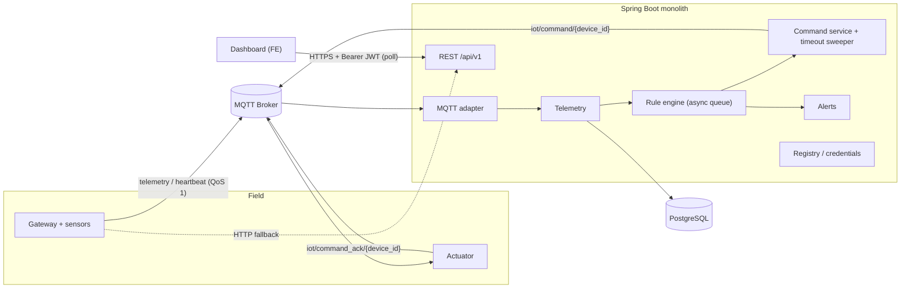
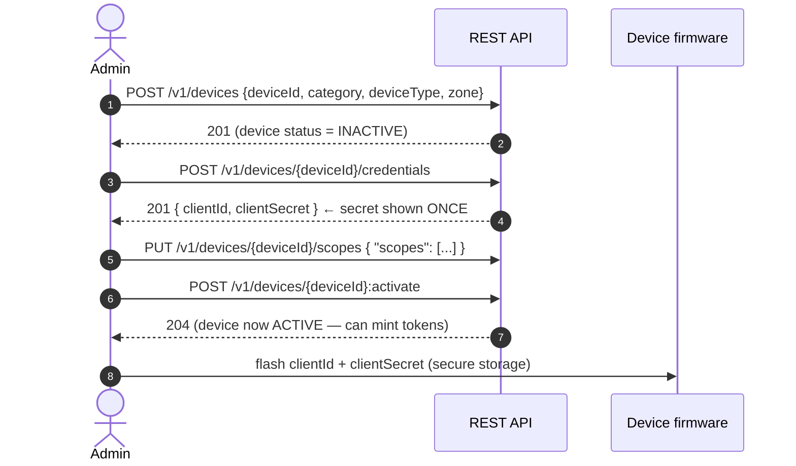
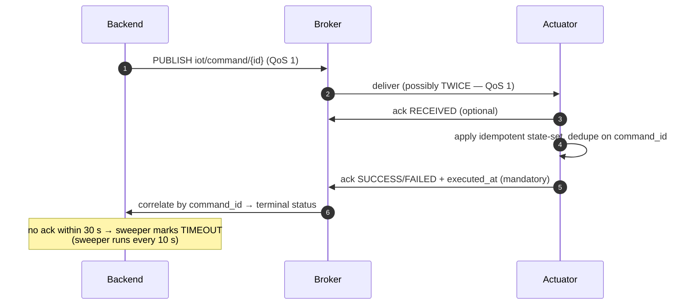
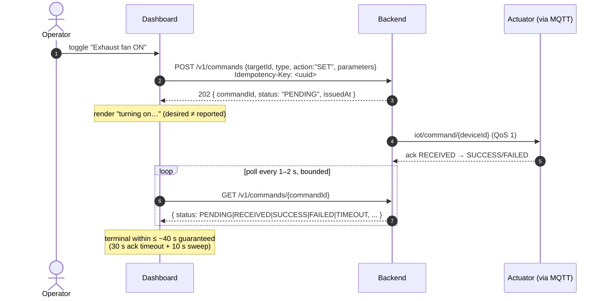
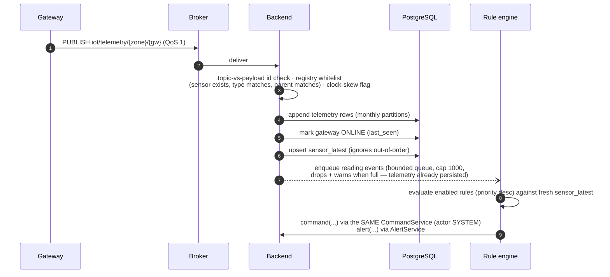
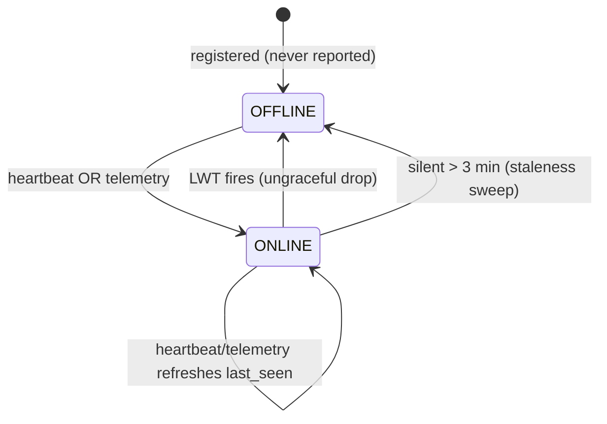

# IoT Platform — Integration Guide (FE + Device Teams)

**Audience:** the frontend/dashboard team and the IoT device/firmware team.
**Status:** reflects the code **as implemented** on `develop` (phases 0–10 complete). Where the design documents and the code disagree, **this document describes the code** and flags the difference. Wire-format details were verified against the actual controllers, DTOs, and MQTT listeners.
**Companion docs:** `iot-platform-system-design.md` (architecture & rationale), `iot-platform-api-design.md` (REST design), `iot-device-team-spec.md` (firmware spec), `iot-platform-openapi.yml`, `iot-platform-ops-runbook.md`.

---

## 1. System overview

The backend is a **single Spring Boot modular monolith** backed by **PostgreSQL** and an **MQTT broker** (Mosquitto in dev). There is no Kafka, no microservices, no message bus — the only async boundary is an in-process queue between telemetry ingest and the rule engine.

- **Devices** talk to the platform primarily over **MQTT** (telemetry, heartbeat, commands, acks) with **HTTP as fallback** for telemetry/heartbeat when the broker is unreachable.
- **The frontend** talks to the platform exclusively over **REST/JSON** under `/api/v1`, authenticated with user JWTs. There is **no WebSocket/SSE** — all "near-real-time" views are **polling** against cheap current-state endpoints.
- The **rule engine** evaluates telemetry asynchronously and can issue actuator commands and raise alerts through the *same* pipeline operators use.



### Key numbers at a glance

| Thing | Value |
|---|---|
| REST base path | `http://{host}:8080/api/v1` (no context path; port default 8080) |
| Swagger UI / OpenAPI | `/api/v1/swagger-ui.html` · `/api/v1/api-docs` (public) |
| MQTT broker (local dev) | `tcp://localhost:1883`, anonymous, no TLS (Docker Compose Mosquitto) |
| User access token TTL | 1 h · refresh token 30 d (rotated on every use) |
| Device token TTL | 1 h (OAuth2 client-credentials) |
| Command ack timeout | **30 s** (`iot.command.ack-timeout`), sweeper runs every 10 s |
| Offline detection | LWT (instant) + staleness sweep: no telemetry/heartbeat for **3 min** → `OFFLINE` |
| Credential rotation grace | **24 h** (old secret still valid) |
| Telemetry history query window | max **7 days** per request |
| Audit query window | max **90 days** per request |
| Pagination | default 50, max 200 per page |
| Rate limits (per minute) | auth 20 (per IP) · user 100 · device 300 · telemetry/heartbeat 600 (per device) |

---

## 2. Conventions (read once, applies everywhere)

### Two wire formats — do not mix them
- **MQTT payloads are `snake_case`** (`gateway_id`, `command_id`, `executed_at`).
- **REST payloads are `camelCase`** (`gatewayId`, `commandId`, `executedAt`).
- Both use **ISO-8601 UTC timestamps** with `Z` suffix (`2026-07-02T10:15:30Z`).
- JSON `null` fields are **omitted** from REST responses (Jackson `NON_NULL`) — e.g. a boolean reading has `valueBool` and no `valueNum` key at all.

### REST error format — RFC 9457 Problem Details
Every error, from every endpoint, is `application/problem+json`:

```json
{
  "type": "https://api.iot.example.com/errors/validation",
  "title": "Unprocessable Entity",
  "status": 422,
  "detail": "Exactly one of sensorId or zone is required",
  "instance": "/api/v1/telemetry",
  "errors": [ { "field": "zone", "message": "must not be blank" } ]
}
```

Branch on `type` (stable) and `status`, never on `detail` (human text, may change). The `errors[]` array appears only on validation failures and lists every failing field.

**Stable `type` values** (all under `https://api.iot.example.com/errors/`):
`validation` (400/422) · `malformed` (400/415) · `unauthenticated` (401) · `token-revoked` (401) · `forbidden` (403) · `not-found` (404) · `conflict` (409) · `invalid-lifecycle-transition` (409) · `safety-interlock` (409) · `rate-limited` (429) · `unavailable` (503) · `internal` (500).

Never expect `200` with an error body — it doesn't happen.

### Pagination — two envelopes
All collection responses wrap items in `data`:

- **Cursor-paged** (append-only / time-ordered sets: `GET /telemetry`, `/commands`, `/alerts`, `/audit-logs`):
  ```json
  { "data": [ ... ], "page": { "nextCursor": "b3Jk...", "hasMore": true, "pageSize": 50 } }
  ```
  Pass `cursor` back verbatim to get the next page; `nextCursor` is omitted on the last page. Cursors are opaque — never parse them.
- **Offset-paged** (small admin sets: `/devices`, `/users`, `/rules`):
  ```json
  { "data": [ ... ], "page": { "offset": 0, "limit": 50, "total": 142 } }
  ```
- Non-paginated lists (`/current-state`, `/connectivity`, `/actuator-state`, `/devices/{id}/sensors`) are just `{ "data": [ ... ] }`.

`pageSize`/`limit` is clamped server-side to **max 200** (default 50).

### Filtering & sorting
Query params, e.g. `?zone=office_1&status=ACTIVE`. Time ranges use `from`/`to` (ISO-8601). Results on cursor endpoints are newest-first keyset order.

### Idempotency (`Idempotency-Key` header)
Client-generated **UUID** header on side-effecting POSTs. Replays within **24 h** return the original result instead of creating a duplicate.
- **Required** on `POST /v1/commands` (a double-clicked toggle must not fire two commands).
- Optional (supported) on `POST /v1/devices`, `POST /v1/devices/{id}/credentials`, `POST /v1/devices/{id}/credentials:rotate`.

### Rate limiting
Enforced at an HTTP filter. Responses carry `RateLimit-Limit`, `RateLimit-Remaining`, `RateLimit-Reset` (seconds). Over the limit → **429** with `Retry-After` header. Limits: auth endpoints 20/min per IP; user JWTs 100/min; device JWTs 300/min; telemetry/heartbeat ingest 600/min per device. **MQTT traffic is not rate-limited** in the app today.

### Correlation ID
Every request/response carries `X-Correlation-Id`. Send your own (≤64 printable ASCII chars) or the server generates a UUID and echoes it back. Log it client-side — it's the key for tracing a request through server logs.

### Security headers / CORS
Responses carry HSTS, `X-Content-Type-Options: nosniff`, `X-Frame-Options: DENY`, CSP `default-src 'self'`.
> ⚠️ **There is no CORS configuration in the backend.** A browser app served from a different origin will be blocked on preflight. FE must either be served same-origin, or fronted by a reverse proxy / gateway that adds CORS headers. Raise this early if you need direct cross-origin calls.

---

## 3. Authentication & authorization

### 3.1 Users (frontend)

OAuth2-style JWT bearer auth. **RS256** signatures; public keys published at `GET /api/v1/.well-known/jwks.json`.

| Endpoint | Auth | Purpose |
|---|---|---|
| `POST /v1/auth/login` | none | `{ "username", "password" }` → tokens |
| `POST /v1/auth/refresh` | none | `{ "refreshToken" }` → new token pair |
| `POST /v1/auth/logout` | none | `{ "refreshToken" }` → `204`, revokes refresh + access token |

**Login / refresh response:**
```json
{
  "accessToken": "eyJ...",
  "tokenType": "Bearer",
  "expiresIn": 3600,
  "refreshToken": "eyJ...",
  "role": "OPERATOR"
}
```

Rules the FE must build around:
- Access token lives **1 h**; refresh token **30 d**. Send `Authorization: Bearer <accessToken>` on everything else.
- **Refresh tokens rotate on every use** — each `/auth/refresh` returns a *new* refresh token and invalidates the old one. Always replace the stored one. Presenting an already-rotated refresh token is treated as theft: the whole token chain is revoked and you get `401` `errors/token-revoked` → force re-login.
- Logout is **instant** (denylist), not "expires within the hour". After logout, the old access token gets `401 token-revoked`.
- Bad credentials → `401` (never `403`).
- Auth endpoints are limited to **20 req/min per IP** — never call `/auth/login` or `/auth/refresh` in a loop; refresh proactively at ~80% of `expiresIn`.

**Role hierarchy** (each role includes everything below it):

`SUPER_ADMIN` > `ADMIN` > `OPERATOR` > `TECHNICIAN` > `VIEWER`

The JWT carries `role` (and `typ: "USER"`). Device tokens carry `typ: "DEVICE"` + `scope` and **no role**, so a device token can never call user/admin endpoints.

### 3.2 Devices

Devices authenticate to the **HTTP API** with OAuth2 client-credentials:

```
POST /api/v1/oauth2/token
Content-Type: application/x-www-form-urlencoded

grant_type=client_credentials&client_id=cli_xxx&client_secret=yyy&scope=telemetry:publish heartbeat:publish
```

Response (snake_case, standard OAuth2):
```json
{ "access_token": "eyJ...", "token_type": "Bearer", "expires_in": 3600, "scope": "telemetry:publish heartbeat:publish" }
```

- Granted scope = **intersection** of the device's provisioned scopes and the requested ones (omit `scope` to get everything provisioned). Honour what you're granted, not what you asked for.
- Token minting requires the device to be **`ACTIVE`** — a `SUSPENDED`/`DECOMMISSIONED`/`INACTIVE` device gets a generic `401`.
- Scopes: `telemetry:publish`, `heartbeat:publish` (used on the HTTP fallback endpoints), `command:subscribe`, `command:ack` (reserved for broker ACLs).

> ⚠️ **MQTT authentication, as implemented today:** the dev broker (`mosquitto.conf` in Docker Compose) runs `allow_anonymous true`, **no TLS**, on port **1883** (and websockets on 9001). Per-device broker credentials/ACLs and MQTTS are **designed but not yet provisioned** (Phase 10 infra work; see the ops runbook). Device identity on MQTT is currently enforced by the backend cross-checking the topic segment against the payload ID and the device registry — not by broker auth. **Firmware should still keep credentials configurable (host, port, username/password, TLS) so switching the production broker to authenticated MQTTS is a config change, not a firmware change.** In prod the *backend* connects with `MQTT_BROKER_URL`/`MQTT_USERNAME`/`MQTT_PASSWORD`.

---

## 4. Device lifecycle & provisioning (admin + firmware)

Devices never self-register. An admin provisions them over REST, then hands credentials to the firmware out-of-band.



Important details verified in code:

- **A freshly registered device starts `INACTIVE`** and cannot mint tokens until an admin calls `:activate`. Don't forget this step — it's the most common "why is my device getting 401" cause.
- Status machine: `INACTIVE/SUSPENDED → ACTIVE` (`:activate`), `ACTIVE → SUSPENDED` (`:suspend`, reversible, disables token minting), `anything → DECOMMISSIONED` (`:decommission`, **terminal**, hard-revokes credentials and scopes). Illegal jumps → `409 errors/invalid-lifecycle-transition`.
- `category` is one of `gateway` / `sensor` / `actuator` (lowercase). Sensors must reference a `parentGatewayId` (and only sensors may). `deviceType` is a free string; the conventions in use: `temp`, `hmid`, `smoke`, `light`, `ac`, `exhst_fan`, `curtain`.
- **The client secret is returned exactly once** (on issue and on `:rotate`). `GET .../credentials` returns metadata only (`clientId`, `rotatedAt`). Lost secret → rotate.
- **Rotation grace window: 24 h** — after `:rotate`, the old secret keeps working until `graceExpiresAt`, so a fleet can roll without lockout. Firmware must support updating the stored secret in the field.

---

## 5. MQTT contract (device team)

### 5.1 Connection parameters

| Parameter | Value (as implemented) |
|---|---|
| Broker (local dev) | `tcp://localhost:1883`, anonymous — see §3.2 warning |
| QoS | **1** for everything (subscribe and publish) |
| `cleanSession` | **`false`** — the server uses a persistent session; actuators should too, so QoS-1 commands queued while briefly offline are delivered on reconnect |
| Keep-alive | server uses 60 s; devices should use ≤ heartbeat interval |
| Retained | server publishes nothing retained; devices shouldn't either (LWT retained is optional/recommended) |
| LWT | register a will on `iot/status/{device_id}` at CONNECT (any payload — see 5.2) |
| Reconnect | bounded, jittered exponential backoff (avoid thundering herd after a broker restart) |
| Clock | NTP-sync; telemetry timestamps skewed >5 min future / >1 h past are flagged server-side |

### 5.2 Topics

| Purpose | Topic | Device role | QoS |
|---|---|---|---|
| Telemetry | `iot/telemetry/{zone}/{gateway_id}` | gateway **publishes** | 1 |
| Heartbeat | `iot/heartbeat/{device_id}` | every device **publishes** | 1 |
| Presence (LWT) | `iot/status/{device_id}` | broker publishes the will | 1 |
| Command | `iot/command/{device_id}` | actuator **subscribes** | 1 |
| Command ack | `iot/command_ack/{device_id}` | actuator **publishes** | 1 |

Backend behaviors to know:
- The **`{gateway_id}` / `{device_id}` topic segment must equal the ID inside the payload** — mismatches are silently dropped (logged server-side, no error reaches the device). This is the current substitute for broker ACLs.
- The server treats **any** message on `iot/status/{device_id}` as an offline signal — the LWT payload body is not parsed. A device is only marked back `ONLINE` by its next heartbeat or telemetry. On clean shutdown, publish to your status topic (or just disconnect cleanly and let staleness sweep catch it) — but never rely on the status topic to announce "online".
- Malformed JSON is logged and dropped, never acked or errored — if data isn't showing up, check payload shape first.

### 5.3 Telemetry payload — `iot/telemetry/{zone}/{gateway_id}`

```json
{
  "timestamp": "2026-07-02T10:15:30Z",
  "zone": "office_1",
  "gateway_id": "OFFICE1_NODE_01",
  "sensors": [
    { "id": "OFFICE1_TEMP_01", "type": "temp",  "value": 25.8, "unit": "C" },
    { "id": "OFFICE1_HMID_01", "type": "hmid",  "value": 60.5, "unit": "%" },
    { "id": "OFFICE1_SMKE_01", "type": "smoke", "value": false }
  ]
}
```

Rules (all enforced in `TelemetryServiceImpl`):
- `value` is polymorphic: **number** for numeric sensors (`temp`, `hmid`, `light` — include `unit`), **boolean** for binary sensors (`smoke`, `open` — omit `unit`). Any other JSON type → that reading is dropped.
- One `timestamp` applies to the whole batch.
- **Every `sensors[].id` must be a registered sensor**, its `type` must match the registry, and it must belong to the publishing gateway — unknown sensor, wrong type, or wrong parent → the reading is rejected (422 on HTTP; dropped on MQTT). Register sensors before publishing for them.
- Duplicate publishes are **not** deduplicated in history (append-only table), but the live "current state" view ignores readings older than what it already has — out-of-order arrivals can't regress the dashboard.

### 5.4 Heartbeat payload — `iot/heartbeat/{device_id}`

```json
{
  "device_id": "OFFICE1_NODE_01",
  "timestamp": "2026-07-02T10:15:30Z",
  "status": "ONLINE",
  "firmware_version": "1.2.0",
  "memory_usage_pct": 43,
  "cpu_usage_pct": 21,
  "wifi_rssi": -58
}
```

- Publish every **30–60 s**. Any heartbeat flips the device `ONLINE` and stamps `last_seen`.
- As implemented, the MQTT path applies only `memory_usage_pct`, `cpu_usage_pct`, `wifi_rssi`, `timestamp`; `status` and `firmware_version` are parsed but **ignored** (harmless to send).
- `*_pct` are 0–100; `wifi_rssi` is dBm (negative).
- **Offline detection:** LWT fires instantly on ungraceful disconnect; independently, a sweeper marks any device silent for **3 minutes** (no heartbeat *and* no telemetry) as `OFFLINE`. Telemetry counts as liveness — a gateway publishing readings every 30 s never needs a separate heartbeat just to stay online (heartbeats still carry the health metrics).

### 5.5 Command payload — `iot/command/{device_id}` (server → actuator)

```json
{
  "command_id": "CMD_5e9c1a2b-...",
  "target_id": "AC_01",
  "type": "ac",
  "action": "SET",
  "parameters": { "status": "ON", "set_temp": 24, "mode": "COOL" }
}
```

- `command_id` is `"CMD_" + UUID` — your **dedup key**.
- `action` is always **`SET`** — commands are absolute state-sets, never toggles.
- `type` is the registry `deviceType` (server-derived, trustworthy).
- Rule-issued and operator-issued commands are **byte-identical** — implement one handler.

**Parameter contracts per device type** (server whitelists these before publishing; anything else is rejected with `422` and never reaches the device — but validate defensively anyway and `FAILED`-ack what you can't honour):

| `type` | Required | Optional | Values |
|---|---|---|---|
| `light` | `status` | `level` | `status`: `ON`/`OFF` · `level`: integer 0–100 |
| `ac` | `status` | `set_temp`, `mode` | `status`: `ON`/`OFF` · `set_temp`: number 16–30 · `mode`: `COOL`/`HEAT`/`DRY`/`FAN`/`AUTO` |
| `exhst_fan` | `status` | — | `ON`/`OFF` (safety actuator) |
| `curtain` | `direction` | — | `UP`/`DOWN`/`STOP` (✅ resolved: the firmware spec's values won over the API doc's `OPEN`/`CLOSED`) |

### 5.6 Command ack payload — `iot/command_ack/{device_id}` (actuator → server)

Interim (optional but recommended — lets the dashboard show "delivered, executing…"):
```json
{ "command_id": "CMD_5e9c...", "device_id": "AC_01", "status": "RECEIVED" }
```

Terminal (**mandatory**):
```json
{ "command_id": "CMD_5e9c...", "device_id": "AC_01", "status": "SUCCESS", "executed_at": "2026-07-02T10:15:31Z" }
```

- `status` ∈ `RECEIVED` | `SUCCESS` | `FAILED` — anything else is logged and ignored.
- `executed_at` should be set on terminal acks (server falls back to its own clock if missing).
- Note the field asymmetry: commands carry `target_id`, acks carry `device_id`.
- There is no `reason` field parsed today — a `FAILED` ack carries no failure detail to the server.

### 5.7 Command lifecycle, redelivery, timeout (firmware requirements)



- **Dedupe on `command_id`** (small LRU cache). On a repeat delivery: don't re-actuate, re-send the same terminal ack.
- **Server-side timeout is 30 seconds** — your ack latency budget. After that the command is `TIMEOUT` (terminal, server-side). **Send your terminal ack even if you're late**: the server still reconciles the actuator's reported state from a late `SUCCESS`, so the dashboard reflects hardware truth.
- The server **never retries** a command; QoS-1 redelivery by the broker is the only retransmission. A `TIMEOUT` command stays timed out — operators just issue a new one.
- Repeated timeouts to the same device (3 within a minute) raise a `COMMAND_SUPPRESSION_SUSPECTED` critical alert for operators — silent devices are visible.
- Reconnect with `cleanSession=false` so commands issued while you were offline are delivered when you return (then dedupe/ack as normal).

### 5.8 HTTP fallback (devices, when MQTT is down)

Same funnel, **different casing/shape** (REST = camelCase). Requires a device Bearer token (§3.2).

**`POST /v1/telemetry`** — scope `telemetry:publish` → `202`:
```json
{
  "gatewayId": "OFFICE1_NODE_01",
  "zone": "office_1",
  "readings": [
    { "sensorId": "OFFICE1_TEMP_01", "sensorType": "temp",  "valueNum": 25.8, "unit": "C", "ts": "2026-07-02T10:15:30Z" },
    { "sensorId": "OFFICE1_SMKE_01", "sensorType": "smoke", "valueBool": false, "ts": "2026-07-02T10:15:30Z" }
  ]
}
```
- Exactly **one** of `valueNum` / `valueBool` per reading (both/neither → `422`). Per-reading `ts` is required.
- `gatewayId` **must equal the token's device identity** → mismatch is `403`.

**`POST /v1/heartbeat`** — scope `heartbeat:publish` → `202`:
```json
{ "deviceId": "OFFICE1_NODE_01", "memoryUsagePct": 43, "cpuUsagePct": 21, "wifiRssi": -58 }
```
- `deviceId` must match the token identity → else `403`. No timestamp/status/firmware fields — the server stamps `lastSeen` itself.

Device HTTP error handling: `401` → re-mint token (Flow: repeat client-credentials); `403` → payload identity mismatch or suspended device — stop and alert ops; `422` → fix payload; `429` → back off per `Retry-After`.

---

## 6. Frontend integration

### 6.1 Full endpoint catalog

All paths below are under `/api/v1`. "Min role" means that role **or higher** (hierarchy in §3.1). All reads return `200` unless noted.

**Auth** (§3.1): `POST /auth/login`, `POST /auth/refresh`, `POST /auth/logout` (204), `POST /oauth2/token` (devices), `GET /.well-known/jwks.json`.

**Users (admin)**

| Endpoint | Min role | Notes |
|---|---|---|
| `GET /users?role=&status=&offset=&pageSize=` | ADMIN | offset-paged |
| `POST /users` | ADMIN | `201`; `{username (3–64), password (8–128), role}`; duplicate username → `409` |
| `GET /users/{userId}` | ADMIN | |
| `PATCH /users/{userId}` | ADMIN | `{role?, status?}`; granting above your own authority → `403` |
| `DELETE /users/{userId}` | ADMIN | `204`, soft-delete → `DISABLED`, revokes refresh tokens |
| `POST /users/{userId}/password-reset` | ADMIN **or self** | `204`; `{newPassword (8–128)}` |

User DTO: `{id, username, role, status: ACTIVE|DISABLED, createdAt}` — never a password hash.

**Devices & registry**

| Endpoint | Min role | Notes |
|---|---|---|
| `GET /devices?zone=&category=&deviceType=&status=&offset=&limit=` | VIEWER | offset-paged |
| `POST /devices` | ADMIN | `201` + `Location`; duplicate id → `409`; bad parent → `422` |
| `GET /devices/{deviceId}` | VIEWER | |
| `PATCH /devices/{deviceId}` | ADMIN | `{zone?, deviceType?, firmwareVersion?}` — at least one, else `422` |
| `GET /devices/{deviceId}/sensors` | VIEWER | `{data:[{sensorId, gatewayId, type, zone}]}` |
| `GET /devices/{deviceId}/health` | VIEWER | see 6.3; `404` if never reported |
| `POST /devices/{deviceId}:activate` / `:suspend` / `:decommission` | ADMIN | `204`; illegal transition → `409` |
| `GET /devices/{deviceId}/credentials` | ADMIN | metadata only |
| `POST /devices/{deviceId}/credentials` | ADMIN | `201`, secret shown **once** |
| `POST /devices/{deviceId}/credentials:rotate` | ADMIN | secret shown **once**, 24 h grace |
| `GET /devices/{deviceId}/scopes` · `PUT /devices/{deviceId}/scopes` | ADMIN | `{"scopes": [...]}` full replace |

Device DTO: `{deviceId, category, deviceType, zone, parentGatewayId, firmwareVersion, status, protocols, createdAt}`.

**Telemetry & live state**

| Endpoint | Min role | Notes |
|---|---|---|
| `GET /telemetry?sensorId=\|zone=&from=&to=&cursor=&pageSize=` | VIEWER | cursor-paged history. **Exactly one** of `sensorId`/`zone`; `from` **and** `to` required; window ≤ 7 d — else `422` |
| `GET /current-state?zone=` | VIEWER | latest reading per sensor |
| `GET /sensors/{sensorId}/latest` | VIEWER | one sensor; `404` if never reported |
| `GET /connectivity?zone=` | VIEWER | per-zone `{zone, online, offline, total}` roll-up (devices that never reported count as offline) |

Reading item: `{sensorId, sensorType, valueNum?|valueBool?, unit?, ts}` (current-state adds `zone`). Exactly one of `valueNum`/`valueBool` present.

**Commands & actuator state** — see 6.2 for the flow.

| Endpoint | Min role | Notes |
|---|---|---|
| `POST /commands` | TECHNICIAN¹ | **`Idempotency-Key` (UUID) header required**; `202` + `Location` |
| `GET /commands?targetId=&status=&from=&to=&cursor=&pageSize=` | VIEWER | cursor-paged |
| `GET /commands/{commandId}` | VIEWER | poll target |
| `GET /actuator-state?zone=&drifted=` | VIEWER | toggle grid; `drifted=true` → only rows where desired ≠ reported |
| `GET /devices/{deviceId}/actuator-state` | VIEWER | `404` if not an actuator / no state yet |

¹ `@PreAuthorize` floor is `TECHNICIAN`; finer role×actuator-class rules apply in the service (see 6.2). *(The API design doc said `OPERATOR`; the code allows `TECHNICIAN` for routine actuators.)*

**Rules (admin)**

| Endpoint | Min role | Notes |
|---|---|---|
| `GET /rules?enabled=&offset=&limit=` | OPERATOR | offset-paged |
| `POST /rules` | ADMIN | `201`; condition/action validated **on write** → `422` with offending token |
| `GET /rules/{ruleId}` | OPERATOR | |
| `PUT /rules/{ruleId}` | ADMIN | full replace |
| `PATCH /rules/{ruleId}` | ADMIN | `{enabled?, priority?}` — at least one, else `422` |
| `DELETE /rules/{ruleId}` | ADMIN | `204` |

Rule DTO: `{ruleId, name, enabled, condition, action, priority, createdBy}`.
Rule grammar (what the rule editor must produce):
- **condition**: one or more `zone.sensorType OP literal` clauses joined by all-`&&` **or** all-`||` (no mixing, no parentheses). `OP` ∈ `==`, `!=`, `>`, `<`, `>=`, `<=`; literal is a number or `true`/`false` (booleans only with `==`/`!=`). Example: `office_1.smoke == true`, `office_1.temp > 30 && office_1.hmid > 80`.
- **action**: semicolon-separated effects, each `command(targetId, SET, {key: value, ...})` or `alert(TYPE, SEVERITY)`. Example: `command(EXHST_01, SET, {status: ON}); alert(SMOKE, CRITICAL)`.
- Condition semantics at runtime: "**any** sensor of that type in that zone matches" — evaluated against fresh current-state, not the triggering reading.

**Alerts**

| Endpoint | Min role | Notes |
|---|---|---|
| `GET /alerts?status=&zone=&severity=&from=&to=&cursor=&pageSize=` | VIEWER | cursor-paged |
| `GET /alerts/{alertId}` | VIEWER | |
| `POST /alerts/{alertId}:acknowledge` | OPERATOR | `OPEN → ACK` only; else `409` |
| `POST /alerts/{alertId}:resolve` | OPERATOR | `OPEN`/`ACK` → `RESOLVED`; re-resolving → `409` |

Alert DTO: `{alertId, type, severity: INFO|WARNING|CRITICAL, zone, sourceDeviceId, message, status: OPEN|ACK|RESOLVED, createdAt}`.
Alert `type` is a string. Rule-raised types are whatever the rule says (e.g. `SMOKE`); the platform also raises **detection alerts** the dashboard should surface: `COMMAND_SUPPRESSION_SUSPECTED` (critical), `TELEMETRY_GAP` (critical — a smoke sensor went quiet >10 min), `AUTH_FAILURE_BURST`, `RATE_LIMIT_SPIKE`, `FORBIDDEN_SPIKE` (warnings), `TOKEN_REUSE_DETECTED` (critical).
There is **no push notification delivery** (no email/webhook/SSE) — surfacing alerts = polling `GET /alerts?status=OPEN`.

**Audit (admin)**

| Endpoint | Min role | Notes |
|---|---|---|
| `GET /audit-logs?actor=&actorType=&event=&target=&from=&to=&cursor=&pageSize=` | ADMIN | `from`+`to` required, window ≤ 90 d, else `422` |

Entry: `{id, ts, actor, actorType: USER|DEVICE|SYSTEM, event, target, detail{}, ip}`. `event` values are dotted-lowercase codes (e.g. `user.login`, `command.issue`) — filter on the stored form, not enum-style names.

### 6.2 The operator control flow (the one flow FE must get right)

Commanding hardware is **asynchronous**: the POST returns before the device has done anything. The UI must model an in-flight state.



Request:
```json
POST /v1/commands
Idempotency-Key: 5e9c0a2e-...
{ "targetId": "EXHST_01", "type": "exhst_fan", "action": "SET", "parameters": { "status": "ON" } }
```
Response `202` + `Location: /api/v1/commands/CMD_...`:
```json
{ "commandId": "CMD_...", "status": "PENDING", "issuedAt": "2026-07-02T10:30:00Z" }
```

What the FE must handle:

- **Lifecycle:** `PENDING → RECEIVED → SUCCESS | FAILED | TIMEOUT` (`RECEIVED` may be skipped). The poll loop is **bounded**: the server guarantees a terminal state within ~40 s worst case. There is **no cancel endpoint** — to undo, issue the inverse state-set.
- **Idempotency-Key is mandatory** (one UUID per user intent — a double-click reuses the key and returns the original command instead of firing twice). Missing header → `400`.
- **`type` is required in the body but the server derives the real device type from the registry** — send the actuator's `deviceType`, but know that a wrong value won't spoof anything.
- **Validation `422`:** target doesn't exist / isn't an actuator / isn't `ACTIVE`; unknown parameter keys; out-of-range values (see the whitelist table in §5.5). Note: a nonexistent target is `422`, not `404`.
- **Authorization `403`** (enforced server-side per role×actuator class — don't hide the buttons by guessing; map the 403):
  - `VIEWER`: no commands.
  - `TECHNICIAN`: routine actuators only (`light`, `ac`, `curtain`).
  - `OPERATOR`: routine + safety actuators **toward safe only** (may turn `exhst_fan` `ON`; `OFF` → `403`).
  - `ADMIN`/`SUPER_ADMIN`: unrestricted.
  - Safety actuator set is config-driven: currently only `exhst_fan`.
  - Zone-based restrictions were **not adopted** — authority is global per role.
- **Safety interlock `409 errors/safety-interlock`:** contract exists for a manual command contradicting an active safety hold; `SUPER_ADMIN` may pass `"override": true` + non-empty `"overrideReason"` (override by a lower role → `403`; missing reason → `422`). ⚠️ **As implemented the interlock check is a no-op** (never triggers) — build the 409 handling anyway; enforcement arrives without an API change.
- **The toggle grid** reads `GET /actuator-state`, never the command list:
  ```json
  { "deviceId": "EXHST_01", "zone": "office_1", "desiredState": "ON", "reportedState": "OFF",
    "inFlight": true, "attributes": {"set_temp": 24}, "lastCommandId": "CMD_...",
    "commandedAt": "...", "updatedAt": "..." }
  ```
  `desiredState` = last commanded; `reportedState` = last device-confirmed; `inFlight` (server-computed `desired ≠ reported`) is your "turning on…" spinner signal. `?drifted=true` is the "needs attention" view. Issuing a command updates `desiredState` immediately, so the grid reflects intent on the next poll even before any ack.

### 6.3 Dashboard polling model

No push channel exists — poll these cheap endpoints (they read one-row-per-key state tables, never the big history table; safe at short intervals and `Cache-Control`-friendly):

| View | Endpoint | Suggested cadence |
|---|---|---|
| Zone readings "now" | `GET /current-state?zone=` | 5–15 s |
| Online/offline roll-up | `GET /connectivity` | 15–30 s |
| Toggle grid | `GET /actuator-state` (+ `?drifted=true` badge) | 5–15 s |
| Open alerts badge | `GET /alerts?status=OPEN&pageSize=1` | 15–30 s |
| In-flight command | `GET /commands/{id}` | 1–2 s until terminal |
| Device detail health | `GET /devices/{id}/health` | on view + 15–30 s |

Live state is **eventually consistent by one sample** — a reading can lag by one publish interval. Health DTO: `{deviceId, connectionStatus: ONLINE|OFFLINE, lastSeen, memoryUsagePct, cpuUsagePct, wifiRssi, updatedAt}`.

Charts/history: `GET /telemetry` with a bounded window (≤7 d per request; page through `nextCursor` for more). Remember: exactly one of `sensorId`/`zone`, and both `from`/`to` — otherwise `422`.

---

## 7. End-to-end flows (how it all connects)

### 7.1 Telemetry ingest (the read path's source of truth)



Same funnel for `POST /v1/telemetry` (HTTP adds the JWT-identity == `gatewayId` check → `403`). Persist-before-evaluate means a backend restart can drop queued *evaluations* but never *data*.

### 7.2 The safety scenario (smoke → exhaust ON)

1. Gateway publishes `{ "id": "OFFICE1_SMKE_01", "type": "smoke", "value": true }`.
2. Rule `office_1.smoke == true` → `command(EXHST_01, SET, {status: ON}); alert(SMOKE, CRITICAL)` fires asynchronously (sub-second).
3. Backend persists command `PENDING` (`issuedBy` = rule id, actor `SYSTEM` — rule-issued commands skip role checks), publishes `iot/command/EXHST_01`, upserts `desiredState=ON`.
4. Fan acks `RECEIVED` → `SUCCESS`; `reportedState=ON`; dashboard's `?drifted` view clears.
5. FE sees the `SMOKE` alert via `GET /alerts?status=OPEN`; operator acknowledges → resolves after the event.
6. If the fan never acks: `TIMEOUT` at 30 s; 3 timeouts in a minute → `COMMAND_SUPPRESSION_SUSPECTED` critical alert. Firmware contract: adopt the fail-safe default for your device class on comms loss.

### 7.3 Device connectivity states



---

## 8. Implementation deviations & gaps (both teams, read this)

Things where the code differs from the design docs, or where a designed control is not yet enforced. None of these change the wire contracts above — but they affect what you can rely on today.

| # | Area | Reality today |
|---|---|---|
| 1 | **CORS** | Not configured. Cross-origin browser calls fail; needs a proxy or a backend change. |
| 2 | **Push channels** | No WebSocket/SSE anywhere. Polling only (design anticipated this; confirming it's final for v1). |
| 3 | **MQTT security** | Dev broker is anonymous, no TLS, no per-device ACLs. Backend compensates with topic/payload/registry cross-checks. MQTTS + per-device broker auth/ACLs are documented ops work (runbook), pending confirmation of the broker auth mechanism. Firmware: keep transport settings configurable. |
| 4 | **Safety interlock** | `409 safety-interlock` contract + `SUPER_ADMIN` override are fully implemented **but the hold-detection is a no-op** — no command is ever actually blocked today. FE should still handle the 409. |
| 5 | **Stale-replay defense** | Implausible telemetry timestamps (>5 min future / >1 h past) are **logged, not rejected** (design said reject with `422`). |
| 6 | **Kafka / Avro** | Not used at all (empty placeholder packages). Rules pipeline is an in-process bounded queue; full queue = dropped evaluations (logged), never dropped data. |
| 7 | **Alert notifications** | No email/webhook/push. Alerts are DB rows + API; FE polling is the delivery mechanism. |
| 8 | **Zone-scoped operator permissions** | Not adopted — command authority is global per role (`user_zone_grants` table was skipped). |
| 9 | **Command issue floor** | `TECHNICIAN` (not `OPERATOR` as the API doc said), with per-class checks in the service. |
| 10 | **Curtain params** | `UP`/`DOWN`/`STOP` (firmware spec won over the API doc's `OPEN`/`CLOSED`). |
| 11 | **MQTT heartbeat extras** | `status`/`firmware_version` accepted but ignored server-side. |
| 12 | **`FAILED` ack `reason`** | Not parsed; no failure detail reaches the server. |
| 13 | **Telemetry retention** | Partition retention is configured off (`retention-months: 0`, dry-run) — nothing is deleted yet. |
| 14 | **MQTT rate limiting** | None (HTTP only). |

---

## 9. Quick-reference tables

### Enums (verbatim)

| Enum | Values |
|---|---|
| Role | `SUPER_ADMIN` `ADMIN` `OPERATOR` `TECHNICIAN` `VIEWER` |
| User status | `ACTIVE` `DISABLED` |
| Device category | `gateway` `sensor` `actuator` (lowercase) |
| Device status | `ACTIVE` `INACTIVE` `SUSPENDED` `DECOMMISSIONED` |
| Connection status | `ONLINE` `OFFLINE` |
| Command status | `PENDING` `RECEIVED` `SUCCESS` `FAILED` `TIMEOUT` |
| Alert severity | `INFO` `WARNING` `CRITICAL` |
| Alert status | `OPEN` `ACK` `RESOLVED` |
| Actor type (audit) | `USER` `DEVICE` `SYSTEM` |
| Device scopes | `telemetry:publish` `command:subscribe` `command:ack` `heartbeat:publish` |
| AC mode | `COOL` `HEAT` `DRY` `FAN` `AUTO` |
| Curtain direction | `UP` `DOWN` `STOP` |

### Timing & limits (config defaults)

| Setting | Default | Config key |
|---|---|---|
| Access / refresh / device token TTL | 1 h / 30 d / 1 h | `iot.security.jwt.*` |
| Command ack timeout / sweep interval | 30 s / 10 s | `iot.command.ack-timeout` |
| Safety actuator types | `[exhst_fan]` | `iot.command.safety-device-types` |
| Health staleness → OFFLINE | 3 min (sweep every 1 min) | `iot.health.stale-after` |
| Telemetry clock-skew flags | 5 min future / 1 h past | `iot.telemetry.max-clock-skew-*` |
| Safety-sensor gap alert | `smoke` quiet > 10 min | `iot.telemetry.safety-gap.*` |
| Credential rotation grace | 24 h | `iot.device.credential-rotation-grace` |
| Idempotency replay window | 24 h | `iot.idempotency.ttl-hours` |
| Telemetry / audit query window max | 7 d / 90 d | `iot.*.history-max-window` |
| Rule queue capacity | 1000 | `iot.rules.queue-capacity` |
| Rate limits per minute | auth 20 · user 100 · device 300 · telemetry 600 | `iot.rate-limit.*` |
| Page size | default 50, max 200 | `iot.pagination` |

### Local development

```bash
# infra (Postgres + Mosquitto; Redis optional/off)
docker compose -f src/main/docker/compose/... up   # see src/main/docker/compose
./gradlew bootRun --args='--spring.profiles.active=local'
# Swagger UI: http://localhost:8080/api/v1/swagger-ui.html
# MQTT:      tcp://localhost:1883 (anonymous)
```

A local seed loader creates a few zones/devices and an admin user on the `local` profile (`LocalDevSeed` in `common`).

### Firmware checklist (condensed)

- [ ] Store `client_id`/`client_secret` securely; secret is field-updatable (24 h rotation grace).
- [ ] Mint token via `POST /oauth2/token`; refresh at ~80% of `expires_in`; never poll auth (20/min limit).
- [ ] MQTT: QoS 1, `cleanSession=false`, keep-alive ≤ heartbeat interval, LWT on `iot/status/{device_id}`, jittered backoff, NTP-synced clock, transport settings configurable (TLS/credentials coming).
- [ ] Telemetry: registered sensors only; numeric value+unit vs boolean value; topic ids == payload ids.
- [ ] Heartbeat every 30–60 s with health metrics (3-minute silence ⇒ marked offline).
- [ ] Commands: dedupe on `command_id`; idempotent `SET` semantics; optional `RECEIVED` ack; **mandatory terminal ack within 30 s** (send it even if late); defensively validate params; fail-safe default on comms loss.
- [ ] HTTP fallback for telemetry/heartbeat in the camelCase format with Bearer token.

### FE checklist (condensed)

- [ ] Token pair storage; refresh at ~80% TTL; **replace refresh token on every refresh**; on `401 token-revoked` force re-login.
- [ ] One RFC 9457 error handler branching on `type`; render `errors[]` for form validation.
- [ ] One paginator for each envelope (cursor + offset); respect `pageSize` clamp.
- [ ] Command issue: UUID `Idempotency-Key` per user intent; model `PENDING/RECEIVED` as in-flight; poll `GET /commands/{id}` 1–2 s until terminal (bounded ≤ ~40 s); no cancel — offer the inverse action; handle `422`/`403`/`409 safety-interlock`.
- [ ] Toggle grid from `/actuator-state` (`inFlight`, `?drifted=true`); readings from `/current-state`; never poll `/telemetry` for live views.
- [ ] Alerts panel polls `status=OPEN`; support acknowledge/resolve; surface detection alert types (§6.1).
- [ ] Gate UI affordances by `role` from login, but treat server `403` as the source of truth.
- [ ] Plan for same-origin deployment or a CORS-adding proxy (see §8.1).
