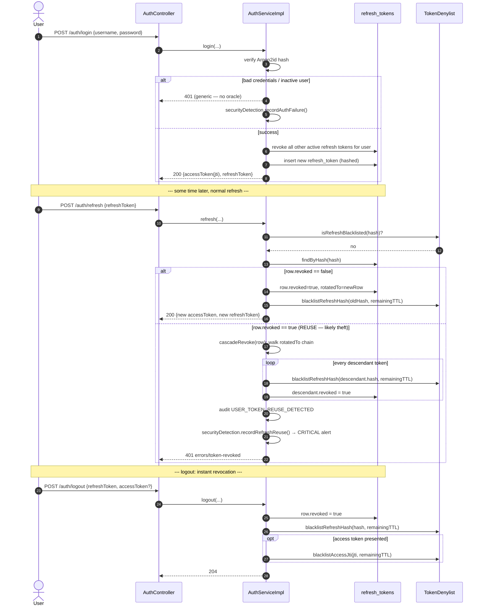
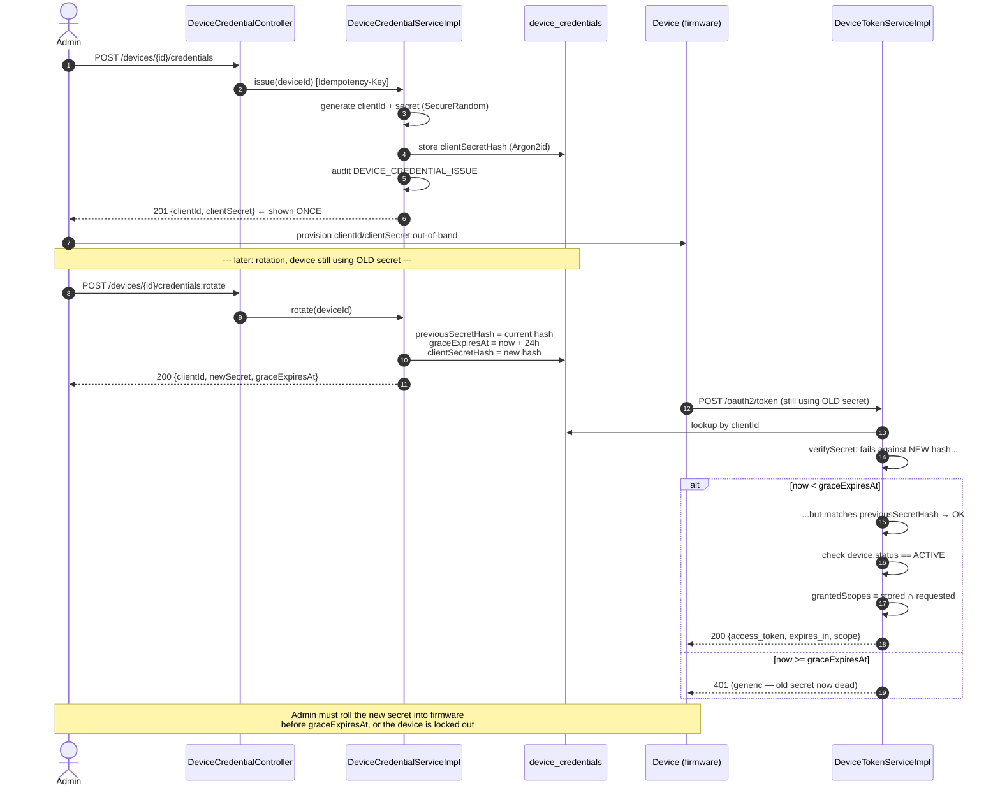
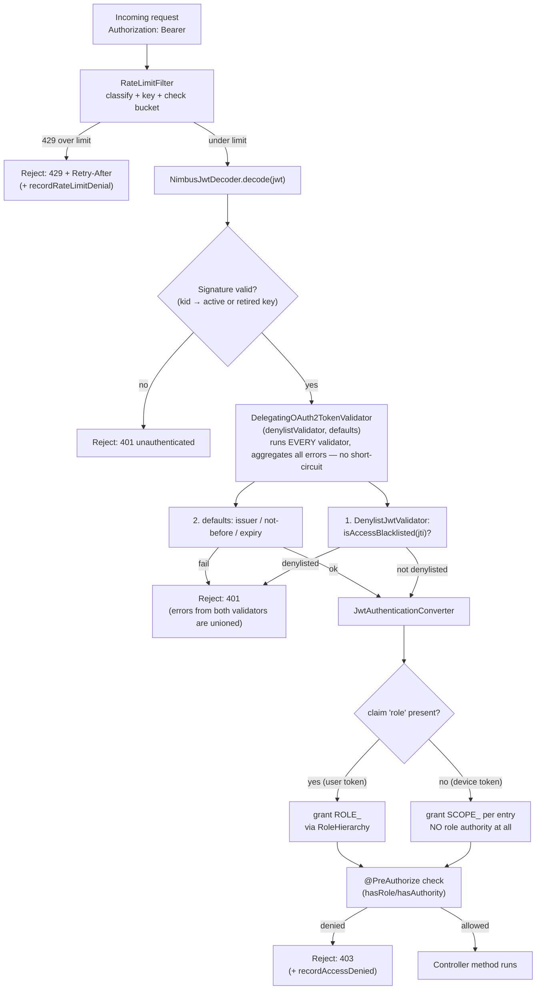
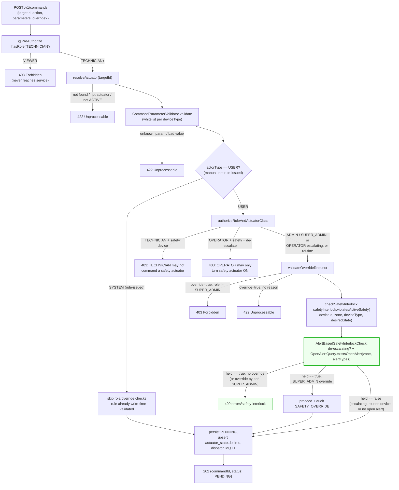
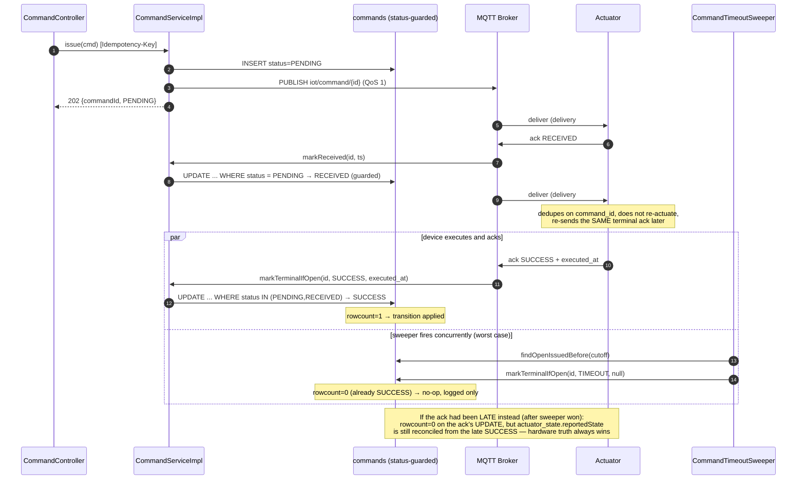
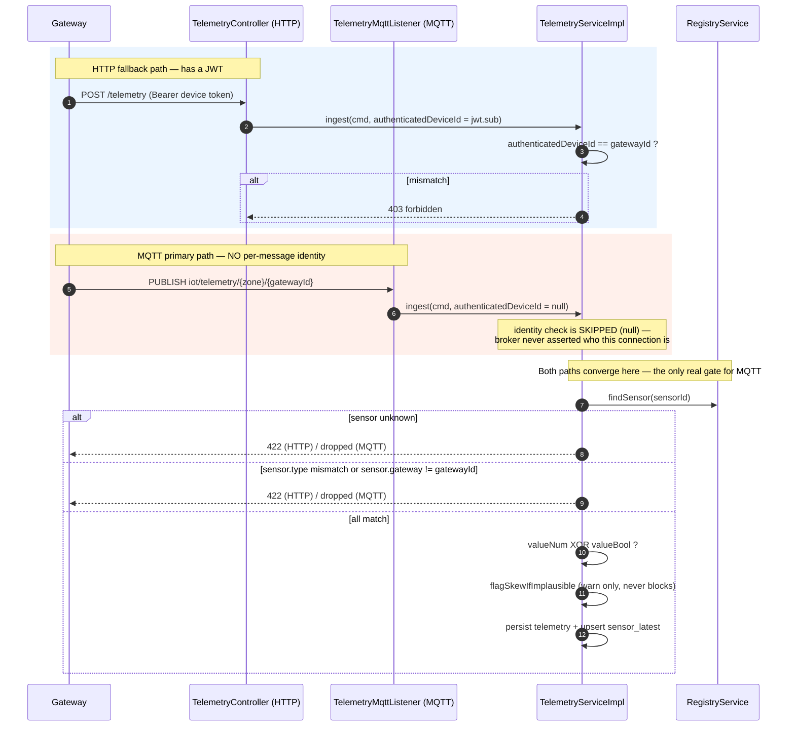
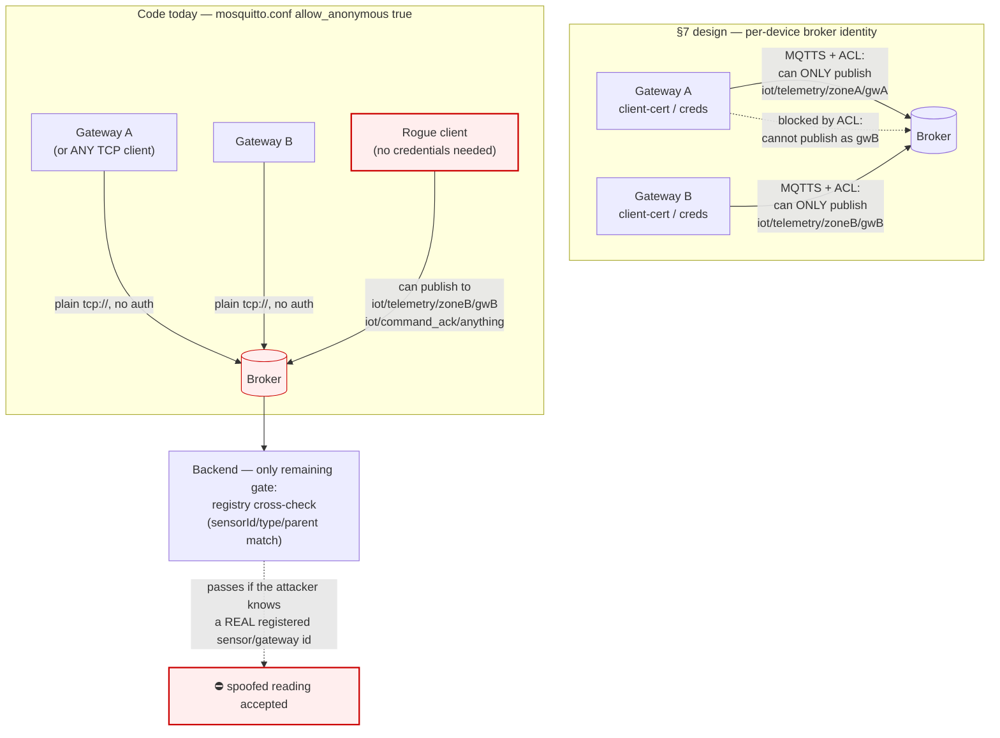
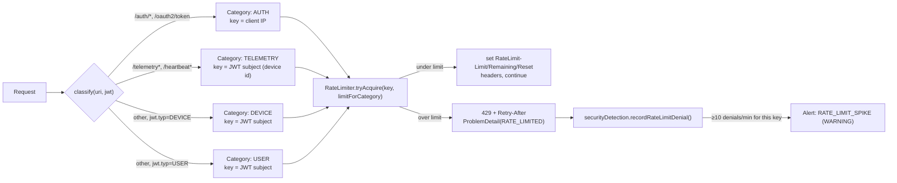
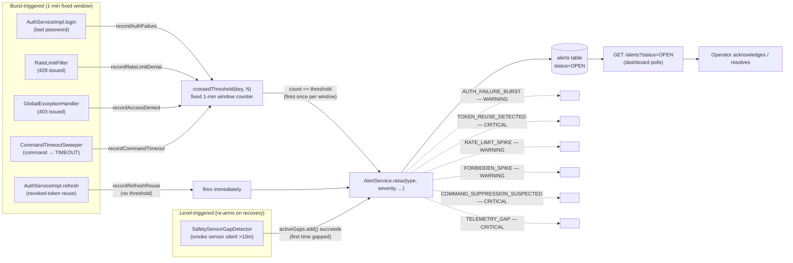

# Security Implementation Reference

**Purpose:** maps every security control described in `iot-platform-system-design.md` §7 ("Security design") to the code that actually implements it — file, lines, mechanism, and what attack/failure case it covers. Where the code only partially implements or deviates from the design, that is called out explicitly rather than glossed over.

**Method:** verified against the source tree (`src/main/java/com/huylq/iotprojectserver`, `src/main/resources`, `src/main/docker/compose`) as of `develop`, phases 0–10. Every claim below is grounded in a specific file; line numbers are approximate (±a few lines from refactors) but the referenced method/class names are exact.

**How to read this doc:** each section states the **design intent** (§7 quote or paraphrase), the **implementation** (file:line + mechanism), the **cases it covers** (what attack/failure it stops), and a **status** — ✅ fully implemented, 🟡 partially implemented, ⛔ not implemented (stub/no-op/gap). A consolidated gap table is at the end (§18).

---

## 1. Security stance recap

Per design doc §7: this is a **safety system**, not just a data system — integrity and availability of the telemetry/command loop outrank confidentiality. That ordering is reflected in the code: of the two places integrity was weakest at last review — broker device-identity (§10) and the operator-control safety interlock (§7) — the safety interlock has since been closed (security gap-remediation plan Phase 1, 2026-07-03); broker-level device identity (§10) remains the largest open gap.

---

## 2. User authentication

**Design intent:** OAuth2 + JWT, 1h access / 30d refresh, Argon2id passwords, RBAC in JWT.

| Mechanism | File : lines | Detail |
|---|---|---|
| Password hashing | `security/SecurityConfig.java` (`passwordEncoder()` bean) | `Argon2PasswordEncoder.defaultsForSpringSecurity_v5_8()` — Spring Security's tuned Argon2id defaults, no custom memory/iteration params |
| Token issuance | `security/JwtService.java` (`mintAccessToken`, `mintDeviceToken`) | `JwtClaimsSet` with `issuer`, `id` (jti, `UUID.randomUUID()`), `issuedAt`, `expiresAt`, `subject`, and either `claim("role", role)` (user) or `claim("scope", ...)` (device). Custom `typ` claim (`USER`/`DEVICE`) distinguishes token kinds |
| Signing | `JwtService.java` | RS256, `kid` header set from `keyManager.activeKid()` (see §4) |
| Access TTL | `application.yaml` `iot.security.jwt.access-token-ttl: 1h` | Matches design's "1 h" exactly |
| Login | `security/user/AuthServiceImpl.login`, `api/AuthController.java` | `POST /api/v1/auth/login`, public endpoint |
| Refresh (rotate-on-use) | `AuthServiceImpl.refresh` | Old row `revoked=true` + `rotatedTo` pointer set; new row + new access token issued |
| Logout | `AuthServiceImpl.logout` | Revokes DB row + denylists refresh hash + denylists the presented access token's `jti` if provided (instant sign-out) |
| Bad-credential handling | `AuthServiceImpl.login` | Identical `401` for unknown username, inactive user, and wrong password — no oracle that reveals which check failed |

**Cases covered:**
- Credential stuffing / brute force → generic `401`, no username-enumeration oracle; combined with the 20/min auth rate limit (§10).
- Stolen access token → expires in 1h max, or is denylisted instantly on logout (§3).
- Stolen refresh token → rotate-on-use means a stolen-then-used-by-attacker token is detected on the legitimate user's next refresh (reuse cascade, §3).
- Plaintext password exposure → Argon2id, never reversible, never logged (no `passwordHash` field on any DTO — verified by grep, §14).

**Extra behavior beyond the design doc:** `AuthServiceImpl.issueTokens` also revokes/denylists *all other active refresh tokens for the same user* on a fresh login — effectively single-active-session-per-login. This is a stricter-than-specified behavior, not a gap.

**Status:** ✅ fully implemented.

### Diagram — login, refresh rotation, and reuse detection



The reuse branch is the important one: an attacker who steals a refresh token and uses it *before* the legitimate user does will cause the legitimate user's next refresh to look like "this token is already revoked" — which is exactly the reuse-cascade trigger, so the theft self-reports.

### Role hierarchy

`security/Role.java`:
```java
public enum Role {
  SUPER_ADMIN, ADMIN, OPERATOR, TECHNICIAN, VIEWER;
}
```
`SecurityConfig.java` builds a Spring `RoleHierarchyImpl` by walking the enum in declaration order so each role implies every role below it — the hierarchy is self-maintaining from the enum, not a separately hand-written string:
```java
Role[] ladder = Role.values();
var builder = RoleHierarchyImpl.withDefaultRolePrefix();
for (int i = 0; i < ladder.length - 1; i++) {
  builder = builder.role(ladder[i].name()).implies(ladder[i + 1].name());
}
```
This means `hasRole('VIEWER')` in `@PreAuthorize` is satisfied by *any* authenticated user role — see the full inventory in §5.

---

## 3. Device authentication (OAuth2 client-credentials)

**Design intent:** one `client_id`/`client_secret` per device, secret hashed and shown once, scopes gate device capability, rotation with grace window.

### Token minting

`security/device/DeviceTokenServiceImpl.mint`:
1. Lookup credential by `client_id` → unknown → generic `401` (`badClient()`).
2. `verifySecret`: Argon2 match against `client_secret_hash`, **or**, if `graceExpiresAt.isAfter(now)`, against `previous_secret_hash` — the rotation-grace mechanism.
3. **Status gate** — only an `ACTIVE` device can mint a token:
```java
var status = cred.getDevice().getStatus();
if (status != Device.Status.ACTIVE) {
  throw badClient();  // same generic 401 for SUSPENDED/DECOMMISSIONED/INACTIVE — no status oracle
}
```
4. **Scope intersection** — granted scopes = `stored ∩ requested` (plain `Set.retainAll`); omitting `scope` in the request grants everything the device is provisioned for.

`api/DeviceTokenController.java`: `POST /api/v1/oauth2/token`, form-encoded, public. `DeviceTokenRequest.grant_type` is constrained with `@Pattern(regexp = "client_credentials")` — any other grant type is rejected at the DTO layer before it reaches the service.

### Diagram — credential issue, rotation grace window, and token mint



### Credential issuance & rotation

`security/device/DeviceCredentialServiceImpl`:
- `client_id = "cli_" + base64url(12 random bytes)`, secret = `base64url(32 random bytes)` — both `SecureRandom`-backed.
- Hashed with the same Argon2id `PasswordEncoder` bean used for user passwords.
- **Shown once**: the issue/rotate response DTO (`CredentialSecretDto`) is the only place the raw secret ever appears; `getMetadata` returns only `clientId` + `rotatedAt`.
- **Rotation grace window**:
```java
OffsetDateTime graceExpiresAt = now.plus(config.credentialRotationGrace());  // default 24h
cred.setPreviousSecretHash(cred.getClientSecretHash());
cred.setGraceExpiresAt(graceExpiresAt);
cred.setClientSecretHash(passwordEncoder.encode(newSecret));
```
Grace window value: `security/device/DeviceCredentialConfig` default `Duration.ofHours(24)`, `application.yaml` `iot.device.credential-rotation-grace: 24h`.
- Every issue/rotate writes `DEVICE_CREDENTIAL_ISSUE`/`DEVICE_CREDENTIAL_ROTATE` to the audit log (§11).
- `Idempotency-Key` header supported on issue/rotate (`DeviceCredentialController`, optional) so a client retry can't mint two secrets for one intent.

### Scopes

`security/device/DeviceScope.java` — exactly the 4 designed scopes: `telemetry:publish`, `command:subscribe`, `command:ack`, `heartbeat:publish`.

### Devices-ingest-only enforcement (T4 mitigation)

Two independent mechanisms, both load-bearing:
1. `TelemetryController` ingest/heartbeat endpoints require `@PreAuthorize("hasAuthority('SCOPE_telemetry:publish')")` / `SCOPE_heartbeat:publish` — device tokens carry these `SCOPE_*` authorities via the JWT `scope` claim.
2. **Every other controller** uses `hasRole(...)`. A device JWT carries **no `role` claim**, so `JwtAuthenticationConverter` grants it no `ROLE_*` authority at all — `hasRole(...)` structurally can never be satisfied by a device token, regardless of scope. `CommandController`'s own javadoc states this explicitly: *"Because device JWTs carry no `role` claim, `hasRole(...)` also enforces devices-ingest-only (T4)."*

**Cases covered:**
- A compromised device token cannot call `/users`, `/devices`, `/commands`, `/rules`, `/alerts`, `/audit-logs` — structurally blocked by the missing `role` claim, not by a maintained blocklist.
- Secret leaked in transit/logs → hashed at rest, shown once, rotatable without downtime (grace window means no lockout mid-roll).
- Retry-mints-two-secrets race → `Idempotency-Key`.

**Status:** ✅ fully implemented.

---

## 4. Token revocation (denylist)

**Design intent:** a fast-deny layer in front of the DB `revoked` flag, closing the "can't kill a stateless access token before expiry" and "DB round-trip on every refresh" gaps.

`common/denylist/TokenDenylist.java` — interface with two key spaces, each taking a TTL:
- `blacklistAccessJti` / `isAccessBlacklisted` (JWT `jti`)
- `blacklistRefreshHash` / `isRefreshBlacklisted` (SHA-256 of the raw refresh token)

**Two interchangeable backends**, switched by config, identical interface:
- `InMemoryTokenDenylist` — `ConcurrentHashMap<String,Instant>`, a `@Scheduled(fixedDelayString = "PT5M")` sweep prunes expired entries. Active when `iot.redis.enabled=false` (the default — `application.yaml`, `application-local.yaml`, `application-test.yaml`).
- `RedisTokenDenylist` — `SET key 1 EX ttl`, no separate sweeper needed (Redis TTL does the work). Active when `iot.redis.enabled=true` (`application-prod.yaml`).

**Validator wiring** — `common/denylist/DenylistJwtValidator.java`:
```java
public OAuth2TokenValidatorResult validate(Jwt token) {
  String jti = token.getId();
  if (jti != null && denylist.isAccessBlacklisted(jti)) {
    return OAuth2TokenValidatorResult.failure(new OAuth2Error("invalid_token", "Token has been revoked", null));
  }
  return OAuth2TokenValidatorResult.success();
}
```
Chained in `SecurityConfig.jwtDecoder`:
```java
// Denylist runs ahead of issuer/expiry checks (§7) — a revoked-but-still-time-valid
// token should fail for the "it's revoked" reason, not get a chance to pass the
// cheaper structural checks first.
OAuth2TokenValidator<Jwt> defaults = JwtValidators.createDefault();
decoder.setJwtValidator(new DelegatingOAuth2TokenValidator<>(denylistValidator, defaults));
```
This is a **single validator gating every JWT** — both user and device tokens flow through the same `NimbusJwtDecoder`, so the denylist applies uniformly to both token kinds.

> ✅ **Fixed (security gap-remediation plan Phase 2, 2026-07-03).** Previously `DelegatingOAuth2TokenValidator<>(defaults, denylistValidator)` listed `defaults` first — functionally harmless (a denylisted-and-expired token was rejected either way, just for the other validator's reason), but a literal mismatch against §7's "ahead of issuer/expiry checks" wording. The constructor argument order now matches: `denylistValidator` runs first.

**TTL = remaining token lifetime** — `AuthServiceImpl.remainingLifetime`:
```java
Duration d = Duration.between(Instant.now(), expiry.toInstant());
return d.isNegative() ? Duration.ZERO : d;
```
Every `blacklistRefreshHash`/`blacklistAccessJti` call uses this, so denylist entries self-expire exactly when the underlying token would have — the store never outlives what it's blocking and never grows unbounded.

**Refresh-reuse cascade** — `AuthServiceImpl.cascadeRevoke`:
```java
private void cascadeRevoke(RefreshToken start) {
  RefreshToken cursor = start;
  while (cursor != null) {
    cursor.setRevoked(true);
    denylist.blacklistRefreshHash(cursor.getTokenHash(), remainingLifetime(cursor.getExpiresAt()));
    cursor = cursor.getRotatedTo();
  }
}
```
Presenting an already-rotated-out refresh token walks `rotated_to` forward and revokes/denylists **every descendant** — an attacker holding a stolen-but-already-used token loses every token that was minted after it, the instant the legitimate holder's later refresh is detected as a reuse. Raises `AuditEvent.USER_TOKEN_REUSE_DETECTED` and feeds `SecurityDetectionService.recordRefreshReuse` (§12). Reuse returns `401 errors/token-revoked`.

**Cases covered:**
- Logout doesn't have to wait out a 1h access-token TTL — instant.
- Stolen refresh token used by an attacker before the legitimate user refreshes → detected on the legitimate user's *next* refresh attempt (their token is now `revoked`), cascading revocation of the whole compromised chain.
- Horizontal scale-out — Redis backend means all instances see the same denials.

**Status:** ✅ fully implemented (validator-ordering wording nuance closed — see above).

### Diagram — how every authenticated request is validated

This is the pipeline every single API call (user or device) passes through before it reaches a controller:



The branch at **H** is what makes "devices are ingest-only" a structural guarantee rather than a maintained rule: a device token never has anything to put in the `role` slot, so every `hasRole(...)` check downstream is unsatisfiable for it, full stop — see §3.

---

## 5. JWT signing key management

**Design intent:** KMS-managed signing key, scheduled rotation, `kid`-based rollover so in-flight tokens survive a key change.

`security/JwtKeyManager.java`:
- Builds an `activeSigningKey` (private + public, RS256) and a `publicJwkSet` containing the **active** key's public JWK plus every **retired** key's public JWK. This is what makes rollover safe: a token signed by a just-retired key still verifies, because its `kid` is still present in the published set.
- If no PEM material is configured (`JwtKeyProperties`), `generateEphemeralKey()` creates an in-process 2048-bit RSA keypair with `kid = "ephemeral-" + UUID` and logs a loud warning that this is acceptable **only** for local/test profiles.
- `activeSigningKey()` is used only by the `JwtEncoder`; `publicJwkSet()` never includes a private key.

`api/JwksController.java`: `GET /api/v1/.well-known/jwks.json` (public) serves `keyManager.publicJwkSet().toJSONObject()` — this is what a `NimbusJwtDecoder.withJwkSource(...)` (or any external verifier) would fetch.

**Key sourcing per profile:**
| Profile | Source |
|---|---|
| `local` / `test` | No `iot.security.jwt.keys.*` set → ephemeral keypair generated at boot |
| `prod` | `${JWT_ACTIVE_KID}` / `${JWT_ACTIVE_PRIVATE_KEY_PEM}` / `${JWT_ACTIVE_PUBLIC_KEY_PEM}` / `${JWT_RETIRED_KEYS}` env vars |

> 🟡 **Partial vs design:** §7's secrets table specifies "JWT signing key: KMS / secrets manager (not source/env in prod)." The code sources the key from **environment variables**, not a KMS SDK call. `JwtKeyManager`'s own javadoc says as much: there is no dependency on a real KMS client anywhere in the code — populating those env vars from a KMS at deploy time is a legitimate way to satisfy the intent, but it happens entirely outside this codebase, not inside it.

**Cases covered:**
- Key rollover without invalidating tokens issued under the old key (as long as the old key stays in `retiredKeys`).
- Local/test dev loop needs zero key configuration.

**Status:** 🟡 partially implemented — rollover mechanics are real and tested; actual KMS custody is a deployment-time expectation, not code.

---

## 6. RBAC — full endpoint authorization inventory

**Design intent:** `@PreAuthorize` on every endpoint, enforced server-side, never trusted to the UI.

`@EnableMethodSecurity` is declared on `SecurityConfig`, which activates `@PreAuthorize`. Every controller method below carries one:

| Controller : method | Route | `@PreAuthorize` |
|---|---|---|
| `AuthController` | `POST /auth/login`, `/refresh`, `/logout` | *(public — no annotation, listed in the security-config public-endpoint list)* |
| `DeviceTokenController` | `POST /oauth2/token` | *(public)* |
| `JwksController` | `GET /.well-known/jwks.json` | *(public)* |
| `TelemetryController` | `POST /telemetry` | `hasAuthority('SCOPE_telemetry:publish')` |
| `TelemetryController` | `GET /telemetry` | `hasRole('VIEWER')` |
| `TelemetryController` | `GET /current-state` | `hasRole('VIEWER')` |
| `TelemetryController` | `GET /sensors/{sensorId}/latest` | `hasRole('VIEWER')` |
| `TelemetryController` | `GET /connectivity` | `hasRole('VIEWER')` |
| `TelemetryController` | `POST /heartbeat` | `hasAuthority('SCOPE_heartbeat:publish')` |
| `DeviceController` | `GET /devices` | `hasRole('VIEWER')` |
| `DeviceController` | `POST /devices` | `hasRole('ADMIN')` |
| `DeviceController` | `GET /devices/{id}` | `hasRole('VIEWER')` |
| `DeviceController` | `PATCH /devices/{id}` | `hasRole('ADMIN')` |
| `DeviceController` | `GET /devices/{id}/health` | `hasRole('VIEWER')` |
| `DeviceController` | `GET /devices/{id}/sensors` | `hasRole('VIEWER')` |
| `DeviceController` | `POST /devices/{id}:activate` | `hasRole('ADMIN')` |
| `DeviceController` | `POST /devices/{id}:suspend` | `hasRole('ADMIN')` |
| `DeviceController` | `POST /devices/{id}:decommission` | `hasRole('ADMIN')` |
| `DeviceCredentialController` | `GET /devices/{id}/credentials` | `hasRole('ADMIN')` |
| `DeviceCredentialController` | `POST /devices/{id}/credentials` | `hasRole('ADMIN')` |
| `DeviceCredentialController` | `POST /devices/{id}/credentials:rotate` | `hasRole('ADMIN')` |
| `DeviceCredentialController` | `GET /devices/{id}/scopes` | `hasRole('ADMIN')` |
| `DeviceCredentialController` | `PUT /devices/{id}/scopes` | `hasRole('ADMIN')` |
| `CommandController` | `POST /commands` | `hasRole('TECHNICIAN')` *(floor only — see §7 for the finer matrix)* |
| `CommandController` | `GET /commands` | `hasRole('VIEWER')` |
| `CommandController` | `GET /commands/{id}` | `hasRole('VIEWER')` |
| `CommandController` | `GET /actuator-state` | `hasRole('VIEWER')` |
| `CommandController` | `GET /devices/{id}/actuator-state` | `hasRole('VIEWER')` |
| `RuleController` | `GET /rules` | `hasRole('OPERATOR')` |
| `RuleController` | `POST /rules` | `hasRole('ADMIN')` |
| `RuleController` | `GET /rules/{id}` | `hasRole('OPERATOR')` |
| `RuleController` | `PUT /rules/{id}` | `hasRole('ADMIN')` |
| `RuleController` | `PATCH /rules/{id}` | `hasRole('ADMIN')` |
| `RuleController` | `DELETE /rules/{id}` | `hasRole('ADMIN')` |
| `AlertController` | `GET /alerts` | `hasRole('VIEWER')` |
| `AlertController` | `GET /alerts/{id}` | `hasRole('VIEWER')` |
| `AlertController` | `POST /alerts/{id}:acknowledge` | `hasRole('OPERATOR')` |
| `AlertController` | `POST /alerts/{id}:resolve` | `hasRole('OPERATOR')` |
| `AuditLogController` | `GET /audit-logs` | `hasRole('ADMIN')` |
| `UserController` | `GET /users` | `hasRole('ADMIN')` |
| `UserController` | `POST /users` | `hasRole('ADMIN')` |
| `UserController` | `GET /users/{id}` | `hasRole('ADMIN')` |
| `UserController` | `PATCH /users/{id}` | `hasRole('ADMIN')` |
| `UserController` | `DELETE /users/{id}` | `hasRole('ADMIN')` |
| `UserController` | `POST /users/{id}/password-reset` | `hasRole('ADMIN') or #userId.toString() == authentication.token.subject` (self-service reset) |

`/actuator/prometheus` and `/actuator/metrics/**` are locked to `hasRole('ADMIN')` at the **filter-chain** level in `SecurityConfig` (not `@PreAuthorize`, since actuator endpoints aren't controller methods here).

Because of the self-maintaining role hierarchy (§2), `hasRole('VIEWER')` is satisfied by all 5 roles, `hasRole('TECHNICIAN')` by TECHNICIAN and above, etc. — exactly matching the §7 authority matrix.

> ⚠️ **Note on `POST /commands`:** the design's API doc originally floors this at `OPERATOR`; the code floors it at `TECHNICIAN` and pushes the fine-grained role×actuator-class decision into the service layer (§7 below) — this is intentional (TECHNICIAN can command *routine* actuators) but means the `@PreAuthorize` annotation alone doesn't tell the whole authorization story for this one endpoint.

**Cases covered:** every T4 (Elevation of Privilege) scenario in the STRIDE table — a VIEWER calling an ADMIN endpoint, a device token calling any role-gated endpoint — is rejected before the controller body runs.

**Status:** ✅ fully implemented.

---

## 7. Operator control authorization & safety interlock

**Design intent:** commanding an actuator is a physical action; role × actuator-class (routine vs safety) authorization, plus a safety interlock that rejects a manual command contradicting an active safety rule, overridable only by `SUPER_ADMIN` with an explicit reason.

### Role × actuator-class gate

`command/CommandServiceImpl.authorizeRoleAndActuatorClass`:
```java
private void authorizeRoleAndActuatorClass(Role callerRole, Device target, ValidatedCommand validated) {
  boolean safety = props.safetyDeviceTypes().contains(target.getDeviceType());
  switch (callerRole) {
    case VIEWER -> throw ApiException.forbidden("VIEWER may not issue commands");
    case TECHNICIAN -> {
      if (safety) throw ApiException.forbidden("TECHNICIAN may not command a safety actuator");
    }
    case OPERATOR -> {
      if (safety && ActuatorStates.isDeEscalating(validated.desiredState())) {
        throw ApiException.forbidden("OPERATOR may only turn a safety actuator ON/escalate");
      }
    }
    case ADMIN, SUPER_ADMIN -> { /* unrestricted */ }
  }
}
```
`ActuatorStates.isDeEscalating` (extracted to a shared utility in the security gap-remediation pass, since the real safety interlock below needs the same check) treats `"OFF"`/`"STOP"`/`"CLOSED"` (case-insensitive) as de-escalating. This implements the §7 matrix exactly: VIEWER never reaches this code (blocked earlier by `@PreAuthorize`), TECHNICIAN is routine-only, OPERATOR may only escalate/turn-ON a safety actuator (never turn one off), ADMIN/SUPER_ADMIN unrestricted. This check only runs for human-issued (`actorType == USER`) commands — rule-engine-issued commands (`actorType == SYSTEM`) skip it, because a rule already passed write-time validation and is authored by an ADMIN.

Safety-actuator classification is **config-driven**, not hardcoded:
```yaml
iot:
  command:
    ack-timeout: 30s
    safety-device-types:
      - exhst_fan
```
Today only `exhst_fan` is classified safety-critical; `light`/`ac`/`curtain` are routine. Adding a second safety type is a config change.

### Override validation

`CommandServiceImpl.validateOverrideRequest`:
```java
private static void validateOverrideRequest(Role callerRole, boolean override, String overrideReason) {
  if (!override) return;
  if (callerRole != Role.SUPER_ADMIN) throw ApiException.forbidden("Only SUPER_ADMIN may set override=true");
  if (overrideReason == null || overrideReason.isBlank())
    throw ApiException.unprocessable("overrideReason is required when override=true");
}
```
Runs unconditionally whenever `override=true` is sent — regardless of whether a safety hold actually exists — so a lower role setting the flag is rejected (`403`) and a `SUPER_ADMIN` who forgets the reason is rejected (`422`), matching §7's rule exactly.

### Safety interlock

`CommandServiceImpl.checkSafetyInterlock`:
```java
private boolean checkSafetyInterlock(IssueCommandCmd cmd, Device target, ValidatedCommand validated, String commandId) {
  boolean held = safetyInterlock.violatesActiveSafety(
      target.getDeviceId(), target.getZone(), target.getDeviceType(), validated.desiredState());
  if (!held) return false;
  if (cmd.callerRole() == Role.SUPER_ADMIN && cmd.override()) {
    return true;   // override accepted — logged + audited
  }
  throw ApiException.safetyInterlock("Command contradicts an active safety action on " + target.getDeviceId());
}
```
On a successful override, `CommandServiceImpl.issue` additionally writes a `SAFETY_OVERRIDE` audit event alongside the normal command audit.

The `409 errors/safety-interlock` HTTP contract (`ApiException.safetyInterlock`, `ErrorType.SAFETY_INTERLOCK`, the override validation above) is now backed by a real signal:

`command/SafetyInterlockCheck.java` — widened interface (security gap-remediation plan Phase 1): `violatesActiveSafety(targetDeviceId, zone, deviceType, desiredState)`. The extra parameters let the implementation answer without re-deriving anything the caller already validated.

`command/AlertBasedSafetyInterlockCheck.java` — **the active bean** (`iot.command.safety-interlock.enabled=true`, the default):
```java
@Override
public boolean violatesActiveSafety(String targetDeviceId, String zone, String deviceType, String desiredState) {
  if (!ActuatorStates.isDeEscalating(desiredState)) {
    return false;   // escalating a safety actuator is always allowed
  }
  List<String> alertTypes = props.alertTypesFor(deviceType);
  if (alertTypes.isEmpty()) {
    return false;   // this device type isn't classified safety-critical
  }
  return openAlerts.existsOpenAlert(zone, alertTypes);
}
```
**The signal:** an `OPEN` alert of a safety-linked type in the target's zone. This is deliberately simple and durable — an open alert already *is* the record that a hazard is unresolved, so no separate "is the rule still active" bookkeeping is needed. Only a *de-escalating* command (`OFF`/`STOP`/`CLOSED`) can trip the interlock; escalating a safety actuator (e.g. turning an exhaust fan ON) is always safe and skips the alert lookup entirely.

The device-type → alert-type mapping is config-driven, not hardcoded:
```yaml
iot:
  command:
    safety-interlock:
      enabled: true
      alert-types-by-device-type:
        exhst_fan:
          - SMOKE
```

**Module boundary preserved:** `command` does not depend on `alert.AlertRepository` directly. `AlertServiceImpl` additionally implements a narrow published interface, `alert/OpenAlertQuery.java`:
```java
public interface OpenAlertQuery {
  boolean existsOpenAlert(String zone, Collection<String> types);
}
```
backed by a new derived query, `AlertRepository.existsByZoneAndTypeInAndStatus(zone, types, Alert.Status.OPEN)`. `command` depends only on `OpenAlertQuery`, matching the System Design §9 rule that cross-module reads go through a published interface, never a repository.

`command/NoOpSafetyInterlockCheck.java` — kept as an explicit, `@ConditionalOnProperty`-gated **opt-out** (`iot.command.safety-interlock.enabled=false`) for isolated unit tests that don't want the `alert`-module dependency, mirroring how `InMemoryTokenDenylist`/`RedisTokenDenylist` coexist behind `iot.redis.enabled`. It is no longer the bean that runs in the shipped application.

**Cases covered:**
- A TECHNICIAN cannot command the exhaust fan under any circumstances.
- An OPERATOR cannot turn the exhaust fan OFF, only ON — so an operator can't accidentally (or maliciously) de-escalate a safety actuator via the routine control path.
- An unauthorized override attempt (`override=true` from ADMIN or below) is rejected and never reaches the interlock check.
- **A `SUPER_ADMIN` (or anyone else) sending `exhaust OFF` while a `SMOKE` alert is genuinely `OPEN` in that zone is now rejected `409 errors/safety-interlock`** — the case this section previously flagged as uncovered. `SUPER_ADMIN` may still proceed with `override=true` + a non-blank `overrideReason`, which writes a `SAFETY_OVERRIDE` audit event.
- The same command, once the alert is `ACK`'d or `RESOLVED`, succeeds normally — the hold releases the moment the hazard signal clears.

**Residual scope note:** the signal is "an open alert of a linked type in the zone," not "the specific rule that raised it is still enabled." In practice these coincide (a rule only stays capable of re-raising the alert while it's enabled and the condition holds), so this is a deliberate simplification, not a known gap — extending to rule-liveness tracking would need `rules` state as a second signal, which nothing in the design or the current threat model calls for.

**Status:** ✅ fully implemented (security gap-remediation plan Phase 1, 2026-07-03) — role/class authorization and the interlock are both real and enforced.

**Audit & rate limit:** every manual command writes `COMMAND_ISSUE` + `MANUAL_COMMAND` audit entries (plus `SAFETY_OVERRIDE` if overriding); manual commands count against the per-user rate limit (§10) — both per §7.

### Diagram — the full authorization chain on `POST /commands`



Every branch above is real and enforced, including the interlock (green) — a manual command that would de-escalate a safety actuator while an open, linked-type alert exists in its zone is genuinely rejected `409`, with the `SUPER_ADMIN` override path still available and fully audited.

---

## 8. Command idempotency & integrity

**Design intent:** MQTT QoS-1 is at-least-once, so commands must be idempotent state-sets, deduped, with a timeout sweeper guaranteeing a terminal state; `Idempotency-Key` prevents duplicate issue from a retry/double-click.

### Idempotency-Key

`common/idempotency/IdempotencyService.lookup`:
```java
String hash = sha256Hex(requestBody);
Optional<IdempotencyKey> existing = repo.findById(new IdempotencyKeyId(key, endpoint));
if (existing.isEmpty()) return IdempotencyResult.fresh();
IdempotencyKey row = existing.get();
if (!row.getRequestHash().equals(hash)) return IdempotencyResult.conflict();  // same key, different body → 409
return IdempotencyResult.replay(row.getResponseStatus(), row.getResponseBody());
```
Key = `(idempotencyKey, endpoint)`; the stored request-body hash detects key-reuse-with-a-different-payload and returns `409 conflict` instead of silently replaying the wrong response. A concurrent double-insert race is caught via `DataIntegrityViolationException` — the existing row wins. TTL 24h (`iot.idempotency.ttl-hours`), pruned hourly.

`common/idempotency/IdempotencyHelper.run` is the controller-facing wrapper used by `CommandController.issue` — here the header is **mandatory** (`@RequestHeader("Idempotency-Key") UUID`), unlike device registration/credential issue where it's optional.

### Command parameter whitelist

`command/CommandParameterValidator` — a `final class` of `static` methods, per-`device_type`:

| Type | Required | Optional | Constraint |
|---|---|---|---|
| `light` | `status` | `level` | `status ∈ {ON,OFF}`, `level` int 0–100 |
| `ac` | `status` | `set_temp`, `mode` | `set_temp` 16–30, `mode ∈ {COOL,HEAT,DRY,FAN,AUTO}` |
| `exhst_fan` | `status` | — | `status ∈ {ON,OFF}` only, no extra attributes |
| `curtain` | `direction` | — | `direction ∈ {UP,DOWN,STOP}` |

Unknown parameters are rejected (`rejectUnknown`, `422` naming the offending key); only `action == "SET"` is accepted at all — anything else is `422` before it ever reaches a device. This is the "no free-form passthrough to the device" control from §7's input-validation table.

### Dedup / status-guarded transitions

`command/CommandRepository` — both ack-handling updates are **conditional `UPDATE`s**, not blind writes:
```java
@Modifying
@Query("UPDATE Command c SET c.status = ...RECEIVED, c.receivedAt = :ts " +
       "WHERE c.commandId = :commandId AND c.status = ...PENDING")
int markReceived(...);

@Modifying
@Query("UPDATE Command c SET c.status = :status, c.executedAt = :executedAt " +
       "WHERE c.commandId = :commandId AND c.status IN (...PENDING, ...RECEIVED)")
int markTerminalIfOpen(...);
```
A row count of 0 means "already moved past this state" — this is what makes a QoS-1 duplicate delivery, a late/duplicate ack, or a race against the timeout sweeper harmless: whichever transition arrives first wins, and every later one is a no-op logged, not an error.

### Timeout sweeper

`command/CommandTimeoutSweeper`:
```java
@Scheduled(fixedDelayString = "PT10S")
public void sweep() {
  OffsetDateTime cutoff = Clocks.nowUtc().minus(props.ackTimeout());  // default 30s
  for (Command c : commandRepo.findOpenIssuedBefore(cutoff)) {
    int updated = commandRepo.markTerminalIfOpen(c.getCommandId(), Command.Status.TIMEOUT, null);
    if (updated > 0) {
      audit.system(AuditEvent.COMMAND_TIMEOUT, ...);
      securityDetection.recordCommandTimeout(c.getTarget().getDeviceId());  // §12
    }
  }
}
```
Runs every 10s; cutoff is `now - ackTimeout` (30s default, `iot.command.ack-timeout`). Every sweep-caused transition is audited and fed into the command-suppression detection signal.

**Cases covered:**
- MQTT redelivering a command → the device dedupes on `command_id` (firmware-side contract); the backend's ack handling is idempotent regardless.
- A double-click issuing two commands → `Idempotency-Key` collapses to one.
- A dropped/lost ack → command doesn't hang forever `PENDING`; it reaches `TIMEOUT` within ~40s worst case (30s timeout + up to 10s sweep interval), and 3 timeouts to the same device in a minute raises a detection alert (§12) — this is the "command suppression detection" the design calls for.
- Malformed/malicious command parameters → whitelisted per device type, rejected at `422` before ever reaching MQTT.

**Status:** ✅ fully implemented.

### Diagram — ack lifecycle vs. redelivery, late acks, and the sweeper race



The `WHERE status IN (...)` guard on every transition is what makes this race harmless either way — whichever write lands first wins, and the loser is a logged no-op, never a corrupted or double-applied state change.

---

## 9. Telemetry / device-plane integrity

**Design intent:** the backend never trusts the transport alone — payload identity must match authenticated identity; unknown sensor types rejected; stale-replay flagged.

`telemetry/TelemetryServiceImpl.ingest`:

**Identity re-validation (HTTP path only):**
```java
if (command.authenticatedDeviceId() != null
    && !command.authenticatedDeviceId().equals(command.gatewayId())) {
  throw ApiException.forbidden("gatewayId does not match the authenticated device identity");
}
```
`authenticatedDeviceId` comes from the JWT `sub`, populated only on the HTTP fallback ingest path. MQTT has no per-message JWT, so this specific check is skipped there — the registry cross-check below is MQTT's only backstop, and the code's own comments say so explicitly (see §9's gap discussion).

**Registry cross-check (`validateReading`, both transports):**
```java
Sensor sensor = registry.findSensor(r.sensorId())
    .orElseThrow(() -> ApiException.unprocessable("Unknown sensorId: " + r.sensorId()));
if (!sensor.getType().equals(r.sensorType()))
  throw ApiException.unprocessable("sensorType mismatch for sensor " + r.sensorId());
if (sensor.getGateway() == null || !sensor.getGateway().getDeviceId().equals(gatewayId))
  throw ApiException.unprocessable("sensorId " + r.sensorId() + " is not registered under gateway " + gatewayId);
```
This is what actually protects MQTT ingest — every reading's sensor must be a real registered sensor, its declared type must match the registry, and it must belong to the gateway that's publishing it. This doubles as the "reject unknown sensor types" control from §7's input-validation table.

**`valueNum` XOR `valueBool`** enforced twice, deliberately:
- DTO level (`TelemetryIngestRequest.isValueShapeValid`, `@AssertTrue`) — Bean Validation, HTTP path only.
- Service level (inside `validateReading`) — re-checked so the MQTT path (which never runs through Bean Validation) gets the same guarantee.

**Clock-skew flagging (`flagSkewIfImplausible`):**
```java
Duration skew = Duration.between(r.ts(), now);
if (skew.isNegative() && skew.negated().compareTo(props.maxClockSkewFuture()) > 0) {
  log.warn("Implausible future ts for sensor {}", r.sensorId());
} else if (!skew.isNegative() && skew.compareTo(props.maxClockSkewPast()) > 0) {
  log.warn("Implausible past ts (possible stale-replay) for sensor {}", r.sensorId());
}
```
Config: `maxClockSkewFuture` 5m, `maxClockSkewPast` 1h (`application.yaml`).

> 🟡 **Detection signal, not a gate:** this method's own javadoc says it flags but never blocks — a Phase-10 detection signal. The reading is stored regardless of skew. Design doc §7 itself describes this control as "flag implausible `ts` skew" (its own wording), so the code matches the design's literal ask — but it's worth being explicit that a replayed "all clear" reading with a skewed timestamp is logged, **not rejected**. If a stronger reject-on-skew behavior is wanted, that would be new work, not a bug fix.

**Cases covered:**
- A device impersonating another gateway over HTTP → `403` (identity mismatch).
- A rogue MQTT publisher claiming to be a sensor that doesn't exist, or that belongs to a different gateway → `422`/dropped (registry cross-check) — this is the primary defense against telemetry spoofing (T1) given the broker gap in §10.
- Malformed reading shape (both/neither of `valueNum`/`valueBool`) → `422` on both transports.
- Replayed old telemetry → flagged in logs (detection signal), not blocked.

**Status:** 🟡 mostly implemented; MQTT-path identity is enforced only via registry cross-check (no broker-asserted identity — see §10), and stale-replay is warn-only.

### Diagram — HTTP fallback vs MQTT ingest, side by side



The registry cross-check is real, but note what it does **not** catch: if an attacker publishes as `gw_office1_01` with a `sensorId` that legitimately belongs to that gateway, every check above passes — because nothing at the broker ever verified the *connection* was actually `gw_office1_01`. That's the broker-ACL gap detailed next.

---

## 10. Broker-level security (largest gap vs design doc)

**Design intent:** per-`device_id` topic ACLs at the broker so device X can only publish/subscribe its own topics — described in §7 as *"the single control that defeats T1/T2"* (telemetry spoofing, command hijack).

`src/main/docker/compose/mosquitto/config/mosquitto.conf` (entire relevant content):
```
listener 1883
allow_anonymous true

listener 9001
protocol websockets
allow_anonymous true
```
No `password_file`, no `acl_file`, no `cafile`/`certfile`/`keyfile` (no TLS) anywhere in this file.

`mqtt/MqttClientLifecycle.java` — the **backend's own** connection to the broker does support a username/password:
```java
if (props.username() != null && !props.username().isBlank()) {
  opts.setUserName(props.username());
  opts.setPassword(props.password() == null ? new char[0] : props.password().toCharArray());
}
```
sourced from `${MQTT_USERNAME}`/`${MQTT_PASSWORD}` in prod config — but this authenticates only the backend's single bridge connection to the broker, not individual devices.

A repo-wide grep for any per-device broker credential provisioning, ACL file generation, or dynamic-security-plugin integration returns nothing — there is no code path anywhere that maps a `DeviceCredential`/`DeviceScope` row to an MQTT-broker-level identity or topic permission.

> ⛔ **Confirmed major gap:** every device connects to the broker **anonymously**. There is no broker-level identity check and no per-topic restriction — any client that can reach port 1883/9001 can publish to any topic, including spoofing another zone's telemetry (`iot/telemetry/office_1/...`) or another device's command-ack topic (`iot/command_ack/{device_id}`). The code is self-aware of this: `TelemetryServiceImpl`'s own comments state *"MQTT has no broker-asserted identity yet (§7 — broker ACLs land in Phase 10)... the registry cross-check here is the 'never trust the transport alone' control."* The only mitigating controls actually in place are the backend-side re-validations covered in §9 — real, but strictly weaker than broker-enforced ACLs, since they only catch *unregistered* or *mismatched-registry* spoofing, not a rogue device correctly guessing/knowing another *registered* device's ID.

**Cases NOT covered (the gap):**
- A rogue device that knows another registered gateway's ID and zone can publish fake telemetry claiming to be that gateway — the registry cross-check passes (the sensor IS registered under that gateway in the DB), so this spoof is **not caught** by anything in code today.
- Any client can subscribe to `iot/command/{any_device_id}` and observe (or, with a malicious broker/MITM, potentially race) commands meant for another actuator.
- No TLS on MQTT — telemetry, heartbeats, and commands travel in plaintext.

**Status:** ⛔ not implemented (documented, explicit gap — Phase 10 per the implementation plan, blocked partly on an unconfirmed MQTT auth mechanism from the device-team spec).

### Diagram — designed trust boundary vs. what's actually enforced



**Read this as:** the design's whole point in §6/§7 was that broker ACLs stop a compromised or rogue device from ever being *able* to send a message that isn't its own — identity is enforced before the message leaves the broker. The actual system has no such gate; the backend's registry cross-check is a *plausibility* check (does this sensor/gateway pairing exist and match?), not an *identity* check (was this specific connection authorized to speak for that sensor/gateway?). Those are different guarantees, and the gap between them is exactly the T1/T2 blast radius the design doc warns about.

---

## 11. Rate limiting

**Design intent:** User 100/min, Device 300/min, Auth 20/min, Telemetry configurable; Redis-backed if multi-instance; a spike itself is a detection signal.

`common/ratelimit/RateLimitFilter.java`:

**Classification** (`classify`):
```java
if (uri.startsWith("/api/v1/auth/") || uri.equals("/api/v1/oauth2/token")) return Category.AUTH;
if (uri.startsWith("/api/v1/telemetry") || uri.startsWith("/api/v1/heartbeat")) return Category.TELEMETRY;
if (uri.startsWith("/api/v1/")) {
  Jwt jwt = currentJwt();
  return jwt == null ? null
      : JwtService.TYPE_DEVICE.equals(jwt.getClaimAsString("typ")) ? Category.DEVICE : Category.USER;
}
```

**Keying** (`keyFor`): `AUTH` is keyed by **client IP** (`X-Forwarded-For` then `getRemoteAddr()`); everything else — including `TELEMETRY` — is keyed by **JWT subject** (device identity). The code comment is explicit that this is deliberate: keying telemetry by device identity, not IP, is "the control against sensor flooding/blinding" (an attacker spamming readings from behind one gateway can't exhaust a shared IP-based bucket meant for the whole fleet).

**Limits** (`application.yaml`):
```yaml
iot:
  rate-limit:
    enabled: true
    user-per-minute: 100
    device-per-minute: 300
    auth-per-minute: 20
    telemetry-per-minute: 600
```
Matches §7's stated numbers exactly (telemetry's "configurable" is realized as `telemetry-per-minute`).

**Response:** every classified request gets `RateLimit-Limit`/`RateLimit-Remaining`/`RateLimit-Reset` headers; a denial returns `429` with `Retry-After` and a `ProblemDetail` body (`ErrorType.RATE_LIMITED`), and fires `securityDetection.recordRateLimitDenial(...)` (§12) — the "a spike in 403/429 is itself a probing signal" control from §7.

**Backend:** `InMemoryRateLimiter` (fixed 1-minute window, default) vs `RedisRateLimiter` (`INCR`+`EXPIRE`, `iot.redis.enabled=true` in prod) — same interface, config-flip switch, matching §7's "Redis-backed if multi-instance." `RedisRateLimiter` **fails open** on Redis unavailability — a deliberate, explicitly-commented availability-over-strictness trade-off (an outage in Redis shouldn't take down the API).

**Cases covered:**
- Brute-force login attempts → capped at 20/min per IP.
- A compromised device flooding telemetry to mask a real event (sensor blinding, T-abuse-case from §7) → capped at 600/min per device identity, not diluted across a shared IP bucket.
- Probing for valid endpoints/roles → `403`/`429` spikes are themselves alertable (§12).

**Status:** ✅ fully implemented.

### Diagram — classify → key → check → respond



---

## 12. Audit logging

**Design intent:** append-only, partitioned, records actor/actor-type/event/target/detail/IP for every security-relevant action; no write endpoint besides the internal writer.

`audit/AuditServiceImpl.append`:
```java
@Transactional(propagation = Propagation.REQUIRES_NEW)
public void append(String actor, AuditLog.ActorType actorType, AuditEvent event,
                   String target, Map<String,Object> detail, String ip) {
  AuditLog row = AuditLog.builder()
      .ts(Clocks.nowUtc()).actor(actor).actorType(actorType)
      .event(event.code()).target(target).detail(detail).ip(ip).build();
  repo.save(row);
}
```
`REQUIRES_NEW` is deliberate: a rolled-back business transaction (e.g., a failed login that throws inside the caller's own transaction) still leaves an audit trail of what was attempted — the audit write survives the rollback of the operation it's recording.

**Schema:** `audit_logs` is range-partitioned by month (`ts` as both PK component and partition key); `PartitionManager` pre-creates upcoming partitions; retention drop is **disabled by default** (`retentionMonths: 0`) and even when enabled defaults to a dry run.

**Event catalog** (`audit/AuditEvent.java`) — 24 codes across 6 categories:

| Category | Codes |
|---|---|
| User/auth | `USER_LOGIN`, `USER_LOGIN_FAILED`, `USER_LOGOUT`, `USER_TOKEN_ROTATED`, `USER_TOKEN_REUSE_DETECTED`, `USER_CREATE`, `USER_UPDATE`, `USER_DELETE`, `USER_PASSWORD_RESET` |
| Device registry | `DEVICE_REGISTER`, `DEVICE_UPDATE`, `DEVICE_ACTIVATE`, `DEVICE_SUSPEND`, `DEVICE_DECOMMISSION`, `DEVICE_CREDENTIAL_ISSUE`, `DEVICE_CREDENTIAL_ROTATE`, `DEVICE_SCOPES_REPLACE` |
| Commands | `COMMAND_ISSUE`, `COMMAND_EXECUTE`, `COMMAND_TIMEOUT`, `MANUAL_COMMAND`, `SAFETY_OVERRIDE` |
| Rules | `RULE_CREATE`, `RULE_UPDATE`, `RULE_PATCH`, `RULE_DELETE` |
| Alerts | `ALERT_ACKNOWLEDGE`, `ALERT_RESOLVE` |
| System | `PARTITION_CREATED`, `PARTITION_DROPPED` |

Every code carries a stable dotted `code()` string (e.g. `user.login.failed`) distinct from the Java identifier — this is what `GET /audit-logs`'s `event` filter matches against.

**Read side:** `AuditLogRepository` (`JpaSpecificationExecutor`), queried via `Specification` in `AuditServiceImpl.query`, cursor-paginated on `(ts, id)` descending; `GET /audit-logs` is `ADMIN`-only and enforces the mandatory bounded time window (§13). There is no create/update/delete endpoint — audit entries are written exclusively by internal service calls.

**Cases covered:**
- Non-repudiation: every login, role change, credential rotation, command issue, safety override, rule change, alert transition has an actor + IP trail (T6 Repudiation mitigation).
- Forensic reconstruction after a suspected device compromise: filter by `actor=<device_id>` to see everything that identity did.

**Status:** ✅ fully implemented.

---

## 13. Detection & incident response

**Design intent:** real-time alerting on auth-failure bursts, refresh-reuse, rate-limit spikes, `403` spikes, command anomalies, and safety-sensor telemetry gaps — turning audit's forensic record into an as-it-happens signal.

`security/detection/SecurityDetectionService` — five detection methods, all raising real `Alert` rows:

| Method | Trigger | Severity | Threshold (default) | Called from |
|---|---|---|---|---|
| `recordAuthFailure(username, ip)` | `AUTH_FAILURE_BURST` | WARNING | 5 failures / 1-min window per username | `AuthServiceImpl.login` |
| `recordRefreshReuse(userId)` | `TOKEN_REUSE_DETECTED` | CRITICAL | unconditional — one reuse is the signal | `AuthServiceImpl.refresh` |
| `recordRateLimitDenial(category, key)` | `RATE_LIMIT_SPIKE` | WARNING | 10 denials / 1-min window per key | `RateLimitFilter` |
| `recordAccessDenied(ip, path)` | `FORBIDDEN_SPIKE` | WARNING | 10 denials / 1-min window per IP | `GlobalExceptionHandler.handleAccessDenied` |
| `recordCommandTimeout(deviceId)` | `COMMAND_SUPPRESSION_SUSPECTED` | CRITICAL | 3 timeouts / 1-min window per device | `CommandTimeoutSweeper` |

Each fires **exactly once per window per key** — the call where the running count first crosses the threshold — via a shared `crossedThreshold` fixed-window counter (same shape as the rate limiter itself), so alert volume tracks distinct incidents, not every subsequent request in the burst. Thresholds are config-driven (`DetectionProperties`, `application.yaml` `iot.detection.*`).

**Level-triggered safety-sensor gap detector** — `telemetry/SafetySensorGapDetector`:
```java
@Scheduled(fixedDelayString = "PT1M")
public void checkForGaps() {
  OffsetDateTime cutoff = Clocks.nowUtc().minus(props.maxAge());  // default 10m
  for (String sensorType : props.sensorTypes()) {                // default ["smoke"]
    for (SensorLatest reading : sensorLatestRepo.findBySensorType(sensorType)) {
      boolean gapped = reading.getTs().isBefore(cutoff);
      if (gapped && activeGaps.add(reading.getSensorId())) {
        alertService.raise("TELEMETRY_GAP", Alert.Severity.CRITICAL, ...);
      } else if (!gapped) {
        activeGaps.remove(reading.getSensorId());
      }
    }
  }
}
```
Unlike the burst counters, this is level-triggered — it fires once when a safety sensor (default: `smoke`) goes quiet for >10 minutes, and auto-clears (re-arms) once that sensor reports again. This directly covers the design's "telemetry gap/anomaly on a safety sensor" detection requirement. Its own javadoc notes the residual gap: this only catches a sensor that *stops* reporting after having reported at least once — a sensor that never reports at all is invisible to this detector.

**Cases covered:**
- Credential-stuffing attempt against one username → `AUTH_FAILURE_BURST` after 5 failures/min.
- Refresh-token theft (attacker uses a token, legitimate user's later refresh detects the reuse) → immediate `TOKEN_REUSE_DETECTED`, no burst needed.
- An attacker probing for permitted endpoints/roles → `FORBIDDEN_SPIKE`.
- A dropped/suppressed MQTT command channel (T3/command-suppression) → `COMMAND_SUPPRESSION_SUSPECTED` after 3 timeouts to the same device in a minute.
- A smoke sensor going silent — whether due to fault or tampering — for 10+ minutes → `TELEMETRY_GAP` CRITICAL.

**Not covered:** broker ACL denials (§10's gap means there's nothing to detect denials *of*, since there are no ACLs); a sensor that never reports even once.

**Status:** ✅ fully implemented for everything that has a signal to detect; inherently limited by the broker gap in §10.

### Diagram — every detection signal fans into `Alert`



---

## 14. Input validation & injection defense

**Design intent:** Bean Validation on REST bodies, schema validation at the ingest funnel, mandatory bounded time windows on partitioned reads, parameterized DB queries, no `eval` in the rule engine, whitelisted command parameters.

### Bean Validation (representative)

| DTO | Constraints |
|---|---|
| `RegisterDeviceRequest` | `@NotBlank @Size(max=64) deviceId`, `@NotNull category`, `@NotBlank @Size(max=32) deviceType`, `@NotBlank @Size(max=64) zone` |
| `TelemetryIngestRequest` | `@NotBlank @Size(max=64) gatewayId/zone`, `@NotEmpty @Valid List<ReadingRequest> readings`; nested reading has `@NotBlank sensorId/sensorType`, `@NotNull ts`, `@AssertTrue` XOR check |
| `IssueCommandRequest` | `@NotBlank @Size(max=64) targetId`, `@NotBlank type/action`, `@Size(max=500) overrideReason` |
| `DeviceTokenRequest` | `@Pattern(regexp="client_credentials") grant_type` |

### Error surface

`api/GlobalExceptionHandler.handleMethodArgumentNotValid`:
```java
List<Map<String,String>> errors = ex.getBindingResult().getFieldErrors().stream()
    .map(f -> Map.of("field", f.getField(), "message", f.getDefaultMessage()))
    .toList();
ProblemDetail pd = ProblemDetail.forStatus(HttpStatus.UNPROCESSABLE_ENTITY);
pd.setType(ErrorType.VALIDATION.uri());
pd.setProperty("errors", errors);
```
`422` with every failing field listed, exactly matching §7's requirement. Other handlers in the same class: `AccessDeniedException` → `403` (+ feeds detection, §12); `AuthenticationException` → `401`; `DataIntegrityViolationException` → `409`; `HttpMessageNotReadableException` → `400 malformed`; a generic `Exception` fallback → `500`, **never** leaking a stack trace to the client.

`common/error/ErrorType.java` — 12 stable, machine-readable `type` URIs: `VALIDATION`, `MALFORMED`, `UNAUTHENTICATED`, `TOKEN_REVOKED`, `FORBIDDEN`, `NOT_FOUND`, `CONFLICT`, `INVALID_LIFECYCLE_TRANSITION`, `RATE_LIMITED`, `UNAVAILABLE`, `SAFETY_INTERLOCK`, `INTERNAL`.

### Mandatory bounded time window (DoS-via-scan defense)

Both partitioned-table reads enforce the same shape:

`api/TelemetryController` (`GET /telemetry`):
```java
if ((sensorId == null) == (zone == null)) throw ApiException.unprocessable("Exactly one of sensorId or zone is required");
if (from == null || to == null) throw ApiException.unprocessable("Both from and to are required");
if (!to.isAfter(from)) throw ApiException.unprocessable("to must be after from");
if (Duration.between(from, to).compareTo(maxWindow) > 0) throw ApiException.unprocessable("Time window exceeds the maximum");
```
`maxWindow` = 7 days (`iot.telemetry.history-max-window`).

`api/AuditLogController` (`GET /audit-logs`): identical shape, `maxWindow` = 90 days (`iot.audit.history-max-window`), `ADMIN`-only.

This is the exact "mandatory bounded time window + (`sensorId` XOR `zone`); else `422`" control from §7's input-validation table, applied to both tables that are actually partitioned.

### Rule engine — no `eval`

`rules/RuleGrammarParser` — a hand-rolled tokenizer (`enum TokenType {IDENT, NUMBER, OP, LOGICAL, DOT, COMMA, LPAREN, RPAREN, LBRACE, RBRACE, COLON, SEMICOLON, EOF}`) plus a recursive-descent parser for both the condition grammar (`zone.sensorType OP literal`, combined by a single `&&`/`||`) and the action grammar (`command(...)`/`alert(...)`). Its own javadoc states there is "no dependency on any general-purpose expression/scripting engine... no reflection, no I/O, and no code-execution primitive anywhere in this class."

**Verified by grep** — searching `src/main/java/com/huylq/iotprojectserver` for `eval`, `ScriptEngine`, `Class.forName`, `ExpressionParser`, `SpEL` returns **zero code matches**; the only hits are javadoc comments describing what is deliberately avoided. There is no `ScriptEngine`, no reflective class loading, and no SpEL `ExpressionParser` anywhere in the codebase. This fully satisfies §7's "Never `eval` ... locked-down SpEL ... or a purpose-built grammar" — the project took the purpose-built-grammar branch, and it's genuinely free of any dynamic-execution primitive. Rule condition/action strings are validated **on write** (`422` naming the offending token), never on read/evaluation.

### SQL injection

All persistence goes through Spring Data JPA / Hibernate query methods, `@Query` with named parameters, or native queries with `@Param` bindings (e.g. the `device_health`/`actuator_state` upserts in §8/§7) — no string-concatenated SQL was found anywhere in the repositories reviewed.

### Command parameter injection

Covered in §8 — whitelisted per `device_type`, `422` on anything outside the whitelist, target must resolve to an `ACTIVE` actuator.

**Cases covered:** malformed/oversized REST bodies; unbounded full-table-scan DoS against `telemetry`/`audit_logs`; arbitrary code execution via a malicious rule string (the single most dangerous input sink per §7, and the one most thoroughly closed); command-parameter injection into device actions; SQL injection.

**Status:** ✅ fully implemented.

---

## 15. Secrets management

**Design intent:** no secret ever appears on the wire in a DTO; one credential per device; secrets shown once; rotation with grace; no plaintext in source/images/logs.

**DTO audit** — a grep across `api/dto/` for `passwordHash|clientSecretHash` returns exactly one hit, and it's a **comment**, not a field:
```java
// api/dto/user/UserDto.java
/** User wire shape. Deliberately omits {@code passwordHash}. */
```
No DTO anywhere declares a hash field. `CredentialSecretDto` (returned once from device credential issue/rotate) carries the raw `clientSecret` by design — that's the one legitimate place a secret appears on the wire, and only once, never again afterward (`getMetadata` returns `clientId` + `rotatedAt` only).

**Sourcing per environment:**

| Secret | Local/test | Prod |
|---|---|---|
| JWT signing key | Ephemeral in-process RSA (§5) | `${JWT_ACTIVE_KID}` / `${JWT_ACTIVE_PRIVATE_KEY_PEM}` / `${JWT_ACTIVE_PUBLIC_KEY_PEM}` / `${JWT_RETIRED_KEYS}` |
| DB credentials | Plaintext dev defaults (`postgres`/`postgres`) | `${DB_URL}` / `${DB_USERNAME}` / `${DB_PASSWORD}` |
| Redis | plaintext local default | `${REDIS_HOST}` / `${REDIS_PORT}` / `${REDIS_PASSWORD}`, `REDIS_TLS_ENABLED` default `true` |
| MQTT | anonymous, no creds | `${MQTT_USERNAME}` / `${MQTT_PASSWORD}` |

Nothing is hard-coded in `application-prod.yaml` — every prod secret is env-var indirected. Local/test defaults are plaintext, which is acceptable only because they're dev-only fixtures.

`DeviceCredentialConfig` grace window default `Duration.ofHours(24)` (§3).

> 🟡 **Partial vs design:** §7's secrets table calls for the JWT signing key and TLS/DB/broker credentials to live in a **KMS / secrets manager**, "not source/env in prod." The code's actual mechanism for all of these is environment-variable injection — legitimate if the deployment pipeline populates those env vars from a real KMS, but the application itself has no KMS SDK dependency anywhere (see §5).

> **Not verified in this review:** CI security gates (SCA/SAST/secret scanning) — these live in CI configuration outside `src/main/java`/`src/main/resources` and were not inspected as part of this code-mapping pass.

**Status:** ✅ DTO/wire-format hygiene fully implemented; 🟡 secrets *custody* (KMS vs env-var) partially implemented.

---

## 16. Transport security & least-privilege (infra-adjacent gaps)

**Transport (TLS):** a grep of all four `application*.yaml` profiles finds **no `server.ssl.*` block anywhere**. `application-prod.yaml` sets `server.forward-headers-strategy: framework` — the standard Spring Boot setting for trusting `X-Forwarded-*` from an upstream proxy — which strongly implies TLS termination is expected to happen at a reverse proxy/load balancer, not in the Spring Boot process itself. `mosquitto.conf` (§10) has zero TLS listeners. `MqttClientLifecycle` connects to whatever `MQTT_BROKER_URL` is configured — nothing in code validates or enforces that the scheme is `ssl://` rather than `tcp://`.

> 🟡 **Gap:** §7 mandates "TLS 1.2+ everywhere ... plain HTTP/MQTT disabled in production." No code or config in this repository positively enforces that. It's consistent with treating TLS as an infrastructure-layer concern, but there is no guardrail in the app itself against an operator accidentally deploying with plaintext `tcp://` in production.

**Least-privilege DB role:** the Docker Compose stack and `application-prod.yaml` both use a single `${DB_USERNAME}`/`${DB_PASSWORD}` pair for both Flyway migrations and runtime JPA access — no separate least-privilege migrate-vs-app role split was found.

**Encryption at rest:** `pgcrypto` is installed in `V1__init_schema.sql`, but only for `gen_random_uuid()` — a grep for any encryption function (`pgp_sym_encrypt` or similar) across all migrations returns nothing. No column-level or other application-level encryption-at-rest mechanism exists.

**Occupancy-data classification:** a grep for `occupancy` (case-insensitive) across the entire source tree and all migrations returns **zero matches**. The design doc's OWASP-IoT-mapping claim that "occupancy data [is] treated as sensitive" has no corresponding implementation — occupancy-adjacent readings (light/motion sensor types) are stored and access-controlled identically to temperature or humidity, with no differentiated retention or access policy.

**Status:** ⛔ all three are gaps — documented as deliberately out of scope for the app-code phases in the implementation plan (infra/ops work), not oversights, but genuinely absent from the code.

---

## 17. Threat model (STRIDE) → implementation status

Cross-referencing the design doc's STRIDE table (§7) against everything above:

| # | Threat | Primary control(s) per design | Implementation status |
|---|---|---|---|
| T1 | Spoofing (telemetry) | Per-gateway topic + broker ACL keyed to `device_id`; backend re-validates identity | 🟡 Backend re-validation ✅ (§9); broker ACL ⛔ (§10) — a rogue device that knows another *registered* device's ID is not stopped |
| T2 | Tampering/spoofing (command) | Command publish authZ; idempotent state-sets; ack correlation; audit | ✅ Fully implemented (§8) — though see T1's broker gap for the MQTT command-ack channel itself |
| T3 | Denial of Service (control path) | Broker HA, rate limits, HTTP fallback, fail-safe defaults | 🟡 Rate limits ✅ (§11); HTTP fallback exists (same `TelemetryService` funnel, §9); broker HA and actuator fail-safe defaults are firmware/ops concerns outside this codebase |
| T4 | Elevation of Privilege | `@PreAuthorize`; devices ingest-only; role-grant ceiling | ✅ Fully implemented (§3, §6) |
| T5 | Information Disclosure | Hashing, secret-shown-once, TLS, no secrets in DTOs | 🟡 Hashing/shown-once/DTO-hygiene ✅ (§3, §15); TLS ⛔ (§16) |
| T6 | Repudiation | Append-only audit with actor + IP + correlation | ✅ Fully implemented (§12), plus `X-Correlation-Id` on every request |
| T7 | Spoofing (user) | Argon2id, auth rate limit 20/min, short TTL + revocation | ✅ Fully implemented (§2, §4, §11) |
| T8 | Tampering (injection) | Parameterized queries; no `eval`, locked-down grammar | ✅ Fully implemented (§14) |

IoT-specific abuse cases from §7:
- **Sensor flooding/blinding** → per-device telemetry rate limit ✅ (§11); gap/anomaly detection 🟡 (skew is flagged, not rejected — §9).
- **Command suppression** → ack-timeout sweeper + `COMMAND_SUPPRESSION_SUSPECTED` detection ✅ (§8, §13).
- **Stale-replay** → server-side timestamp comparison exists, but only warns ✅/🟡 (§9).

---

## 18. Summary of confirmed gaps

For a project-planning view, every deviation found in this review, in one table:

| # | Area | Design doc §7 claim | Code reality | Severity |
|---|---|---|---|---|
| 1 | ~~Safety interlock~~ | Manual command contradicting an active safety action is rejected `409 safety-interlock` | ✅ **Resolved 2026-07-03** (security gap-remediation plan Phase 1) — `AlertBasedSafetyInterlockCheck` genuinely holds a de-escalating command when an `OPEN` alert of a linked type exists in the target's zone; `SUPER_ADMIN` override still requires a reason and is audited. See §7 above. | — closed |
| 2 | **Broker ACLs** | Per-`device_id` topic ACLs are "the single control that defeats T1/T2" | `mosquitto.conf` has `allow_anonymous true` on every listener, no `acl_file`, no TLS — no broker-level device identity or topic restriction of any kind | 🔴 High — only backend-side registry cross-checks remain, which don't stop a spoofer using a *real* device's ID |
| 3 | **MQTT/REST TLS** | "TLS 1.2+ everywhere ... plain HTTP/MQTT disabled in production" | No `server.ssl.*` in any profile; no TLS listener in `mosquitto.conf`; nothing in code enforces the broker URL scheme | 🟠 Medium — assumed delegated to infra, but the app has no positive guardrail |
| 4 | **JWT / secrets custody** | "KMS / secrets manager (not source/env in prod)" | Sourced via plain environment variables; no KMS SDK dependency in code | 🟡 Low-medium — functionally fine if the deployment pipeline is trusted, but not what the doc specifies |
| 5 | **Least-privileged DB role** | "least-priv DB user" (trust-boundary table) | One DB credential for both Flyway migration and runtime app access | 🟡 Low-medium |
| 6 | **Encryption at rest** | Checklist item | `pgcrypto` present but only used for UUID generation; no column/volume encryption in app scope | 🟡 Low-medium (likely intended as infra-layer) |
| 7 | **Occupancy data classification** | OWASP IoT mapping claims this is handled | Zero code/schema differentiation for occupancy-adjacent sensor types | 🟡 Low |
| 8 | **Stale-replay rejection** | "flag implausible ts skew" (design's own wording) | Implemented exactly as worded — flags via `log.warn`, does not reject | ℹ️ Not a gap vs the literal text, but worth knowing it's detection-only |
| 9 | **CI security gates** | SCA + SAST + secret scanning gating merges | Not inspected in this pass (outside `src/main`/`resources`) — no evidence found or refuted | ❓ Unverified |
| 10 | ~~Denylist validator ordering~~ | Denylist check "ahead of issuer/expiry checks" | ✅ **Resolved 2026-07-03** (security gap-remediation plan Phase 2) — `DelegatingOAuth2TokenValidator(denylistValidator, defaults)` now lists the denylist validator first, matching the design's wording literally. See §4 above. | — closed |

**Remaining open gaps, ranked:** #2 (broker ACLs) and #3 (transport TLS) are the highest-impact items still open — both are infra/broker-configuration work, not application logic, per the security gap-remediation plan's Phase 3/4. #4–#7 and #9 are lower-severity and mostly infra-adjacent (KMS custody, DB role split, at-rest encryption, occupancy classification, CI gates) — see the remediation plan's Phases 5–9 for each. #8 was never a real gap.

**Everything not listed above (plus the two now-closed rows)** — user auth, device auth, token revocation/denylist, RBAC, the operator-control safety interlock, command idempotency, rate limiting, audit logging, detection/incident response, input validation, and the rule-engine's freedom from `eval` — is **fully and correctly implemented**.
