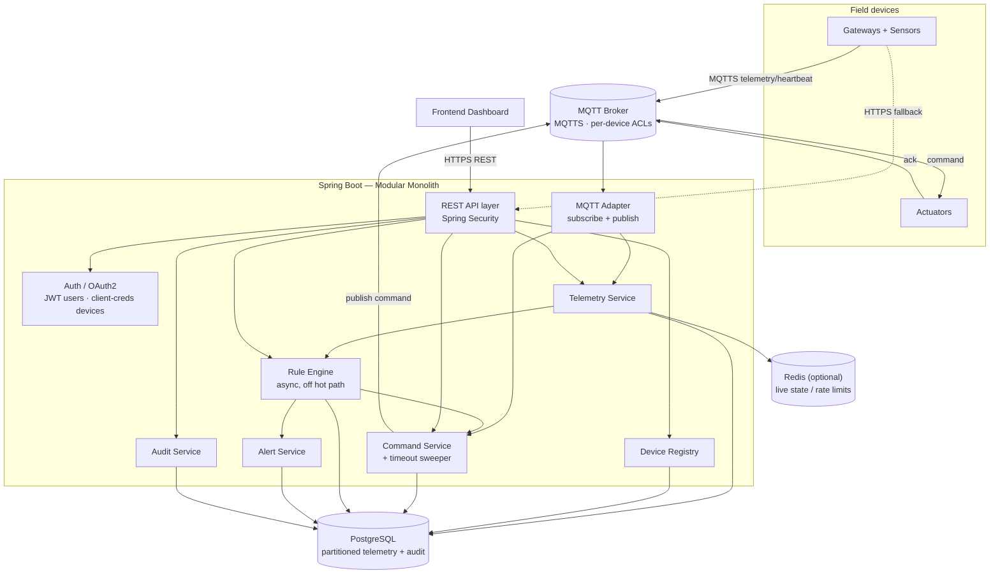
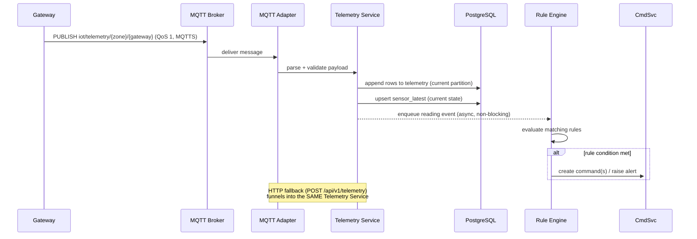
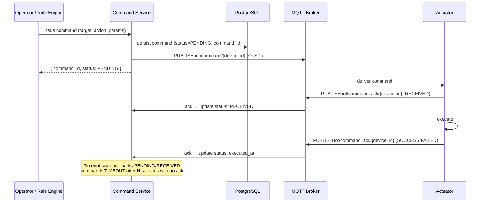
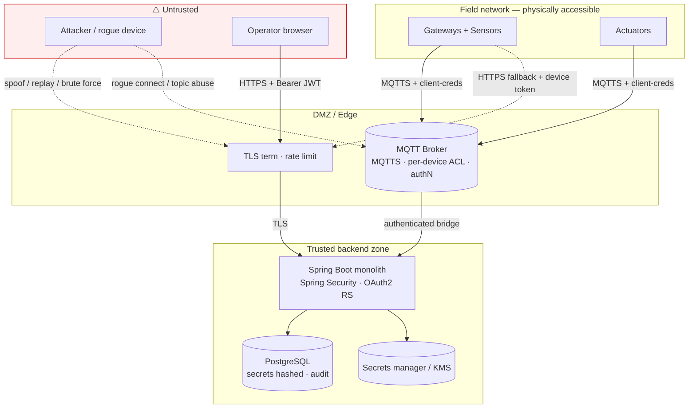

# Giám sát & Điều khiển IoT Văn phòng — Thiết kế Hệ thống

**Trạng thái:** Bản thiết kế nền tảng · **Stack:** Spring Boot · MQTT · REST/HTTPS · Spring Security · PostgreSQL
**Tài liệu đi kèm:** tài liệu hiện có *IoT Office Monitoring & Control Data Specification* (payloads, topics, REST endpoints). Tài liệu này là tầng *kiến trúc* nằm trên đặc tả đó — nó giải thích quy mô, mô hình dữ liệu, thiết kế thành phần, và các đánh đổi đằng sau mỗi lựa chọn. Ở những chỗ hai tài liệu chồng lấn, đặc tả dữ liệu là nguồn quyền uy cho định dạng truyền dữ liệu (wire format); tài liệu này là nguồn quyền uy cho cấu trúc và quyết định.

---

## 0. Giả định (nêu rõ chúng ra, hãy sửa lại nếu sai)

Quy mô của một tòa nhà văn phòng đủ giới hạn để thiết kế trực tiếp dựa trên đó. Tôi tiến hành dựa trên các giả định sau; **ba trong số chúng, nếu khác đi, sẽ thay đổi thiết kế** và được đánh dấu ⚠️.

| # | Giả định | Tác động nếu sai |
|---|------------|-----------------|
| 1 | **Một tòa nhà duy nhất**, ~12 khu vực (zone), **tổng cộng vài trăm thiết bị** (gateway + cảm biến + bộ chấp hành). | ⚠️ Đa tòa nhà / SaaS đa người thuê (multi-tenant) đảo lộn nhiều quyết định (tenancy trong mô hình dữ liệu, mở rộng broker, có thể phải tách dịch vụ). |
| 2 | Gateway phát telemetry tổng hợp khoảng mỗi **10–60 giây**; heartbeat mỗi 30–60 giây. | Phát ở tần suất cao hơn hoặc theo từng cảm biến làm tăng tốc độ nạp dữ liệu (ingest), nhưng vẫn nằm thoải mái trong phạm vi một node cho đến khi đạt ~hàng nghìn thiết bị. |
| 3 | **Telemetry được lưu giữ dài hạn** (vài tháng đến hơn một năm) cho lịch sử/xu hướng. | ⚠️ Lưu giữ ngắn (ví dụ 7–30 ngày) loại bỏ nhu cầu phân vùng/giảm mẫu (downsampling) — bảng Postgres thường là đủ. |
| 4 | Dashboard cần **trạng thái hiện tại gần thời gian thực** ("mỗi zone đang đọc giá trị gì lúc này", "thiết bị này có online không") cùng với truy vấn lịch sử. | ⚠️ Nếu cần truyền trực tiếp (live streaming) dưới một giây tới nhiều client một cách bắt buộc, hãy thêm WebSocket/SSE push và một cache trạng thái trực tiếp như thành phần cốt lõi, không phải tùy chọn. |
| 5 | Một nhóm nhỏ người vận hành (từ một chữ số đến vài chục người dùng dashboard đồng thời). | Nhiều người dùng hơn chỉ làm tăng QPS đọc, được xử lý bằng read replica từ lâu trước khi bất cứ thứ gì khác cần thay đổi. |

---

## 1. Yêu cầu

### Chức năng
- Nạp **telemetry** từ cảm biến qua MQTT (chính) và HTTP (dự phòng), thông qua các gateway tổng hợp cảm biến.
- Lưu trữ telemetry dưới dạng **lịch sử chuỗi thời gian (time-series)** và phơi bày **trạng thái hiện tại** theo zone/cảm biến.
- **Đăng ký & vòng đời thiết bị**: đăng ký, cập nhật, tạm ngưng, kích hoạt, ngừng sử dụng, xoay vòng thông tin xác thực (gateway, cảm biến, bộ chấp hành).
- **Xác thực/Phân quyền (AuthN/AuthZ)**: OAuth2 + JWT cho người dùng với RBAC (`SUPER_ADMIN`/`ADMIN`/`OPERATOR`/`VIEWER`); OAuth2 client-credentials + scopes cho thiết bị.
- **Rule engine**: đánh giá điều kiện trên telemetry/trạng thái → gửi lệnh và phát cảnh báo (ví dụ: khói → bật quạt hút + cảnh báo).
- **Gửi lệnh (command dispatch)** tới bộ chấp hành qua MQTT với vòng đời được theo dõi (`PENDING → RECEIVED → SUCCESS/FAILED/TIMEOUT`) và tương quan xác nhận (acknowledgement correlation).
- Theo dõi **heartbeat / kết nối** và trạng thái online/offline của thiết bị.
- **Ghi nhật ký kiểm toán (audit logging)** các sự kiện liên quan đến bảo mật và điều khiển.
- **REST APIs** cho dashboard và quản trị.

### Phi chức năng (với mục tiêu sơ bộ)
| Thuộc tính | Mục tiêu | Ghi chú |
|----------|--------|-------|
| Nạp telemetry | hàng chục msg/s lúc cao điểm | Thoải mái với một node. |
| Độ trễ đọc dashboard | < 300 ms cho trạng thái hiện tại; < 1 s cho khoảng lịch sử điển hình | Thúc đẩy việc tách trạng thái hiện tại/lịch sử (§4, §5). |
| Lệnh đầu-cuối | bộ chấp hành phản ứng trong ~1–2 s sau khi phát lệnh | Bị giới hạn bởi MQTT + thiết bị, không phải backend. |
| Tính nhất quán | **Mạnh (strong)** cho registry/RBAC/lệnh; **cuối cùng (eventual)** chấp nhận được cho trạng thái dashboard trực tiếp | Các luồng kiểu tiền/xác thực dùng transaction; các giá trị đọc trực tiếp có thể trễ một mẫu. |
| Tính sẵn sàng | Cao cho **giao tiếp thiết bị** (an toàn: khói) và luồng lệnh; tốt nhất có thể (best-effort) cho dashboard | Khiến MQTT broker trở thành thành phần quan trọng nhất (§8). |
| Bảo mật | TLS 1.2+ ở mọi nơi, bí mật được băm (hash), RBAC, ACL topic theo từng thiết bị, audit đầy đủ | Chi tiết ở §7. |

---

## 2. Ước lượng quy mô (tính nhẩm)

Mục đích của phần này là *biện minh cho việc giữ hệ thống nhỏ gọn*.

**Thiết bị.** ~12 zone × (≈1–2 gateway + ≈5–15 cảm biến + ≈5–15 bộ chấp hành) → khoảng **100–400 thiết bị**.

**Tốc độ nạp.** ~20 gateway phát mỗi 30 s, ~8 giá trị đọc mỗi cái → `20/30 × 8 ≈ 5 readings/s`. Ngay cả ở chu kỳ 10 s thì cũng chỉ ~15 readings/s. Heartbeat: 400 thiết bị / 30 s ≈ **13 msg/s**. Lệnh: vài lệnh mỗi phút. **Tổng cộng: hàng chục thông điệp/giây lúc cao điểm.**

**Lưu trữ (con số duy nhất tăng trưởng).** Ở ~5 readings/s liên tục → ~430 K dòng/ngày → **~160 M dòng/năm**. Ở ~100 byte/dòng kèm index, tính khoảng **vài trăm MB/ngày**, **~100–300 GB/năm**. Postgres xử lý được mức này *cùng với* một chiến lược phân vùng + lưu giữ (§5); nếu không có chiến lược đó, một bảng telemetry đơn lẻ không giới hạn sẽ suy giảm hiệu năng truy vấn qua nhiều tháng. Audit log tăng chậm hơn nhiều (theo sự kiện).

**Kết luận.** Thông lượng là chuyện nhỏ với một node. Mối quan tâm kỹ thuật dữ liệu thực sự duy nhất là **tăng trưởng bảng telemetry theo thời gian**, không phải số request mỗi giây. Mọi thứ khác (registry, RBAC, lệnh, rule) đều là dữ liệu quan hệ khối lượng thấp. Điều này có tính quyết định với kiến trúc: **một modular monolith trên một instance PostgreSQL là nền tảng đúng đắn**, và độ phức tạp thêm vào phải nhắm tới một trong các giả định ⚠️ mới biện minh được cho chính nó.

---

## 3. Thiết kế tổng quan

### Góc nhìn thành phần



Backend là **một đơn vị triển khai (deployable)** với ranh giới module nội bộ rõ ràng (§9). MQTT broker (Mosquitto / EMQX / HiveMQ) nằm giữa thiết bị và backend; backend là một *client* MQTT (một subscriber bền bỉ + một publisher). Redis là tùy chọn và chỉ xứng đáng có chỗ khi cần fan-out trạng thái trực tiếp hoặc giới hạn tốc độ (rate limiting) phân tán.

### Luồng nạp telemetry



### Luồng gửi lệnh + xác nhận



---

## 4. Mô hình dữ liệu & các mẫu truy cập

Các mẫu truy cập quyết định cách lưu trữ, không phải ngược lại. Các mẫu chủ đạo là: **ghi thêm (append) telemetry nhanh**; đọc **giá trị mới nhất của mỗi cảm biến** và **trạng thái online/offline của thiết bị** một cách rẻ cho dashboard; truy vấn **telemetry theo (zone hoặc cảm biến) trên một khoảng thời gian**; cập nhật **registry / RBAC / lệnh** theo transaction; **audit** chỉ ghi-thêm (append-only).

```mermaid
erDiagram
    USERS ||--o{ REFRESH_TOKENS : has
    DEVICES ||--o| DEVICE_CREDENTIALS : "authenticates with"
    DEVICES ||--o{ DEVICE_SCOPES : granted
    DEVICES ||--o| DEVICE_HEALTH : "latest health"
    DEVICES ||--o{ SENSORS : "parent gateway of"
    DEVICES ||--o{ COMMANDS : "targets"
    USERS ||--o{ COMMANDS : "issued by"
    RULES ||--o{ COMMANDS : "triggers"
    DEVICES ||--o{ ALERTS : "source"

    USERS {
        uuid id PK
        string username UK
        string password_hash "argon2id"
        enum role
        enum status
        timestamptz created_at
    }
    REFRESH_TOKENS {
        uuid id PK
        uuid user_id FK
        string token_hash
        timestamptz expires_at
        bool revoked
    }
    DEVICES {
        string device_id PK
        enum category "gateway|sensor|actuator"
        string device_type "temp|hmid|smoke|light|ac|exhst_fan|curtain"
        string zone
        string parent_gateway_id FK "null unless sensor"
        string firmware_version
        enum status "ACTIVE|INACTIVE|SUSPENDED|DECOMMISSIONED"
        string_array protocols
        timestamptz created_at
    }
    DEVICE_CREDENTIALS {
        string device_id PK_FK
        string client_id UK
        string client_secret_hash
        string previous_secret_hash "rotation grace"
        timestamptz rotated_at
    }
    DEVICE_SCOPES {
        string device_id FK
        string scope "telemetry:publish|command:subscribe|command:ack|heartbeat:publish"
    }
    DEVICE_HEALTH {
        string device_id PK_FK
        enum connection_status "ONLINE|OFFLINE"
        timestamptz last_seen
        int memory_usage_pct
        int cpu_usage_pct
        int wifi_rssi
        timestamptz updated_at
    }
    SENSORS {
        string sensor_id PK
        string gateway_id FK
        string type
        string zone
    }
    TELEMETRY {
        bigint id PK
        timestamptz ts "partition key"
        string zone
        string gateway_id
        string sensor_id
        string sensor_type
        double value_num "null for boolean"
        bool value_bool "null for numeric"
        string unit
    }
    SENSOR_LATEST {
        string sensor_id PK
        string zone
        string sensor_type
        double value_num
        bool value_bool
        timestamptz ts
    }
    COMMANDS {
        string command_id PK
        string target_id FK
        string type
        string action
        jsonb parameters
        enum status "PENDING|RECEIVED|SUCCESS|FAILED|TIMEOUT"
        string issued_by "user id | rule id | system"
        timestamptz issued_at
        timestamptz received_at
        timestamptz executed_at
    }
    RULES {
        uuid rule_id PK
        string name
        bool enabled
        text condition
        text action
        int priority
        string created_by
    }
    ALERTS {
        bigint id PK
        string type "SMOKE|..."
        enum severity
        string zone
        string source_device_id FK
        text message
        enum status "OPEN|ACK|RESOLVED"
        timestamptz created_at
    }
    AUDIT_LOGS {
        bigint id PK
        timestamptz ts "partition key"
        string actor
        enum actor_type "USER|DEVICE|SYSTEM"
        string event
        string target
        jsonb detail
        string ip
    }
```

**Những ghi chú là quyết định thiết kế, không chỉ là schema:**

- **`telemetry` không có khóa ngoại (FK) tới `devices`.** Đây là nhật ký sự kiện chỉ ghi-thêm khối lượng lớn; kiểm tra FK trên mỗi lần insert tốn thông lượng mà lợi ích lại nhỏ, và các dòng thiết bị thay đổi chậm. Hãy coi telemetry là các sự kiện bất biến (immutable facts); xác thực danh tính thiết bị tại lúc nạp, không phải qua ràng buộc DB.
- **`sensor_latest` (hoặc Redis) tách trạng thái hiện tại khỏi lịch sử.** Câu hỏi của dashboard "nhiệt độ ở office_1 ngay bây giờ là bao nhiêu" không được phép quét bảng telemetry lớn. Hãy upsert giá trị mới nhất của mỗi cảm biến khi nạp. Đánh đổi: hơi khuếch đại ghi (write amplification) + view trực tiếp nhất quán cuối cùng trễ một mẫu — chấp nhận được theo mục tiêu nhất quán.
- **`device_health` là một dòng mỗi thiết bị, được upsert khi có heartbeat — không phải một dòng mỗi heartbeat.** Lưu mọi heartbeat thuần túy là khuếch đại ghi cho dữ liệu hiếm khi truy vấn theo lịch sử. Giữ sức khỏe *mới nhất*; nếu sau này cần lịch sử sức khỏe, hãy thêm một bảng phân vùng lưu giữ ngắn hạn (ví dụ 7 ngày) riêng.
- **Các index quan trọng trên `telemetry`:** `(sensor_id, ts DESC)` và `(zone, ts DESC)` — chúng hỗ trợ hai dạng truy vấn mà dashboard thực sự phát ra. Đừng over-index một bảng nặng về ghi-thêm.
- **`refresh_tokens` được lưu phía máy chủ** (đã băm) một cách có chủ đích — xem §7 về lý do refresh token 30 ngày không thể hoàn toàn stateless nếu bạn muốn thu hồi (revocation).

---

## 5. Các quyết định then chốt & đánh đổi

Mỗi quyết định nêu rõ nó mua được gì, tốn gì, và phương án bị loại bỏ.

### 5.1 Modular monolith, không phải microservices
**Quyết định:** một đơn vị triển khai Spring Boot, một Postgres, ranh giới module nội bộ mạnh mẽ.
**Mua được:** transaction và truy vấn xuyên registry/telemetry/lệnh trở nên dễ dàng; chỉ một thứ để triển khai, quan sát, và gỡ lỗi; tái cấu trúc rẻ trong khi domain còn đang ổn định.
**Tốn:** mọi module mở rộng và triển khai cùng nhau; một module tệ có thể ảnh hưởng cả tiến trình (được giảm thiểu bằng kỷ luật module + ranh giới rule bất đồng bộ ở §5.6).
**Bị loại bỏ — microservices:** ở mức hàng chục msg/s, chúng thêm transaction phân tán, nhất quán xuyên dịch vụ, và bề mặt vận hành gấp N lần với **không** lợi ích mở rộng nào. Đặc tả §0 gọi chúng là "services" (Telemetry Service, Rule Engine, …) — hãy giữ chúng là *module*, không phải *tiến trình*.
**Xem xét lại khi:** ⚠️ SaaS đa tòa nhà, hàng nghìn thiết bị, hoặc nhịp độ team/triển khai độc lập. Các ranh giới module bên dưới được vẽ sao cho một module có thể được tách thành dịch vụ riêng sau này mà không phải viết lại bên gọi.

### 5.2 PostgreSQL cho mọi thứ, telemetry phân vùng theo phạm vi thời gian
**Quyết định:** một Postgres duy nhất. `telemetry` và `audit_logs` được **phân vùng theo phạm vi theo tháng**, với một **job lưu giữ** xóa các phân vùng cũ (rẻ) thay vì `DELETE` (đắt).
**Mua được:** transaction/join quan hệ cho registry & RBAC; quét phạm vi thời gian nhanh chỉ chạm các phân vùng liên quan; dọn dữ liệu cũ là thao tác metadata.
**Tốn:** quản lý phân vùng (tự động hóa bằng `pg_partman` hoặc một job theo lịch).
**Bị loại bỏ — DB chuỗi thời gian chuyên dụng (InfluxDB) / NoSQL:** chia tách hệ thống ghi nhận (system of record) và thêm một thành phần vận hành mà quy mô không đáng. NoSQL còn mất các join/transaction mà registry và RBAC cần.
**Lộ trình nâng cấp (chưa phải bây giờ):** nếu khối lượng telemetry hoặc truy vấn tổng hợp của dashboard tăng, áp dụng **TimescaleDB** (một *extension* của Postgres — cùng database) để có hypertables + **continuous aggregates** (trung bình hàng giờ/hàng ngày được tính sẵn cho biểu đồ). Đây là drop-in, không phải migration sang hệ thống mới.

### 5.3 Tách trạng thái hiện tại với lịch sử
Được nói ở §4. Các lượt đọc trực tiếp chạm `sensor_latest`/`device_health` (hoặc Redis); lịch sử chạm `telemetry` phân vùng. Đây là quyết định hiệu năng hữu ích nhất cho dashboard.

### 5.4 MQTT chính, HTTP dự phòng — một phễu nạp duy nhất
**Quyết định:** MQTT (QoS 1, MQTTS) là chính; `POST /api/v1/telemetry` là dự phòng. **Cả hai luồng đều gọi cùng một Telemetry Service** — validate, lưu trữ, cập nhật trạng thái, và bàn giao cho rule đều nằm ở một chỗ.
**Mua được:** MQTT cho push hiệu quả, phát hiện hiện diện qua last-will, và fan-out pub/sub tới bộ chấp hành; HTTP bao phủ các thiết bị/mạng hạn chế và cho một luồng nạp suy giảm khi broker sập.
**Tốn:** hai phương tiện truyền tải để bảo mật và validate nhất quán — giải quyết bằng cách dồn vào một dịch vụ thay vì lặp lại logic theo từng phương tiện.

### 5.5 Giao lệnh là at-least-once → lệnh phải idempotent
**Quyết định:** MQTT QoS 1 có thể giao một lệnh **hai lần**. Thiết kế hành động bộ chấp hành thành **gán-trạng-thái idempotent** (`SET status=ON`), và để thiết bị **khử trùng lặp theo `command_id`**. Theo dõi vòng đời `PENDING → RECEIVED → SUCCESS/FAILED`, với một **timeout sweeper** đánh dấu `TIMEOUT` khi không có ack đến trong N giây. Ack tương quan theo `command_id` trên `iot/command_ack/{device_id}`.
**Mua được:** giao lại an toàn, không lỗi "bật hai lần", không lệnh nào kẹt mãi ở `PENDING`.
**Ghi chú:** các lệnh trong đặc tả của bạn đã là gán-trạng-thái (tốt) — điều này chỉ làm yêu cầu đó tường minh và thêm sweeper.

### 5.6 Rule engine chạy bất đồng bộ, ngoài hot path nạp
**Quyết định:** lưu telemetry trước, **sau đó** bàn giao giá trị đọc cho rule engine qua một hàng đợi nội tiến trình có giới hạn + worker. Callback MQTT không bao giờ chặn (block) chờ đánh giá rule hoặc phát lệnh.
**Mua được:** một rule chậm/phức tạp hoặc một lượt phát lệnh chậm không thể làm nghẽn việc nạp; không gì bị mất vì telemetry đã được lưu bền vững trước khi đánh giá.
**Tốn:** hành động của rule nhất quán cuối cùng so với giá trị đọc kích hoạt (dưới một giây ở quy mô này).
**Bị loại bỏ — Kafka/Redis Streams bây giờ:** không cần thiết ở mức hàng chục msg/s. **Xem xét lại khi** bạn cần phát lại sự kiện (event replay), nhiều rule nặng, hoặc tách xử lý rule sang dịch vụ riêng.
**Chi tiết an toàn:** điều kiện rule được lưu dưới dạng chuỗi (`"office_1.temp > 30"`). **Không `eval` chúng.** Dùng một bộ đánh giá biểu thức hạn chế — Spring Expression Language (SpEL) với ngữ cảnh chỉ-đọc, bị khóa chặt, hoặc một ngữ pháp nhỏ chuyên dụng — để một rule độc hại/lỗi không thể thực thi mã tùy ý hoặc đọc trạng thái ngoài ý định.

### 5.7 Tóm tắt đánh đổi

| Lựa chọn | Đã chọn | Thay vì | Vì | Đảo lại khi |
|--------|--------|------|---------|-----------|
| Topology | Modular monolith | Microservices | Quy mô nhỏ; vận hành đơn giản hơn | Đa tòa nhà / quy mô team |
| Lưu trữ | Postgres (+phân vùng) | InfluxDB / NoSQL | Nhu cầu quan hệ chiếm ưu thế; khối lượng quản lý được | Tổng hợp TS nặng → TimescaleDB |
| Đọc trực tiếp | Bảng trạng thái / Redis | Quét telemetry | Độ trễ dashboard | — |
| Luồng rule | Bất đồng bộ nội tiến trình | Đồng bộ inline / Kafka | Bảo vệ việc nạp, nhưng không tốn overhead broker | Replay / rule nặng → Kafka |
| Command QoS | QoS 1 + idempotency | QoS 2 | QoS 2 nặng hơn; idempotency là bảo hiểm rẻ hơn | — |

---

## 6. Mô hình giao tiếp & topic

Từ đặc tả dữ liệu, đã chuẩn hóa. **Thay đổi duy nhất tôi khuyến nghị** là topic telemetry theo từng gateway để ACL chặt hơn (§7).

| Mục đích | Topic | Publisher | Subscriber | QoS |
|---------|-------|-----------|-----------|-----|
| Telemetry | `iot/telemetry/{zone}/{gateway_id}` *(trước là `iot/telemetry/{zone}`)* | Gateway | Backend | 1 |
| Command | `iot/command/{device_id}` | Backend | Actuator | 1 |
| Command ack | `iot/command_ack/{device_id}` | Actuator | Backend | 1 |
| Heartbeat | `iot/heartbeat/{device_id}` | Device | Backend | 0–1 |
| Presence (LWT) | `iot/status/{device_id}` | Broker (last will) | Backend | 1 |

**Vì sao đổi topic telemetry:** với `iot/telemetry/{zone}`, ACL broker chỉ có thể hạn chế ở mức *zone* — bất kỳ thiết bị nào được cấp quyền cho `office_1` đều có thể phát telemetry giả mạo là bất kỳ gateway nào trong `office_1`. Thêm `/{gateway_id}` cho phép broker thực thi "gateway này chỉ được phát telemetry của chính nó." Với một văn phòng đơn lẻ đáng tin cậy thì việc này có thể chấp nhận bỏ qua, nhưng đó là một thay đổi topic một dòng đổi lấy lợi ích phân quyền thật sự.

**Last Will & Testament:** đăng ký một LWT cho mỗi thiết bị để broker tự động phát "offline" nếu một thiết bị rớt mà không ngắt kết nối sạch — phát hiện hiện diện đáng tin cậy hơn so với chờ một heartbeat bị bỏ lỡ.

---

## 7. Thiết kế bảo mật

Truyền tải, danh tính, phân quyền, và audit — đặc tả liệt kê các yêu cầu; ở đây là cách chúng khớp với nhau. Phần này là tầng bảo mật của thiết kế: lập trường, các ranh giới tin cậy, mô hình mối đe dọa, và bộ kiểm soát, được tổ chức sao cho các kiểm soát có tác động cao nhất đi trước.

### Lập trường bảo mật: đây là hệ thống an toàn (safety), không chỉ là hệ thống dữ liệu

Đặc điểm định nghĩa khiến các ưu tiên thông thường được sắp xếp lại: một cảm biến khói mà telemetry của nó có thể bị giả mạo, hoặc một lệnh quạt hút có thể bị làm giả hoặc bị chặn, là một thất bại **an toàn vật lý**, không phải sự cố quyền riêng tư. Điều đó dẫn tới ba ưu tiên bất đối xứng lan tỏa qua mọi thứ bên dưới:

| Ưu tiên | Vì sao nó chiếm ưu thế ở đây | Nơi thực thi |
|---|---|---|
| **Tính toàn vẹn của telemetry & lệnh** | Một giá trị "không có khói" giả hoặc một bộ chấp hành bị chiếm quyền là một sự kiện đe dọa tính mạng — toàn vẹn vượt trên bảo mật riêng tư cho mặt phẳng thiết bị. | Danh tính theo từng thiết bị + ACL topic (phân quyền broker bên dưới); idempotency lệnh & audit (§5.5) |
| **Tính sẵn sàng của luồng thiết bị/lệnh** | Nếu broker hoặc luồng lệnh sập trong một đám cháy, hệ thống hỏng đúng lúc nó quan trọng nhất. | Broker HA, HTTP fallback, mặc định fail-safe của bộ chấp hành (§8 + "Tính sẵn sàng như một thuộc tính bảo mật" bên dưới) |
| **Tính xác thực của mọi tác nhân** | Cả *ai* (người vận hành) và *cái gì* (thiết bị) phải được nhận dạng chứng minh được trước bất kỳ hành động điều khiển nào. | OAuth2/JWT (người dùng) + client-credentials (thiết bị) |

Tính bảo mật riêng tư vẫn quan trọng (thông tin xác thực, audit, tài khoản người vận hành), nhưng với một hệ thống giám sát văn phòng thì **tính toàn vẹn/sẵn sàng của vòng điều khiển là viên ngọc quý.**

### Ranh giới tin cậy & bề mặt tấn công

Mỗi mũi tên cắt qua một ranh giới nét đứt là một điểm kiểm tra xác thực + phân quyền. Mạng hiện trường (field network) **có thể tiếp cận vật lý** (thiết bị nằm ở trần, tường, phòng máy) — hãy coi mọi thiết bị như có thể đã bị xâm phạm, đó chính là lý do danh tính theo từng thiết bị và ACL topic theo từng thiết bị (không phải một khóa dùng chung) là không thể thương lượng.



| Ranh giới được cắt qua | Mối đe dọa tại điểm cắt | Kiểm soát |
|---|---|---|
| Operator → Edge | Token bị đánh cắp/giả mạo, brute force | Validate Bearer JWT, TTL access ngắn, rate limit xác thực, security headers |
| Device → Broker | Thiết bị giả mạo (rogue), giả danh, lạm dụng topic | Broker authN (client-creds / cert), ACL topic theo từng `device_id` |
| Device → Edge (fallback) | Cùng thiết bị giả mạo qua HTTP | Device token + scope; `deviceId` trong body phải khớp danh tính token |
| Broker → Backend | Broker bị xâm phạm tiêm thông điệp | Bridge đã xác thực; backend tái-validate payload & danh tính thiết bị |
| Backend → DB / Secrets | Di chuyển ngang (lateral movement), trộm bí mật | Cô lập mạng, user DB tối thiểu quyền, bí mật ở KMS không phải trong mã nguồn |
| Mạng hiện trường (vật lý) | Trộm thiết bị, trích xuất firmware, nghe lén | TLS trên đường truyền; thông tin xác thực theo từng thiết bị (một bị xâm phạm ≠ tất cả); luồng decommission |

### Mô hình mối đe dọa (STRIDE, xếp hạng theo bán kính ảnh hưởng đến an toàn)

Ba mối hàng đầu có thể gây hại vật lý; chúng nhận các kiểm soát mạnh nhất.

| # | Mối đe dọa (STRIDE) | Kịch bản | Tác động | Kiểm soát chính |
|---|---|---|---|---|
| **T1** | Spoofing (telemetry) | Thiết bị bị xâm phạm phát "không có khói" giả / giá trị giả cho zone khác | 🔴 An toàn: cháy thật không được cảnh báo | Topic theo từng gateway + ACL broker khóa theo `device_id`; backend khẳng định danh tính payload == danh tính đã xác thực |
| **T2** | Tampering/Spoofing (lệnh) | Kẻ tấn công làm giả hoặc phát lại một lệnh bộ chấp hành (`exhaust OFF`) | 🔴 An toàn / điều khiển | Phân quyền phát lệnh; gán-trạng-thái idempotent; tương quan ack; audit mọi lệnh |
| **T3** | Denial of Service (luồng điều khiển) | Làm ngập broker/backend để một cảnh báo khói hoặc lệnh không bao giờ tới | 🔴 Tính sẵn sàng đúng lúc quan trọng nhất | Broker HA, rate limit, HTTP fallback, mặc định fail-safe của bộ chấp hành |
| **T4** | Elevation of Privilege | Viewer làm hành động admin; thiết bị gọi API admin | Điều khiển trái phép | RBAC `@PreAuthorize`; thiết bị bị giới hạn ở endpoint nạp; trần cấp quyền (role-grant ceiling) |
| **T5** | Information Disclosure | Rò rỉ client secret, password hash, refresh token | Bảo mật riêng tư; tạo điều kiện cho T1/T2 | Băm (Argon2id / SHA-256), bí mật chỉ hiện một lần, TLS, không bí mật trong log/DTO |
| **T6** | Repudiation | Người vận hành/thiết bị chối đã phát lệnh/thay đổi | Trách nhiệm giải trình | Audit chỉ ghi-thêm với actor + IP + correlation id |
| **T7** | Spoofing (người dùng) | Credential stuffing, brute force, trộm token (XSS) | Chiếm tài khoản | Argon2id, rate limit xác thực 20/phút, TTL access ngắn + thu hồi |
| **T8** | Tampering (injection) | SQL injection; biểu thức rule độc hại thực thi mã | RCE / giả mạo dữ liệu | Truy vấn tham số hóa (JPA); **không `eval`** — SpEL/DSL bị khóa chặt (§5.6) |

**Các trường hợp lạm dụng đặc thù IoT** đáng nêu: **làm ngập/làm mù cảm biến** (spam giá trị đọc để che một sự kiện thật → rate limit nạp theo từng thiết bị + phát hiện khoảng trống/bất thường); **chặn lệnh** (drop MQTT để `exhaust ON` không bao giờ tới → ack-timeout sweeper phát hiện không giao được + mặc định fail-safe bộ chấp hành); **phát lại cũ (stale-replay)** (phát lại một "đã hết khói" cũ → dấu thời gian nạp phía máy chủ, gắn cờ độ lệch `ts` bất hợp lý).

### Người dùng
- **OAuth2 + JWT.** Access token **1 giờ**, refresh token **30 ngày**.
- **Mật khẩu băm bằng Argon2id** (BCrypt là phương án dự phòng chấp nhận được). Không bao giờ plaintext.
- **RBAC** qua các role trong JWT, thực thi bằng `@PreAuthorize` ở mức phương thức (`SUPER_ADMIN` > `ADMIN` > `OPERATOR` > `VIEWER`).
- **Thu hồi refresh token cần trạng thái phía máy chủ.** Một JWT thuần stateless không thể bị thu hồi trước khi hết hạn — một refresh token 30 ngày bạn không thể "giết" là một rủi ro. Lưu refresh token đã băm (bảng `refresh_tokens`), xoay vòng khi dùng (phát cái mới, thu hồi cái cũ), và hỗ trợ thu hồi tường minh khi logout/bị xâm phạm. Access token vẫn stateless và sống ngắn, nhưng **denylist bên dưới** cho chúng khả năng thu hồi tức thì khi không thể chấp nhận chờ tới một giờ.

### Thiết bị
- **OAuth2 client-credentials**, một `client_id`/`client_secret` cho mỗi thiết bị; **secret lưu băm**, không bao giờ trả lại sau khi phát/xoay vòng.
- **Scopes** (`telemetry:publish`, `command:subscribe`, `command:ack`, `heartbeat:publish`) kiểm soát mỗi thiết bị được làm gì.
- **Xoay vòng thông tin xác thực với cửa sổ ân hạn:** giữ `previous_secret_hash` còn hiệu lực một thời gian ngắn sau khi xoay vòng để thiết bị không bị khóa giữa chừng. Audit mọi lần xoay vòng.

### Thu hồi token (denylist)
Cờ `revoked` trong DB trên `refresh_tokens` là quyền uy; denylist là một **tầng từ-chối-nhanh đặt trước nó** giúp đóng hai khoảng trống mà chỉ cờ không làm được: (a) thu hồi một **access** token stateless trước khi hết hạn tự nhiên, và (b) tránh một vòng truy vấn DB trên mỗi lần refresh.

- **Một validator gác mọi JWT.** Một `OAuth2TokenValidator<Jwt>` tùy chỉnh được nối vào `NimbusJwtDecoder`, để cả request người dùng *và* thiết bị đều đi qua nó. Một token có `jti` nằm trong denylist sẽ thất bại xác minh ngay lập tức, trước cả kiểm tra issuer/expiry — mỗi access token được phát giờ mang một claim `jti` ngẫu nhiên chính là để có thể đánh địa chỉ ở đây.
- **Hai không gian khóa, hai mục đích.**
  - **Access JTI** — chặn một JWT đã phát trước khi hết hạn tự nhiên 1 giờ. Được thêm khi logout (khi client cũng xuất trình access token của nó) và theo yêu cầu nếu ta muốn buộc đăng xuất ai đó.
  - **Refresh hash** (SHA-256 của token thô) — short-circuit luồng refresh trước bất kỳ truy vấn DB nào, và đóng vai trò mục từ-chối-nhanh cho bất kỳ token nào ta đã thu hồi hoặc xoay vòng ra.
- **TTL = thời gian sống còn lại của token.** Mỗi mục tự hết hạn khi token cơ sở đáng lẽ cũng hết — kho lưu không thể phình vô hạn và ta không bao giờ vô tình chặn lâu hơn cái mình đang chặn.
- **Cascade tái-sử-dụng refresh.** Khi một refresh token đã bị thu hồi lại được xuất trình (khả năng cao là bị xâm phạm), chuỗi được duyệt qua `rotated_to` và hash của mọi hậu duệ bị đưa vào denylist — kẻ tấn công giữ token đã xoay vòng ra mất nó ngay khoảnh khắc ta thấy cái cũ hơn. Bản thân việc tái sử dụng trả về `401 errors/token-revoked`.
- **Backend cắm-rút (pluggable).** `InMemoryTokenDenylist` (mặc định, `iot.redis.enabled=false`) cho single-instance và test; `RedisTokenDenylist` (`iot.redis.enabled=true`) khi chạy >1 instance để tất cả cùng thấy các từ chối. Interface giống hệt nhau; chuyển đổi chỉ là lật một config.
- **Chi phí & đánh đổi:** một lượt tra Redis (hoặc map trong bộ nhớ) thêm trên mỗi request đã xác thực — không đáng kể so với kiểm tra chữ ký JWT. Đáng giá để giữ logout/xâm phạm thực sự tức thì thay vì "cuối cùng trong vòng 1 giờ."

### Phân quyền broker (cái dễ bị bỏ sót)
Broker ánh xạ danh tính đã xác thực của mỗi thiết bị tới **ACL topic theo từng `device_id`** để thiết bị X chỉ có thể publish/subscribe các topic của chính nó. Không có điều này, một thiết bị bị xâm phạm có thể giả mạo telemetry của zone khác hoặc chiếm lệnh của thiết bị khác — tức là làm giả một giá trị "không có khói" hoặc gửi lệnh bộ chấp hành. Gắn ACL vào danh tính thiết bị (client-creds hoặc client cert), khóa theo `device_id`/`gateway_id` (do đó có thay đổi topic ở §6). Đây là kiểm soát duy nhất đánh bại **T1/T2**.

| Thiết bị | Được publish | Được subscribe |
|---|---|---|
| Gateway `gw_office1_01` | `iot/telemetry/office_1/gw_office1_01`, `iot/heartbeat/gw_office1_01` | — |
| Actuator `act_exhaust_1` | `iot/command_ack/act_exhaust_1`, `iot/heartbeat/act_exhaust_1` | `iot/command/act_exhaust_1` |

**Hai lớp bảo vệ (belt and suspenders):** backend còn tái-validate rằng `gatewayId`/`deviceId` của payload bằng danh tính đã xác thực — không bao giờ chỉ tin ACL broker, phòng khi chính broker bị xâm phạm.

### Truyền tải & headers
- **TLS 1.2+ ở mọi nơi**: HTTPS cho REST, MQTTS cho MQTT. HTTP/MQTT thường bị vô hiệu trong production.
- Security headers trên các response REST: `Strict-Transport-Security`, `X-Content-Type-Options`, `X-Frame-Options`, `Content-Security-Policy`.

### Audit
`audit_logs` chỉ ghi-thêm, phân vùng. Ghi lại: đăng nhập người dùng, đăng ký/xóa thiết bị, xoay vòng thông tin xác thực, thay đổi rule, thực thi lệnh, thay đổi quyền/role. Mỗi mục mang actor, loại actor (USER/DEVICE/SYSTEM), event, target, và IP nguồn.

### Giới hạn tốc độ (rate limiting)
Theo đặc tả (User 100/phút, Device 300/phút, Auth 20/phút, Telemetry cấu hình được). Thực thi tại API gateway/filter; nếu chạy nhiều hơn một instance backend, hãy chống lưng bộ đếm bằng **Redis** để giới hạn là toàn cục thay vì theo từng instance. Một đợt tăng vọt `403`/`429` bản thân nó là tín hiệu thăm dò/lạm dụng (xem phần Phát hiện bên dưới).

### Quản lý bí mật & thông tin xác thực

| Bí mật | Lưu trữ | Vòng đời | Xoay vòng | Quy tắc phơi bày |
|---|---|---|---|---|
| Mật khẩu người dùng | Băm Argon2id trong `users` | đến khi đổi | reset bởi user/admin | không bao giờ trả lại; reset không phát plaintext |
| Client secret thiết bị | băm trong `device_credentials` (+ `previous_secret_hash`) | đến khi xoay vòng | `:rotate` với **cửa sổ ân hạn** | **hiện một lần** lúc phát/xoay, không bao giờ nữa |
| Refresh token | băm SHA-256 trong `refresh_tokens` | 30 ngày, xoay khi dùng | xoay-khi-dùng | đã băm; tái dùng → cascade thu hồi (trên) |
| Khóa ký JWT | KMS / secrets manager (không trong source/env ở prod) | xoay vòng theo lịch | key-rollover với `kid` | khóa riêng không bao giờ rời KMS |
| TLS / DB / thông tin xác thực broker | KMS / secrets manager, tiêm lúc runtime | theo chính sách | xoay được | không trong source, không trong image |

**Quy tắc:** không bí mật trong quản lý mã nguồn, image container, log, response lỗi, hoặc DTO (nguyên tắc "không `passwordHash`/`clientSecretHash` trên đường truyền" của thiết kế API thực thi điều này); một thông tin xác thực **cho mỗi thiết bị** để một lần xâm phạm bị giới hạn, không bao giờ là một khóa dùng chung cho cả đội; `Idempotency-Key` khi phát/xoay thông tin xác thực để một lần retry không thể tạo ra secret trùng; quét bí mật (gitleaks/trufflehog) trong CI.

### Validate đầu vào & phòng thủ injection

| Bề mặt | Rủi ro | Kiểm soát |
|---|---|---|
| Body/param REST | Đầu vào dị dạng/quá lớn/không hợp lệ | Bean Validation (`@Valid`), binding DTO chặt, `422` liệt kê mọi trường lỗi |
| Payload telemetry (MQTT + HTTP) | Payload dị dạng/quá lớn, nhầm lẫn kiểu | Validate schema tại phễu nạp duy nhất; từ chối loại cảm biến lạ; `valueNum` XOR `valueBool` |
| Đọc phân vùng (telemetry, audit) | Quét toàn bảng không giới hạn như một dạng DoS | **Bắt buộc** cửa sổ thời gian có giới hạn + (`sensorId` XOR `zone`); nếu không thì `422` |
| Truy cập DB | SQL injection | Chỉ truy vấn tham số hóa / binding JPA — không SQL nối chuỗi |
| **Rule engine** | **Thực thi mã tùy ý qua biểu thức rule** | **Không bao giờ `eval`.** SpEL bị khóa chặt (chỉ-đọc, không reflection/I/O) hoặc một ngữ pháp chuyên dụng; validate condition/action **lúc ghi** (`422` với token vi phạm) — xem §5.6 |
| Tham số lệnh | Injection vào hành động thiết bị | Whitelist hành động/tham số; chỉ gán-trạng-thái idempotent; từ chối target không phải bộ chấp hành/đã decommission (`422`) |

Rule engine là **bể đầu vào nguy hiểm nhất** — một chuỗi được lưu rồi đem thực thi — đó là lý do bộ đánh giá bị khóa chặt ở §5.6 là một kiểm soát bảo mật, không chỉ là độ vững chắc.

### Tính sẵn sàng như một thuộc tính bảo mật

Vì đây là hệ thống an toàn, tính sẵn sàng của vòng điều khiển *chính là* bảo mật. Các giảm thiểu ở §8 (broker HA, phiên bền bỉ, HTTP fallback) là chịu lực ở đây. Hai hành vi đặc thù an toàn:
- **Fail safe, không fail open** — mọi suy giảm (broker sập, mất ack, mất hàng đợi rule) để hệ thống ở trạng thái *đã biết, quan sát được, an toàn*; bộ chấp hành áp dụng mặc định an toàn khi mất giao tiếp thay vì âm thầm bỏ một hành động an toàn.
- **Phát hiện chặn lệnh** — ack-timeout sweeper (§5.5) phát hiện việc không giao được dưới dạng `TIMEOUT`, nên kẻ tấn công drop thông điệp MQTT không thể âm thầm chặn `exhaust ON`.

### Phát hiện & ứng phó sự cố

Audit (trên) là pháp y *sau khi việc xảy ra*; **phát hiện (detection)** bắt được mọi thứ khi chúng đang xảy ra. Cảnh báo về: lỗi xác thực lặp lại / credential stuffing; cascade tái-dùng refresh token bị kích hoạt (khả năng cao là bị trộm); ACL broker từ chối (một thiết bị publish ngoài topic của nó → khả năng cao là T1); lệnh từ một actor bất thường hoặc tới một target bất thường; khoảng trống/bất thường telemetry trên một cảm biến an toàn; tăng vọt `403`/`429`.

**Thiết bị bị xâm phạm** là sự cố thực tế có khả năng cao nhất (thiết bị bị phơi bày vật lý). Việc khoanh vùng có tính phẫu thuật nhờ danh tính theo từng thiết bị: **suspend** (`:suspend` vô hiệu thông tin xác thực) → **decommission** nếu được xác nhận (`:decommission` thu hồi thông tin xác thực + ACL topic) → rà soát audit mọi thứ danh tính đó đã làm → đối chiếu các cảm biến lân cận trong cửa sổ xâm phạm. Bán kính ảnh hưởng là một thiết bị, không bao giờ là cả đội.

### Ánh xạ tiêu chuẩn (tham khảo nhanh)

Bao phủ **OWASP API Security Top 10** — broken auth (OAuth2/JWT, Argon2id, thu hồi), phân quyền cấp chức năng/đối tượng (`@PreAuthorize`, trần cấp quyền, thiết bị chỉ-nạp), tiêu thụ tài nguyên (rate limit, phân trang có giới hạn, bắt buộc giới hạn cửa sổ thời gian), phân quyền cấp thuộc tính (DTO bỏ bí mật/PK), cấu hình sai (security headers, TLS, làm cứng prod) — và **OWASP IoT Top 10**: thông tin xác thực yếu/cứng-mã (secret thiết bị băm theo từng cái), dịch vụ mạng không an toàn (MQTTS + ACL), thiếu quyền riêng tư (dữ liệu chiếm dụng được coi là nhạy cảm), truyền/lưu trữ không an toàn (TLS + mã hóa khi nghỉ), quản lý thiết bị (registry, vòng đời, decommission).

### Checklist bảo mật (cổng lúc build)

- [ ] TLS 1.2+ được thực thi trên REST và MQTT; plaintext bị vô hiệu ở prod.
- [ ] Mật khẩu Argon2id; client secret theo từng thiết bị, băm, hiện một lần, xoay được với ân hạn.
- [ ] Broker xác thực mọi kết nối; ACL topic theo từng `device_id`; backend tái-validate danh tính payload.
- [ ] `@PreAuthorize` trên mọi endpoint; trần cấp quyền; thiết bị chỉ-nạp.
- [ ] Chuỗi validator JWT bao gồm denylist; thu hồi access `jti` + refresh-hash; refresh xoay-khi-dùng + cascade tái-dùng.
- [ ] Biểu thức rule qua bộ đánh giá bị khóa chặt — **không `eval`** — validate lúc ghi.
- [ ] Bắt buộc cửa sổ thời gian có giới hạn + scope trên các lượt đọc phân vùng; rate limit (chống lưng bằng Redis nếu đa instance).
- [ ] Security headers (HSTS, nosniff, frame-deny, CSP); không bí mật trong source/image/log/DTO (dùng KMS).
- [ ] Mã hóa khi nghỉ cho DB + sao lưu được mã hóa, đã kiểm thử khôi phục.
- [ ] Audit chỉ ghi-thêm bao phủ mọi sự kiện trên, với actor + IP.
- [ ] Idempotency lệnh, tương quan ack, timeout sweeper, mặc định fail-safe bộ chấp hành.
- [ ] CI: SCA + SAST + quét bí mật chặn merge.

---

## 8. Các chế độ hỏng & mở rộng

### Cái gì hỏng trước — và đó không phải thông lượng

| Hỏng | Tác động | Giảm thiểu |
|---------|--------|------------|
| **MQTT broker sập** *(SPOF tác động cao nhất)* | Không giao tiếp thiết bị — kể cả cảnh báo khói và lệnh | Chạy một broker **HA/clustered** (EMQX/HiveMQ) hoặc ít nhất là khởi động lại nhanh + **phiên bền bỉ**; HTTP fallback cho nạp suy giảm; backend kết nối lại với backoff |
| **Backend bỏ lỡ thông điệp khi kết nối lại** | Mất telemetry/ack QoS-1 trong lúc khởi động lại | Subscribe với **phiên bền bỉ** (`cleanSession=false`); broker xếp hàng QoS-1 trong lúc backend vắng mặt ngắn |
| **Bảng telemetry phình to** qua nhiều tháng | Truy vấn lịch sử chậm | Phân vùng theo tháng + lưu giữ/drop; `sensor_latest` giữ các lượt đọc trực tiếp khỏi bảng lớn |
| **Mất ack lệnh** | Lệnh kẹt `PENDING` | **Timeout sweeper** → `TIMEOUT` |
| **Mất hàng đợi rule trong bộ nhớ khi khởi động lại** | Các đánh giá rule đang dở bị bỏ | Telemetry được lưu *trước* khi đánh giá, nên các sự kiện không mất và rule có thể tái-suy-luận; chỉ thêm hàng đợi bền vững nếu cần đảm bảo kích hoạt rule exactly-once |
| **Thiết bị bị xâm phạm** | Telemetry giả mạo / lệnh bị chiếm | ACL topic theo từng thiết bị + scope (§7) |

### Thang mở rộng (chỉ khi một giả định ⚠️ thay đổi)
Leo theo thứ tự chi phí; đừng nhảy cóc.

1. **Theo chiều dọc (vertical)** — máy to hơn. Mua được nhiều thời gian nhất với ít công sức nhất.
2. **Read replica** — gánh các lượt đọc dashboard/lịch sử; chấp nhận độ trễ sao chép (ổn với lịch sử).
3. **TimescaleDB + continuous aggregates** — khi truy vấn biểu đồ/tổng hợp chiếm ưu thế.
4. **Cluster broker** — khi số thiết bị hoặc fan-out vượt quá một broker.
5. **Backend theo chiều ngang (horizontal)** — **điểm gài ở đây:** phía REST là stateless (JWT) và mở rộng dễ dàng sau một load balancer, nhưng **consumer MQTT là stateful**. Chạy N instance một cách ngây thơ nghĩa là mỗi cái xử lý mọi thông điệp N lần. Khắc phục bằng **MQTT shared subscriptions** (MQTT 5 / EMQX `$share/...`) để cân bằng tải việc nạp giữa các instance, *hoặc* giữ việc nạp ở một instance **được bầu làm leader** trong khi mở rộng REST.
6. **Tách dịch vụ** — sau cùng: bóc đường ống nạp+rule ra sau Kafka thành dịch vụ riêng. Chỉ ở quy mô đa tòa nhà thực sự.

---

## 9. Cấu trúc module (monolith với các đường nối sẵn-sàng-tách)

Một app Spring Boot; các package ánh xạ 1:1 với các "service" của đặc tả dữ liệu, nên bất kỳ cái nào cũng có thể trở thành dịch vụ riêng sau này mà không phải đổi bên gọi.

```
com.company.iot
├── api/                # REST controllers, DTOs, error handling, OpenAPI
├── security/           # Spring Security, OAuth2 resource server, JWT, RBAC, rate limit
│   ├── user/           #   user auth, refresh-token store, roles
│   └── device/         #   client-credentials, scopes, secret rotation
├── mqtt/               # MQTT adapter: subscriber, publisher, topic mapping, LWT
├── registry/           # devices, sensors, lifecycle, credential issuance
├── telemetry/          # ingest funnel (MQTT + HTTP), persistence, sensor_latest, query
├── rules/              # rule CRUD, safe expression evaluator, async evaluation worker
├── command/            # command issue, MQTT dispatch, ack handling, timeout sweeper
├── alert/              # alert raising, status, (notification hooks)
├── audit/              # audit log writer + query
├── health/             # heartbeat ingest, device_health upsert, connectivity status
└── common/             # shared types, validation, time/partitioning utilities
```

**Các quy tắc ranh giới giữ cho việc tách rẻ:** các module nói chuyện qua interface dịch vụ (không phải qua repository của nhau); chỉ `telemetry`, `command`, `audit`, `health` sở hữu quyền ghi vào bảng của mình; bước nhảy `rules` → `command`/`alert` đi qua một interface công bố để sau này có thể trở thành một network call.

---

## 10. Ánh xạ tới đặc tả dữ liệu

Tài liệu này không nêu lại các hợp đồng truyền dữ liệu (wire contract) — chúng nằm trong đặc tả dữ liệu và vẫn là quyền uy. Ánh xạ:

| Mục của đặc tả dữ liệu | Module sở hữu | Ghi chú thiết kế ở đây |
|-------------------|-----------------|-------------------|
| §10–14 MQTT topics & payloads | `mqtt`, `telemetry`, `command`, `health` | Độ chi tiết topic (§6), QoS/idempotency (§5.5), hiện diện LWT |
| §15 Rule engine | `rules` | Bất đồng bộ, ngoài hot path; đánh giá an toàn (§5.6) |
| §8–9 Auth & security | `security` | Kho refresh-token, ACL broker, ân hạn xoay vòng (§7) |
| §18–27 REST APIs | `api` + các module tương ứng | Hợp đồng không đổi; được chống lưng bởi mô hình dữ liệu ở §4 |
| §28 Định dạng lỗi / §29 Rate limit | `api`, `security` | Giới hạn toàn cục (chống lưng Redis) nếu đa instance |

---

## 11. Câu hỏi mở cần xác nhận trước khi build

1. **Khoảng lưu giữ (retention horizon)** cho telemetry (giả định #3) — quyết định phân vùng vs. bảng thường, và liệu TimescaleDB có nằm trong lộ trình không.
2. **Một vs đa tòa nhà** (giả định #1) — nếu multi-tenant thậm chí *có khả năng* về sau, hãy thêm `tenant_id` vào các bảng cốt lõi ngay bây giờ; gần như miễn phí lúc đầu và đau đớn để gắn vào sau.
3. **Tính trực tiếp của dashboard** (giả định #4) — polling là ổn cho "gần thời gian thực"; nếu cần push, hãy lên kế hoạch WebSocket/SSE và coi cache trạng thái trực tiếp là cốt lõi.
4. **Sản phẩm broker & HA** — Mosquitto (đơn giản, một node) vs EMQX/HiveMQ (clustering, MQTT 5 shared subscriptions, ACL phong phú hơn). Bước 5 của thang mở rộng ở §8 phụ thuộc vào điều này.

---

### Kết luận
✅ **Kiến trúc vững chắc cho quy mô đã nêu.** Bản năng modular-monolith + Postgres + một-broker của đội là đúng đắn — giá trị thêm vào ở đây là việc tách mô hình dữ liệu (lịch sử vs trạng thái hiện tại), phân vùng telemetry, idempotency lệnh, ranh giới rule bất đồng bộ, phân quyền phía broker, và bố cục module sẵn-sàng-tách rõ ràng. Các rủi ro thực sự cần theo dõi là **MQTT broker như một SPOF** và **tăng trưởng telemetry theo thời gian**; cả hai đều có giảm thiểu cụ thể, chi phí thấp ở trên.
