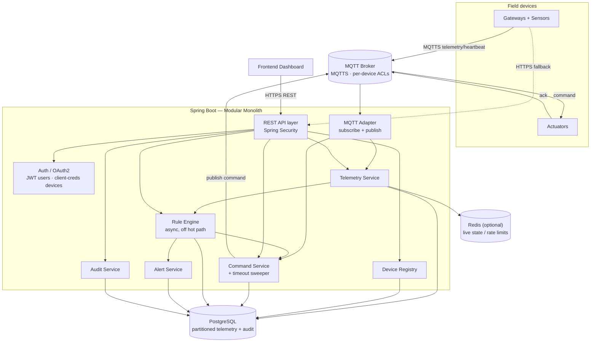
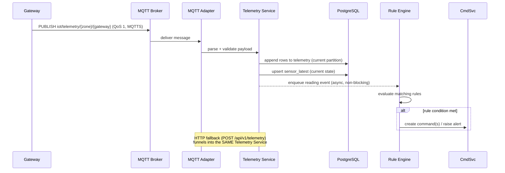
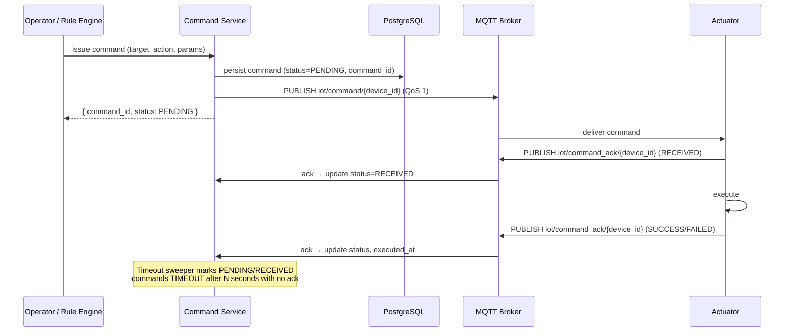
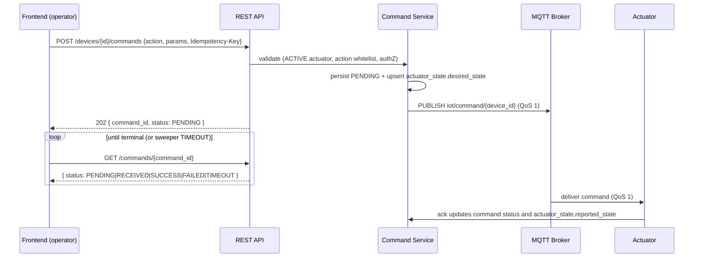
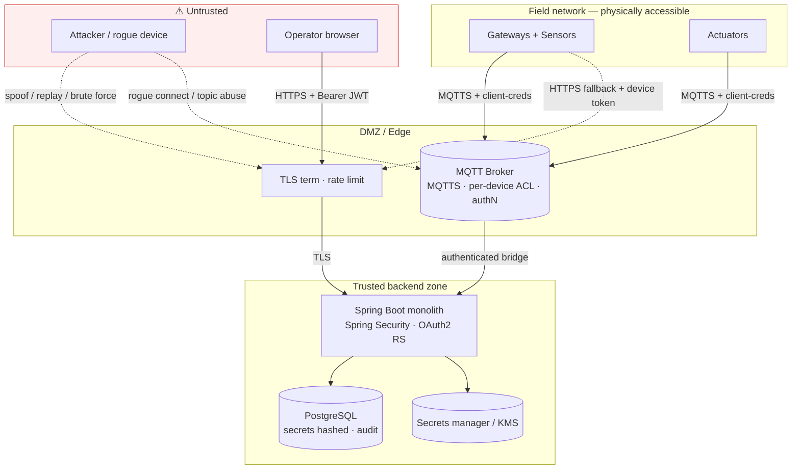

# Office IoT Monitoring & Control — System Design

**Status:** Design baseline · **Stack:** Spring Boot · MQTT · REST/HTTPS · Spring Security · PostgreSQL
**Companion document:** the existing *IoT Office Monitoring & Control Data Specification* (payloads, topics, REST endpoints). This document is the *architecture* layer above that spec — it explains scale, the data model, component design, and the trade-offs behind each choice. Where the two overlap, the data spec is authoritative for wire formats; this document is authoritative for structure and decisions.

---

## 0. Assumptions (state them, correct me if wrong)

The scale of an office building is bounded enough to design against directly. I'm proceeding on these assumptions; **three of them, if different, change the design** and are flagged ⚠️.

| # | Assumption | Impact if wrong |
|---|------------|-----------------|
| 1 | **Single building**, ~12 zones, **a few hundred devices total** (gateways + sensors + actuators). | ⚠️ Multi-building / SaaS multi-tenant flips several decisions (tenancy in the data model, broker scaling, possibly service extraction). |
| 2 | Gateways publish aggregated telemetry roughly every **10–60 s**; heartbeats every 30–60 s. | Higher-frequency or per-sensor publishing raises ingest rate, but stays well within single-node range until ~thousands of devices. |
| 3 | **Telemetry is retained long-term** (months to a year+) for history/trends. | ⚠️ Short retention (e.g. 7–30 days) removes the need for partitioning/downsampling — plain Postgres tables suffice. |
| 4 | Dashboard needs **near-real-time current state** ("what is each zone reading now", "is this device online") plus historical queries. | ⚠️ If hard sub-second live streaming to many clients is required, add WebSocket/SSE push and a live-state cache as first-class, not optional. |
| 5 | A handful of operators (single-digit to low-tens concurrent dashboard users). | More users only raises read QPS, handled by a read replica long before anything else changes. |

---

## 1. Requirements

### Functional
- Ingest sensor **telemetry** via MQTT (primary) and HTTP (fallback), through gateways that aggregate sensors.
- Persist telemetry as **time-series history** and expose **current state** per zone/sensor.
- **Device registry & lifecycle**: register, update, suspend, activate, decommission, rotate credentials (gateways, sensors, actuators).
- **AuthN/AuthZ**: OAuth2 + JWT for users with RBAC (`SUPER_ADMIN`/`ADMIN`/`OPERATOR`/`TECHNICIAN`/`VIEWER`); OAuth2 client-credentials + scopes for devices.
- **Rule engine**: evaluate conditions over telemetry/state → dispatch commands and raise alerts (e.g. smoke → exhaust ON + alert).
- **Command dispatch** to actuators over MQTT with a tracked lifecycle (`PENDING → RECEIVED → SUCCESS/FAILED/TIMEOUT`) and acknowledgement correlation.
- **Operator device control** from the dashboard: authorized users issue control commands to actuators (turn on/off, set parameters), see **current actuator state**, and track each command's outcome — driven through the *same* command pipeline the rule engine uses, never a parallel path.
- **Heartbeat / connectivity** tracking and device online/offline status.
- **Audit logging** of security- and control-relevant events.
- **REST APIs** for the dashboard and administration.

### Non-functional (with rough targets)
| Property | Target | Notes |
|----------|--------|-------|
| Telemetry ingest | tens of msgs/s peak | Comfortably single-node. |
| Dashboard read latency | < 300 ms for current-state; < 1 s for typical history ranges | Drives the current-state/history split (§4, §5). |
| Command end-to-end | actuator reacts within ~1–2 s of issue | Bounded by MQTT + device, not backend. |
| Consistency | **Strong** for registry/RBAC/commands; **eventual** acceptable for live dashboard state | Money/auth-like paths get transactions; live readings can lag by a sample. |
| Availability | High for **device comms** (safety: smoke) and command path; best-effort for dashboard | Makes the MQTT broker the most critical component (§8). |
| Security | TLS 1.2+ everywhere, hashed secrets, RBAC, per-device topic ACLs, full audit | Detailed in §7. |

---

## 2. Scale estimate (back-of-envelope)

The point of this section is to *justify keeping the system small*.

**Devices.** ~12 zones × (≈1–2 gateways + ≈5–15 sensors + ≈5–15 actuators) → order of **100–400 devices**.

**Ingest rate.** ~20 gateways publishing every 30 s, ~8 readings each → `20/30 × 8 ≈ 5 readings/s`. Even at 10 s intervals it's ~15 readings/s. Heartbeats: 400 devices / 30 s ≈ **13 msg/s**. Commands: a few per minute. **Total: tens of messages/second, peak.**

**Storage (the one number that grows).** At ~5 readings/s sustained → ~430 K rows/day → **~160 M rows/year**. At ~100 bytes/row with indexes, call it **a few hundred MB/day**, **~100–300 GB/year**. Postgres handles this *with* a partitioning + retention strategy (§5); without one, a single unbounded telemetry table degrades query performance over months. Audit logs grow far slower (event-driven).

**Conclusion.** Throughput is trivial for one node. The only real data-engineering concern is **telemetry table growth over time**, not requests per second. Everything else (registry, RBAC, commands, rules) is low-volume relational data. This is decisive for the architecture: **a modular monolith on one PostgreSQL instance is the right baseline**, and added complexity must point at one of the ⚠️ assumptions to justify itself.

---

## 3. High-level design

### Component view



The backend is **one deployable** with clear internal module boundaries (§9). The MQTT broker (Mosquitto / EMQX / HiveMQ) sits between devices and backend; the backend is an MQTT *client* (a persistent subscriber + a publisher). Redis is optional and earns its place only for live-state fan-out or distributed rate limiting.

### Telemetry ingest flow



### Command dispatch + acknowledgement flow



---

## 4. Data model & access patterns

Access patterns chosen the storage, not the reverse. The dominant patterns are: **append telemetry fast**; read **latest value per sensor** and **device online/offline** cheaply for the dashboard; query **telemetry by (zone or sensor) over a time range**; transactional **registry / RBAC / command** updates; append-only **audit**.

```mermaid
erDiagram
    USERS ||--o{ REFRESH_TOKENS : has
    DEVICES ||--o| DEVICE_CREDENTIALS : "authenticates with"
    DEVICES ||--o{ DEVICE_SCOPES : granted
    DEVICES ||--o| DEVICE_HEALTH : "latest health"
    DEVICES ||--o| ACTUATOR_STATE : "latest actuator state"
    DEVICES ||--o{ SENSORS : "parent gateway of"
    DEVICES ||--o{ COMMANDS : "targets"
    USERS ||--o{ COMMANDS : "issued by"
    RULES ||--o{ COMMANDS : "triggers"
    DEVICES ||--o{ ALERTS : "source"

    USERS {
        uuid id PK
        string username UK
        string password_hash "argon2id"
        enum role
        enum status
        timestamptz created_at
    }
    REFRESH_TOKENS {
        uuid id PK
        uuid user_id FK
        string token_hash
        timestamptz expires_at
        bool revoked
    }
    DEVICES {
        string device_id PK
        enum category "gateway|sensor|actuator"
        string device_type "temp|hmid|smoke|light|ac|exhst_fan|curtain"
        string zone
        string parent_gateway_id FK "null unless sensor"
        string firmware_version
        enum status "ACTIVE|INACTIVE|SUSPENDED|DECOMMISSIONED"
        string_array protocols
        timestamptz created_at
    }
    DEVICE_CREDENTIALS {
        string device_id PK_FK
        string client_id UK
        string client_secret_hash
        string previous_secret_hash "rotation grace"
        timestamptz rotated_at
    }
    DEVICE_SCOPES {
        string device_id FK
        string scope "telemetry:publish|command:subscribe|command:ack|heartbeat:publish"
    }
    DEVICE_HEALTH {
        string device_id PK_FK
        enum connection_status "ONLINE|OFFLINE"
        timestamptz last_seen
        int memory_usage_pct
        int cpu_usage_pct
        int wifi_rssi
        timestamptz updated_at
    }
    SENSORS {
        string sensor_id PK
        string gateway_id FK
        string type
        string zone
    }
    TELEMETRY {
        bigint id PK
        timestamptz ts "partition key"
        string zone
        string gateway_id
        string sensor_id
        string sensor_type
        double value_num "null for boolean"
        bool value_bool "null for numeric"
        string unit
    }
    SENSOR_LATEST {
        string sensor_id PK
        string zone
        string sensor_type
        double value_num
        bool value_bool
        timestamptz ts
    }
    ACTUATOR_STATE {
        string device_id PK_FK
        string desired_state "last commanded: ON|OFF|..."
        string reported_state "last confirmed by device"
        jsonb attributes "setpoint, level, mode"
        string last_command_id FK
        timestamptz commanded_at
        timestamptz updated_at
    }
    COMMANDS {
        string command_id PK
        string target_id FK
        string type
        string action
        jsonb parameters
        enum status "PENDING|RECEIVED|SUCCESS|FAILED|TIMEOUT"
        string issued_by "user id | rule id | system"
        timestamptz issued_at
        timestamptz received_at
        timestamptz executed_at
    }
    RULES {
        uuid rule_id PK
        string name
        bool enabled
        text condition
        text action
        int priority
        string created_by
    }
    ALERTS {
        bigint id PK
        string type "SMOKE|..."
        enum severity
        string zone
        string source_device_id FK
        text message
        enum status "OPEN|ACK|RESOLVED"
        timestamptz created_at
    }
    AUDIT_LOGS {
        bigint id PK
        timestamptz ts "partition key"
        string actor
        enum actor_type "USER|DEVICE|SYSTEM"
        string event
        string target
        jsonb detail
        string ip
    }
```

**Notes that are design decisions, not just schema:**

- **`telemetry` has no foreign key to `devices`.** It's the high-volume append-only event log; FK checks on every insert cost throughput for little benefit, and device rows change slowly. Treat telemetry as immutable facts; validate device identity at ingest, not via a DB constraint.
- **`sensor_latest` (or Redis) separates current state from history.** The dashboard's "what's the temperature in office_1 right now" must not scan the big telemetry table. Upsert the latest value per sensor on ingest. Trade-off: slight write amplification + the live view is eventually consistent by one sample — acceptable per the consistency targets.
- **`actuator_state` is the control-plane mirror of `sensor_latest`.** The dashboard's toggles need "is this light/fan ON *right now*" without scanning `commands` history. Keep **`desired_state`** (what we last commanded) distinct from **`reported_state`** (what the device last confirmed via ack/telemetry): the gap between them *is* the in-flight / drift signal the UI renders ("turning on…", or "commanded ON but device reports OFF → investigate"). Upsert `desired_state` when a command is issued, `reported_state` on ack/telemetry. One row per actuator; history lives in `commands` + `telemetry`, not here.
- **`device_health` is one row per device, upserted on heartbeat — not one row per heartbeat.** Storing every heartbeat is pure write amplification for data you rarely query historically. Keep *latest* health; if you ever need health history, add a short-retention (e.g. 7-day) partitioned table separately.
- **Indexes that matter on `telemetry`:** `(sensor_id, ts DESC)` and `(zone, ts DESC)` — these back the two query shapes the dashboard actually issues. Don't over-index an append-heavy table.
- **`refresh_tokens` is stored server-side** (hashed) on purpose — see §7 on why 30-day refresh tokens can't be purely stateless if you want revocation.

---

## 5. Key decisions & trade-offs

Each decision names what it buys, what it costs, and the alternative rejected.

### 5.1 Modular monolith, not microservices
**Decision:** one Spring Boot deployable, one Postgres, strong internal module boundaries.
**Buys:** trivial transactions and queries across registry/telemetry/commands; one thing to deploy, observe, and debug; cheap refactoring while the domain is still settling.
**Costs:** all modules scale and deploy together; a bad module can affect the whole process (mitigated by module discipline + the async rule boundary in §5.6).
**Rejected — microservices:** at tens of msgs/s they add distributed transactions, cross-service consistency, and N× the ops surface for **zero** scaling benefit. The §0 spec calls these "services" (Telemetry Service, Rule Engine, …) — keep them as *modules*, not *processes*.
**Revisit when:** ⚠️ multi-building SaaS, thousands of devices, or independent team/deploy cadence. The module boundaries below are drawn so a module can be lifted into its own service later without rewriting callers.

### 5.2 PostgreSQL for everything, telemetry range-partitioned by time
**Decision:** single Postgres. `telemetry` and `audit_logs` are **range-partitioned by month**, with a **retention job** dropping old partitions (cheap) instead of `DELETE` (expensive).
**Buys:** relational transactions/joins for registry & RBAC; fast time-range scans hitting only relevant partitions; old-data cleanup is a metadata operation.
**Costs:** partition management (automate with `pg_partman` or a scheduled job).
**Rejected — dedicated time-series DB (InfluxDB) / NoSQL:** splits the system of record and adds an operational component the scale doesn't warrant. NoSQL also loses the joins/transactions registry and RBAC need.
**Upgrade path (not now):** if telemetry volume or dashboard-aggregation queries grow, adopt **TimescaleDB** (a Postgres *extension* — same database) for hypertables + **continuous aggregates** (pre-rolled hourly/daily averages for charts). This is a drop-in, not a migration to a new system.

### 5.3 Current-state vs history split
Covered in §4. Live reads hit `sensor_latest`/`device_health` (or Redis); history hits partitioned `telemetry`. This is the single most useful performance decision for the dashboard.

### 5.4 MQTT primary, HTTP fallback — one ingestion funnel
**Decision:** MQTT (QoS 1, MQTTS) is primary; `POST /api/v1/telemetry` is fallback. **Both paths call the same Telemetry Service** — validation, persistence, state update, and rule hand-off live in one place.
**Buys:** MQTT gives efficient push, last-will presence detection, and pub/sub fan-out to actuators; HTTP covers constrained devices/networks and gives a degraded ingest path if the broker is down.
**Costs:** two transports to secure and validate consistently — solved by funneling into one service rather than duplicating logic per transport.

### 5.5 Command delivery is at-least-once → commands must be idempotent
**Decision:** MQTT QoS 1 may deliver a command **twice**. Design actuator actions as **idempotent state-sets** (`SET status=ON`), and have devices **dedupe on `command_id`**. Track lifecycle `PENDING → RECEIVED → SUCCESS/FAILED`, with a **timeout sweeper** marking `TIMEOUT` when no ack arrives within N seconds. Acks correlate by `command_id` on `iot/command_ack/{device_id}`.
**Buys:** safe redelivery, no "toggled twice" bugs, no commands stuck forever in `PENDING`.
**Note:** your spec's commands are already state-sets (good) — this just makes the requirement explicit and adds the sweeper.

### 5.6 Rule engine runs async, off the ingest hot path
**Decision:** persist telemetry first, **then** hand the reading to the rule engine via an in-process bounded queue + worker(s). The MQTT callback never blocks on rule evaluation or command publishing.
**Buys:** a slow/complex rule or a slow command publish can't back up ingestion; nothing is lost because telemetry is durably stored before evaluation.
**Costs:** rule actions are eventually-consistent w.r.t. the triggering reading (sub-second at this scale).
**Rejected — Kafka/Redis Streams now:** unnecessary at tens of msgs/s. **Revisit when** you need event replay, many heavy rules, or to decouple rule processing onto its own service.
**Safety detail:** rule conditions are stored as strings (`"office_1.temp > 30"`). **Do not `eval` them.** Use a restricted expression evaluator — Spring Expression Language (SpEL) with a locked-down, read-only context, or a small purpose-built grammar — so a malicious/buggy rule can't execute arbitrary code or read unintended state.

### 5.7 Trade-off summary

| Choice | Picked | Over | Because | Flip when |
|--------|--------|------|---------|-----------|
| Topology | Modular monolith | Microservices | Tiny scale; simpler ops | Multi-building / team scale |
| Store | Postgres (+partitioning) | InfluxDB / NoSQL | Relational needs dominate; volume manageable | Heavy TS aggregation → TimescaleDB |
| Live reads | State table / Redis | Scan telemetry | Dashboard latency | — |
| Rule path | Async in-process | Sync inline / Kafka | Protect ingest, but no broker overhead | Replay / heavy rules → Kafka |
| Command QoS | QoS 1 + idempotency | QoS 2 | QoS 2 is heavier; idempotency is cheaper insurance | — |
| Control API | Async `202` + poll/push | Sync block-till-done | Device latency is unbounded; reuse existing lifecycle | Push needed → SSE/WS |

### 5.8 Operator control plane — synchronous request, asynchronous outcome
**Context:** the dashboard must let an authorized operator drive actuators directly (light/AC/exhaust on-off, setpoints) — the command path of §3/§5.5, now triggered by a human over REST instead of by a rule.

**Decision:** the control endpoint is **command-*issuing*, not command-*completing***. `POST .../commands` validates → persists the command `PENDING` → publishes to MQTT → returns **`202 Accepted` with `{command_id, status: PENDING}`** immediately. It does **not** hold the HTTP request open waiting for the actuator. The front-end resolves the terminal state (`SUCCESS/FAILED/TIMEOUT`) by **polling `GET .../commands/{command_id}`** — which fits assumption #4's near-real-time polling — or, if/when push is adopted, over the *same* SSE/WebSocket channel that serves live state. The existing **timeout sweeper** (§5.5) guarantees the command always reaches a terminal state, so the UI's poll loop is bounded.



**Buys:** the API stays responsive no matter how slow the device or broker is; reuses the whole lifecycle + sweeper + audit; no long-held connections.
**Costs:** the UI must model an in-flight state ("turning on…") and reconcile to the terminal one — it cannot show success synchronously. That is the honest model for controlling physical hardware.
**Cross-cutting controls (each detailed elsewhere):**
- **Idempotency** — require an `Idempotency-Key` on issue so a double-click or client retry maps to **one** command (same mechanism as credential issue, §7).
- **Target validation (`422`)** — target must be an **ACTIVE actuator**; reject sensors, gateways, and `SUSPENDED`/`DECOMMISSIONED` devices; action + params **whitelisted per `device_type`** (§7 input-validation table).
- **Authorization & safety interlocks** — who may command what, and what happens when a manual command contradicts an active safety rule: §7.
- **Bulk / zone control (deliberately optional):** "turn off all lights in `office_1`" is sugar that **fans out into N individual per-device commands** server-side — each still gets its own `command_id`, ack, and audit entry. Keep the unit of truth the single-device command; don't invent a second lifecycle for batches. Add only if the UX needs it.

---

## 6. Communication & topic model

From the data spec, normalized. The **one change I recommend** is per-gateway telemetry topics for tighter ACLs (§7).

| Purpose | Topic | Publisher | Subscriber | QoS |
|---------|-------|-----------|-----------|-----|
| Telemetry | `iot/telemetry/{zone}/{gateway_id}` *(was `iot/telemetry/{zone}`)* | Gateway | Backend | 1 |
| Command | `iot/command/{device_id}` | Backend | Actuator | 1 |
| Command ack | `iot/command_ack/{device_id}` | Actuator | Backend | 1 |
| Heartbeat | `iot/heartbeat/{device_id}` | Device | Backend | 0–1 |
| Presence (LWT) | `iot/status/{device_id}` | Broker (last will) | Backend | 1 |

**Why the telemetry topic change:** with `iot/telemetry/{zone}`, broker ACLs can only restrict to *zone* granularity — any device authorized for `office_1` could publish telemetry claiming to be any gateway in `office_1`. Adding `/{gateway_id}` lets the broker enforce "this gateway may publish only its own telemetry." For a single trusted office this may be acceptable to skip, but it's a one-line topic change for a real authorization win.

**Last Will & Testament:** register an LWT per device so the broker auto-publishes "offline" if a device drops without a clean disconnect — more reliable presence than waiting for a missed heartbeat.

---

## 7. Security design

Transport, identity, authorization, and audit — the spec lists the requirements; here is how they fit together. This section is the security layer of the design: the stance, the trust boundaries, the threat model, and the control set, organized so the highest-impact controls come first.

### Security stance: this is a safety system, not just a data system

The defining characteristic that reorders the usual priorities: a smoke sensor whose telemetry can be spoofed, or an exhaust-fan command that can be forged or suppressed, is a **physical-safety** failure, not a privacy incident. That drives three asymmetric priorities that ripple through everything below:

| Priority | Why it dominates here | Where enforced |
|---|---|---|
| **Integrity of telemetry & commands** | A faked "no smoke" reading or a hijacked actuator is a life-safety event — integrity outranks confidentiality for the device plane. | Per-device identity + topic ACLs (broker authorization below); command idempotency & audit (§5.5) |
| **Availability of the device/command path** | If the broker or command path is down during a fire, the system fails when it matters most. | Broker HA, HTTP fallback, fail-safe actuator defaults (§8 + "Availability as a security property" below) |
| **Authenticity of every actor** | Both *who* (operator) and *what* (device) must be provably identified before any control action. | OAuth2/JWT (users) + client-credentials (devices) |

Confidentiality still matters (credentials, audit, operator accounts), but for an office-monitoring system the **integrity/availability of the control loop is the crown jewel.**

### Trust boundaries & attack surface

Every arrow crossing a dashed boundary is an authentication + authorization checkpoint. The field network is **physically accessible** (devices sit in ceilings, walls, plant rooms) — treat every device as potentially compromised, which is exactly why per-device identity and per-device topic ACLs (not a shared key) are non-negotiable.



| Boundary crossed | Threat at the crossing | Control |
|---|---|---|
| Operator → Edge | Stolen/forged token, brute force | Bearer JWT validation, short access TTL, auth rate limit, security headers |
| Device → Broker | Rogue device, identity spoofing, topic abuse | Broker authN (client-creds / cert), per-`device_id` topic ACL |
| Device → Edge (fallback) | Same device spoofing over HTTP | Device token + scope; `deviceId`-in-body must match token identity |
| Broker → Backend | Compromised broker injecting messages | Authenticated bridge; backend re-validates payloads & device identity |
| Backend → DB / Secrets | Lateral movement, secret theft | Network isolation, least-priv DB user, secrets in KMS not source |
| Field network (physical) | Device theft, firmware extraction, sniffing | TLS on the wire; per-device creds (one compromise ≠ all); decommission flow |

### Threat model (STRIDE, ranked by safety blast radius)

The top three can cause physical harm; they get the strongest controls.

| # | Threat (STRIDE) | Scenario | Impact | Primary control(s) |
|---|---|---|---|---|
| **T1** | Spoofing (telemetry) | Compromised device publishes fake "no smoke" / forged reading for another zone | 🔴 Safety: real fire unalerted | Per-gateway topic + broker ACL keyed to `device_id`; backend asserts payload identity == authenticated identity |
| **T2** | Tampering/Spoofing (command) | Attacker forges or replays an actuator command (`exhaust OFF`) | 🔴 Safety / control | Command publish authZ; idempotent state-sets; ack correlation; audit of every command |
| **T3** | Denial of Service (control path) | Flood broker/backend so a smoke alert or command never lands | 🔴 Availability when it matters most | Broker HA, rate limits, HTTP fallback, fail-safe actuator defaults |
| **T4** | Elevation of Privilege | Viewer does admin action; device calls admin API | Unauthorized control | RBAC `@PreAuthorize`; devices restricted to ingest endpoints; role-grant ceiling |
| **T5** | Information Disclosure | Leak of client secret, password hash, refresh token | Confidentiality; enables T1/T2 | Hashing (Argon2id / SHA-256), secret-shown-once, TLS, no secrets in logs/DTOs |
| **T6** | Repudiation | Operator/device denies issuing a command/change | Accountability | Append-only audit with actor + IP + correlation id |
| **T7** | Spoofing (user) | Credential stuffing, brute force, token theft (XSS) | Account takeover | Argon2id, auth rate limit 20/min, short access TTL + revocation |
| **T8** | Tampering (injection) | SQL injection; malicious rule expression executing code | RCE / data tampering | Parameterized queries (JPA); **no `eval`** — locked-down SpEL/DSL (§5.6) |

**IoT-specific abuse cases** worth calling out: **sensor flooding/blinding** (spam readings to mask a real event → per-device ingest rate limit + gap/anomaly detection); **command suppression** (drop MQTT so `exhaust ON` never lands → ack-timeout sweeper surfaces non-delivery + fail-safe actuator default); **stale-replay** (replay an old "all clear" → server-side ingest timestamp, flag implausible `ts` skew).

### Users
- **OAuth2 + JWT.** Access token **1 h**, refresh token **30 d**.
- **Passwords hashed with Argon2id** (BCrypt acceptable fallback). Never plaintext.
- **RBAC** via roles in the JWT, enforced with method-level `@PreAuthorize` (`SUPER_ADMIN` > `ADMIN` > `OPERATOR` > `TECHNICIAN` > `VIEWER`). `TECHNICIAN` is a maintenance/field role slotted between `OPERATOR` and `VIEWER`: it reads all state and may command **routine** actuators in permitted zones for diagnostics/testing, but not safety actuators and never a safety override.
- **Refresh-token revocation needs server-side state.** A pure stateless JWT can't be revoked before expiry — a 30-day refresh token you can't kill is a liability. Store refresh tokens hashed (`refresh_tokens` table), rotate on use (issue new, revoke old), and support explicit revoke on logout/compromise. Access tokens stay stateless and short-lived, but the **denylist below** gives them instant revocation when waiting up to an hour isn't acceptable.

### Devices
- **OAuth2 client-credentials**, one `client_id`/`client_secret` per device; **secret stored hashed**, never returned again after issue/rotation.
- **Scopes** (`telemetry:publish`, `command:subscribe`, `command:ack`, `heartbeat:publish`) gate what each device may do.
- **Credential rotation with a grace window:** keep `previous_secret_hash` valid briefly after rotation so a device doesn't get locked out mid-roll. Audit every rotation.

### Operator control authorization & safety interlocks
Exposing device control to the dashboard widens the **Elevation-of-Privilege** surface (T4): a control command is a physical action, so *who* may issue *what* is a first-class authorization decision, enforced with `@PreAuthorize` at the command endpoint — never in the UI.

| Role | May read state | May command routine actuators (light, AC, curtain) | May command safety actuators (exhaust fan, smoke-linked) | May override an active safety rule/alert |
|---|---|---|---|---|
| `VIEWER` | ✅ | ✗ | ✗ | ✗ |
| `TECHNICIAN` | ✅ | ✅ (permitted zones — diagnostics/testing) | ✗ | ✗ |
| `OPERATOR` | ✅ | ✅ (permitted zones) | ✅ (turn **ON** / escalate only) | ✗ |
| `ADMIN` | ✅ | ✅ | ✅ | ✗ |
| `SUPER_ADMIN` | ✅ | ✅ | ✅ | ✅ (explicit, confirmed, audited) |

`TECHNICIAN` mirrors `OPERATOR`'s routine-actuator authority (zone-scoped, for maintenance/testing) but is barred from **safety** actuators — only `OPERATOR`+ may drive an exhaust/smoke-linked device. Like everyone below `SUPER_ADMIN`, a `TECHNICIAN` command is still subject to the safety interlock below.

**Safety interlock — the rule engine outranks manual control.** Because this is a safety system, a manual command that *contradicts* an active safety action (e.g. operator sends `exhaust OFF` while a smoke rule holds it `ON`, or an `OPEN` smoke alert exists for that zone) is **rejected `409`/`safety-interlock`** for everyone below `SUPER_ADMIN` — and even there it requires an explicit override flag + reason, and is audited as a distinct `SAFETY_OVERRIDE` event. Degradation stays **fail-safe** (§"Availability as a security property"): manual control can always move an actuator *toward* the safe state, never silently away from one the system is actively enforcing.

> **Implemented (2026-07-03).** The hold signal is: an **`OPEN` alert of a safety-linked type in the target actuator's zone**, checked only against **de-escalating** commands (`OFF`/`STOP`/`CLOSED` — escalating a safety actuator is always allowed regardless of open alerts). This needs no separate "is the rule still active" bookkeeping — an open alert already *is* the durable record that the hazard is unresolved. The mapping from safety `device_type` to holding alert `type`s is config-driven (`iot.command.safety-interlock.alert-types-by-device-type`, default `exhst_fan → [SMOKE]`), consumed through a narrow published interface (`alert.OpenAlertQuery`) so `command` never reaches into `alert`'s repository — preserving the §9 module-boundary rule. A config flag (`iot.command.safety-interlock.enabled=false`) reverts to a no-op check for isolated testing.

**Every manual command is audited** with actor, actor-type `USER`, source IP, target, action, and `command_id` (§Audit) — manual control is exactly the kind of control-relevant event that must be non-repudiable. Manual commands are also subject to the per-user rate limit (§Rate limiting), which doubles as abuse detection on the control path.

### Token revocation (denylist)
The DB `revoked` flag on `refresh_tokens` is authoritative; the denylist is a **fast-deny layer in front of it** that closes two gaps the flag alone can't: (a) revoking a stateless **access** token before its natural expiry, and (b) avoiding a DB round-trip on every refresh.

- **One validator gates every JWT.** A custom `OAuth2TokenValidator<Jwt>` is chained into the `NimbusJwtDecoder`, so user *and* device requests pass through it. A token whose `jti` is in the denylist fails verification immediately, ahead of issuer/expiry checks — every issued access token now carries a random `jti` claim specifically so it's addressable here. *(Implemented 2026-07-03: `DelegatingOAuth2TokenValidator<>(denylistValidator, defaults)` — the denylist validator is listed and evaluated first, matching this ordering literally rather than just functionally.)*
- **Two key spaces, two purposes.**
  - **Access JTI** — blocks an issued JWT before its 1 h natural expiry. Added on logout (when the client also presents its access token) and on demand if we ever want to forcibly sign someone out.
  - **Refresh hash** (SHA-256 of the raw token) — short-circuits the refresh path before any DB lookup, and serves as the fast-deny entry for any token we've already revoked or rotated out.
- **TTL = remaining token lifetime.** Every entry auto-expires when the underlying token would have anyway — the store can't grow unbounded and we can never accidentally outlive what we're blocking.
- **Refresh-reuse cascade.** When a revoked refresh token is presented again (likely compromise), the chain is walked via `rotated_to` and every descendant's hash is denylisted — an attacker holding the rotated-out token loses it the moment we see the older one. The reuse itself returns `401 errors/token-revoked`.
- **Pluggable backend.** `InMemoryTokenDenylist` (default, `iot.redis.enabled=false`) for single-instance and tests; `RedisTokenDenylist` (`iot.redis.enabled=true`) when running >1 instance so all of them see the same denials. The interface is identical; switching is a config flip.
- **Cost & trade-off:** one extra Redis (or in-memory map) lookup per authenticated request — negligible next to the JWT signature check. Worth it to keep logout/compromise truly instantaneous instead of "eventual within 1 h."

### Broker authorization (the easy-to-miss one)
The broker maps each device's authenticated identity to **per-`device_id` topic ACLs** so device X can only publish/subscribe its own topics. Without this, one compromised device can spoof another zone's telemetry or hijack another device's commands — i.e. fake a "no smoke" reading or send actuator commands. Tie ACLs to the device's identity (client-creds or client cert), keyed by `device_id`/`gateway_id` (hence the topic change in §6). This is the single control that defeats **T1/T2**.

| Device | May publish | May subscribe |
|---|---|---|
| Gateway `gw_office1_01` | `iot/telemetry/office_1/gw_office1_01`, `iot/heartbeat/gw_office1_01` | — |
| Actuator `act_exhaust_1` | `iot/command_ack/act_exhaust_1`, `iot/heartbeat/act_exhaust_1` | `iot/command/act_exhaust_1` |

**Belt and suspenders:** the backend additionally re-validates that the payload's `gatewayId`/`deviceId` equals the authenticated identity — never trust the broker ACL alone, in case the broker itself is compromised.

### Transport & headers
- **TLS 1.2+ everywhere**: HTTPS for REST, MQTTS for MQTT. Plain HTTP/MQTT disabled in production.
- Security headers on REST responses: `Strict-Transport-Security`, `X-Content-Type-Options`, `X-Frame-Options`, `Content-Security-Policy`.

### Audit
Append-only, partitioned `audit_logs`. Record: user login, device registration/deletion, credential rotation, rule changes, command execution, permission/role changes. Each entry carries actor, actor type (USER/DEVICE/SYSTEM), event, target, and source IP.

### Rate limiting
Per the spec (User 100/min, Device 300/min, Auth 20/min, Telemetry configurable). Enforce at the API gateway/filter; if you run more than one backend instance, back the counters with **Redis** so limits are global rather than per-instance. A spike in `403`/`429` is itself a probing/abuse signal (see Detection below).

### Secrets & credential management

| Secret | Storage | Lifetime | Rotation | Exposure rule |
|---|---|---|---|---|
| User password | Argon2id hash in `users` | until changed | user/admin reset | never returned; reset issues no plaintext |
| Device client secret | hash in `device_credentials` (+ `previous_secret_hash`) | until rotated | `:rotate` with **grace window** | **shown once** at issue/rotate, never again |
| Refresh token | SHA-256 hash in `refresh_tokens` | 30 d, rotated on use | rotate-on-use | hashed; reuse → revoke cascade (above) |
| JWT signing key | KMS / secrets manager (not source/env in prod) | scheduled rotation | key-rollover with `kid` | private key never leaves KMS |
| TLS / DB / broker creds | KMS / secrets manager, injected at runtime | per policy | rotatable | not in source, not in images |

**Rules:** no secret in source control, container images, logs, error responses, or DTOs (the API design's "no `passwordHash`/`clientSecretHash` on the wire" enforces this); one credential **per device** so one compromise is contained, never a shared fleet key; `Idempotency-Key` on credential issue/rotate so a retry can't mint duplicate secrets; secret scanning (gitleaks/trufflehog) in CI.

### Input validation & injection defense

| Surface | Risk | Control |
|---|---|---|
| REST bodies/params | Malformed/oversized/invalid input | Bean Validation (`@Valid`), strict DTO binding, `422` listing every failing field |
| Telemetry payloads (MQTT + HTTP) | Malformed/over-large payloads, type confusion | Schema validation at the single ingest funnel; reject unknown sensor types; `valueNum` XOR `valueBool` |
| Partitioned reads (telemetry, audit) | Unbounded full-table scan as DoS | **Mandatory** bounded time window + (`sensorId` XOR `zone`); else `422` |
| DB access | SQL injection | Parameterized queries / JPA bindings only — no string-concatenated SQL |
| **Rule engine** | **Arbitrary code execution via rule expression** | **Never `eval`.** Locked-down SpEL (read-only, no reflection/I/O) or a purpose-built grammar; validate condition/action **on write** (`422` with offending token) — see §5.6 |
| Command parameters | Injection into device action | Whitelist actions/params; idempotent state-sets only; reject non-actuator/decommissioned target (`422`) |

The rule engine is the **single most dangerous input sink** — a stored string that gets executed — which is why the §5.6 locked-down evaluator is a security control, not just a robustness one.

### Availability as a security property

Because this is a safety system, availability of the control loop *is* security. The §8 mitigations (broker HA, persistent sessions, HTTP fallback) are load-bearing here. Two safety-specific behaviors:
- **Fail safe, not fail open** — every degradation (broker down, ack lost, rule queue lost) leaves the system in a *known, observable, safe* state; actuators adopt safe defaults on comms loss rather than silently dropping a safety action.
- **Command suppression detection** — the ack-timeout sweeper (§5.5) surfaces non-delivery as `TIMEOUT`, so an attacker dropping MQTT messages can't silently suppress `exhaust ON`.

### Detection & incident response

Audit (above) is forensic *after the fact*; **detection** catches things as they happen. Alert on: repeated auth failures / credential stuffing; refresh-token reuse cascade triggered (likely theft); broker ACL denials (a device publishing outside its topics → likely T1); commands from an unexpected actor or to an unexpected target; telemetry gap/anomaly on a safety sensor; `403`/`429` spikes.

**Device compromise** is the most likely real incident (devices are physically exposed). Containment is surgical because of per-device identity: **suspend** (`:suspend` disables credentials) → **decommission** if confirmed (`:decommission` revokes credentials + topic ACLs) → audit-review everything that identity did → cross-check neighbouring sensors for the compromise window. Blast radius is one device, never the fleet.

### Standards mapping (quick reference)

Covers **OWASP API Security Top 10** — broken auth (OAuth2/JWT, Argon2id, revocation), function/object-level authZ (`@PreAuthorize`, role-grant ceiling, devices ingest-only), resource consumption (rate limits, bounded pagination, mandatory time-window scoping), property-level authZ (DTOs omit secrets/PKs), misconfiguration (security headers, TLS, prod hardening) — and the **OWASP IoT Top 10**: weak/hardcoded credentials (per-device hashed secrets), insecure network services (MQTTS + ACLs), insufficient privacy (occupancy data treated as sensitive), insecure transfer/storage (TLS + encryption at rest), device management (registry, lifecycle, decommission).

### Security checklist (build-time gate)

- [ ] TLS 1.2+ enforced on REST and MQTT; plaintext disabled in prod.
- [ ] Argon2id passwords; per-device client secrets, hashed, shown once, rotatable with grace.
- [ ] Broker authenticates every connection; per-`device_id` topic ACLs; backend re-validates payload identity.
- [ ] `@PreAuthorize` on every endpoint; role-grant ceiling; devices ingest-only.
- [ ] JWT validator chain includes denylist; access `jti` + refresh-hash revocation; refresh rotate-on-use + reuse cascade.
- [ ] Rule expressions via locked-down evaluator — **no `eval`** — validated on write.
- [ ] Mandatory bounded time-window + scope on partitioned reads; rate limits (Redis-backed if multi-instance).
- [ ] Security headers (HSTS, nosniff, frame-deny, CSP); no secrets in source/images/logs/DTOs (KMS instead).
- [ ] Encryption at rest for DB + encrypted, restore-tested backups.
- [ ] Append-only audit covering all events above, with actor + IP.
- [ ] Command idempotency, ack correlation, timeout sweeper, fail-safe actuator defaults.
- [ ] CI: SCA + SAST + secret scanning gating merges.

---

## 8. Failure modes & scaling

### What breaks first — and it isn't throughput

| Failure | Effect | Mitigation |
|---------|--------|------------|
| **MQTT broker down** *(highest-impact SPOF)* | No device comms — including smoke alerts and commands | Run an **HA/clustered broker** (EMQX/HiveMQ) or at least fast-restart + **persistent sessions**; HTTP fallback gives degraded ingest; backend reconnects with backoff |
| **Backend misses messages on reconnect** | Lost QoS-1 telemetry/acks during a restart | Subscribe with **persistent session** (`cleanSession=false`); broker queues QoS-1 while backend is briefly away |
| **Telemetry table bloat** over months | Slow history queries | Monthly partitioning + retention/drop; `sensor_latest` keeps live reads off the big table |
| **Command ack lost** | Command stuck `PENDING` | **Timeout sweeper** → `TIMEOUT` |
| **In-memory rule queue lost on restart** | In-flight rule evaluations dropped | Telemetry is persisted *before* evaluation, so facts aren't lost and rules are re-derivable; add a durable queue only if you need guaranteed exactly-once rule firing |
| **Compromised device** | Spoofed telemetry / hijacked commands | Per-device topic ACLs + scopes (§7) |

### Scaling ladder (only if an ⚠️ assumption changes)
Climb in order of cost; don't skip ahead.

1. **Vertical** — bigger box. Buys the most time for the least effort.
2. **Read replica** — offload dashboard/history reads; accept replication lag (fine for history).
3. **TimescaleDB + continuous aggregates** — when chart/aggregation queries dominate.
4. **Broker cluster** — when device count or fan-out outgrows one broker.
5. **Horizontal backend** — **here's the catch:** the REST side is stateless (JWT) and scales behind a load balancer trivially, but the **MQTT consumer is stateful**. Running N instances naively means each processes every message N times. Fix with **MQTT shared subscriptions** (MQTT 5 / EMQX `$share/...`) to load-balance ingestion across instances, *or* keep ingestion as a single **leader-elected** instance while scaling REST.
6. **Extract services** — last: peel the ingestion+rule pipeline out behind Kafka into its own service. Only at genuine multi-building scale.

---

## 9. Module structure (monolith with extract-ready seams)

One Spring Boot app; packages map 1:1 to the data-spec's "services," so any one can later become its own service without changing callers.

```
com.company.iot
├── api/                # REST controllers, DTOs, error handling, OpenAPI
├── security/           # Spring Security, OAuth2 resource server, JWT, RBAC, rate limit
│   ├── user/           #   user auth, refresh-token store, roles
│   └── device/         #   client-credentials, scopes, secret rotation
├── mqtt/               # MQTT adapter: subscriber, publisher, topic mapping, LWT
├── registry/           # devices, sensors, lifecycle, credential issuance
├── telemetry/          # ingest funnel (MQTT + HTTP), persistence, sensor_latest, query
├── rules/              # rule CRUD, safe expression evaluator, async evaluation worker
├── command/            # command issue, MQTT dispatch, ack handling, timeout sweeper
├── alert/              # alert raising, status, (notification hooks)
├── audit/              # audit log writer + query
├── health/             # heartbeat ingest, device_health upsert, connectivity status
└── common/             # shared types, validation, time/partitioning utilities
```

**Boundary rules that keep extraction cheap:** modules talk through service interfaces (not each other's repositories); only `telemetry`, `command`, `audit`, `health` own write access to their tables; the `rules` → `command`/`alert` hop goes through a published interface so it can later become a network call.

---

## 10. Mapping to the data specification

This document doesn't restate the wire contracts — they live in the data spec and remain authoritative. The mapping:

| Data-spec section | Owned by module | Design notes here |
|-------------------|-----------------|-------------------|
| §10–14 MQTT topics & payloads | `mqtt`, `telemetry`, `command`, `health` | Topic granularity (§6), QoS/idempotency (§5.5), LWT presence |
| §15 Rule engine | `rules` | Async, off hot path; safe evaluation (§5.6) |
| §8–9 Auth & security | `security` | Refresh-token store, broker ACLs, rotation grace (§7) |
| §18–27 REST APIs | `api` + respective modules | Unchanged contracts; backed by the data model in §4 |
| §28 Error format / §29 Rate limits | `api`, `security` | Global (Redis-backed) limits if multi-instance |

---

## 11. Open questions to confirm before build

1. **Retention horizon** for telemetry (assumption #3) — drives partitioning vs. plain tables, and whether TimescaleDB is on the roadmap.
2. **Single vs multi-building** (assumption #1) — if multi-tenant is even *possible* later, add a `tenant_id` to the core tables now; it's nearly free upfront and painful to retrofit.
3. **Dashboard liveness** (assumption #4) — polling is fine for "near-real-time"; if you need push, plan WebSocket/SSE and treat the live-state cache as first-class.
4. **Broker product & HA** — Mosquitto (simple, single-node) vs EMQX/HiveMQ (clustering, MQTT 5 shared subscriptions, richer ACLs). The §8 scaling step 5 depends on this.
5. **Control-command outcome delivery** (ties to #3) — confirm polling `GET /commands/{id}` is acceptable for the operator UX, or commit to SSE/WebSocket push now so toggles reflect terminal state without a poll loop.
6. **Safety-override policy** (§5.8 / §7) — confirm the interlock rules: which actuators count as "safety-critical," whether `SUPER_ADMIN` override is even permitted, and what confirmation/justification it must capture. **Resolved (2026-07-02, policy) / Implemented (2026-07-03, enforcement):** `SUPER_ADMIN` override is permitted, gated on a non-blank `overrideReason` and audited as `SAFETY_OVERRIDE`; safety-critical types are config-driven (`iot.command.safety-device-types`, default `[exhst_fan]`). The interlock itself now actually holds a de-escalating command whenever an `OPEN` alert of a linked type exists in the target's zone (§"Operator control authorization & safety interlocks" above) — this was a documented no-op stub through the initial build phases and is real as of the security gap-remediation pass.
7. **Zone-scoped operator permissions** — is control authority global per role, or scoped to specific zones per user? If zone-scoped, the authorization model needs a user↔zone grant table (cheap now, awkward to retrofit).

---

### Verdict
✅ **Architecture is sound for the stated scale.** The team's modular-monolith + Postgres + single-broker instinct is correct — the value added here is the data-model split (history vs current state), telemetry partitioning, command idempotency, the async rule boundary, broker-side authorization, and a clear extract-ready module layout. The genuine risks to watch are the **MQTT broker as SPOF** and **telemetry growth over time**; both have concrete, low-cost mitigations above.
